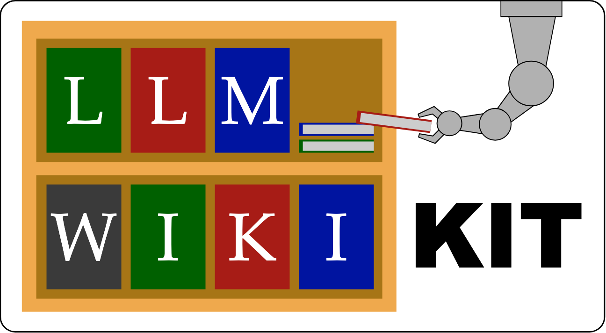

# llm-wiki-kit


調査した内容と決定した事項を wiki に蓄積し、Claude Code に読み書きさせるためのテンプレートです。

会話で決定した内容はコンテキストが切れると失われますが、wiki page に記録しておけば次の会話で読み直せます。
調査した資料を保存する、資料を読んで wiki page に変換する、page 同士を `[[link]]` で接続する、作業を issue で追跡する。
こうした作業の手順を skill、page の書式や置き場の規約を rule として同梱しているので、使う側が毎回やり方を指示せずに済みます。

コードだけでなく、設計書やナレッジ管理を LLM で行いたい場合の出発点として利用できます。


上の録画は、clone して `setup.sh` を実行し、最初のチュートリアルが始まるまでを 20 秒に収めたものです（依存のインストール待ちは省略しています）。
手順は下の「セットアップ」以降にあります。

## 動作に必要なもの

- git
- node
- Claude Code 本体と、そのアカウント

clone は誰でも可能ですが、動作させるには Claude Code のアカウントと課金が別途必要です。

`setup.sh` は 3 つのいずれかが無いと、ワークスペースを作る前に停止します。
`--no-launch` を付けて実行した場合だけ、Claude Code の確認を飛ばします。

`setup.sh` は bash で動作します。
Windows では WSL または Git Bash から実行してください。

## セットアップ

```bash
git clone https://github.com/yu-takahas/llm-wiki-kit.git
cd llm-wiki-kit
./setup.sh
```

実行すると作成先を聞かれます。
Enter だけで `~/wiki/my-wiki` になります。
引数で直接渡すこともできます:

```bash
./setup.sh ~/path/to/my-wiki
```

`setup.sh` が行うのは、テンプレートのコピー、`git init`、依存のインストール、最初の commit までです。
最後に Claude Code が起動します。
起動せずに終了する場合は `./setup.sh --no-launch` を使用します。

clone したディレクトリは、生成したワークスペースの skill から参照され続けます。
削除や移動をする場合は、ワークスペース側の `.claude/CLAUDE.md` にある kit のパスを書き換えてください。

## 最初に行うこと

チュートリアルの issue を 4 本収録しています。
Claude Code が起動したら、次のように話しかけると開始します。

```text
00_issues/tutorial-01-first-wiki.md を読んで、チュートリアルを始めたい。最初のステップから案内して
```

| issue                    | 内容                                             |
| ------------------------ | ------------------------------------------------ |
| `tutorial-01-first-wiki` | テーマを 1 つ調査し、最初の wiki page を作成する |
| `tutorial-02-review`     | 01 で作った page をレビューし、指摘を採って直す  |
| `tutorial-03-graduation` | 自分のテーマで一通りを自走する                   |
| `tutorial-04-weekly`     | wiki が蓄積した後のメンテナンスを行う            |

01 から 03 は 1 本が 1 セッションで、01 は 30 分ほどで終わります。
04 は page が溜まってから開くものなので、続けて実行しても検査するものがありません。

Obsidian があれば `[[link]]` を GUI で辿れます。
無くてもすべて動作します。

## ディレクトリ構造

`setup.sh` が `templates/` をコピーして作る、ワークスペース側の構成です。

```text
00_issues/          進行中タスクのメモ。1 ファイルが 1 つの作業単位
10_raw/             調査した内容を加工せず保存する場所
20_library/         本の目次と PDF
30_wiki/            整理した知識。他の場面でも再利用できるもの
40_project/         案件ごとの wiki page
50_feedback/        Claude の振る舞いについての蓄積
90_reports/weekly/  週次アーカイブ
```

最初に扱うのは `00_issues/` と `10_raw/` と `30_wiki/` です。
`10_raw/` に集めた資料を読み、再利用できる知識は `30_wiki/` へ、その案件でしか使用しないものは `40_project/<案件>/` へ振り分けます。

`00_issues/` は状態をフォルダ位置で表すので、着手前のものは `00_issues/.10_todo/` に入ります。
ドットで始まるため `ls` の既定では見えません。

チュートリアルで案内するのはこの流れと、`50_feedback/` と `90_reports/weekly/` です。
残りは必要になった時点で参照してください。

ルートで最初に見るのは、wiki のカタログ `index.md` と、タスクの盤面 `1_issues.md` です。

## skill

`/lw-<name>` で起動します。

4 つのワークフローに分かれます。

**issue 管理** — すべての作業を issue の開閉で追う

- `/lw-create-issue` — 作業を issue として起票する
- `/lw-update-issue` — 進捗・中断点・TODO を issue に書き込む（`--fixed` / `--faded` で閉じるところまで）
- `/lw-retro` — 気づいたことを `50_feedback/` や wiki に記録する（記録前に確認を求めます）
- `/lw-commit` — issue を最新化し、`log.md` と `index.md` を更新して commit する（`--fixed` / `--faded` で閉じるところまで）

**ナレッジ蓄積** — 外部の情報を調べて wiki にする

- `/lw-research-doc` — URL やキーワードから素材を `10_raw/` に集める
- `/lw-render` — 素材を読んで `30_wiki/` や `40_project/` の page に書き起こす
- `/lw-doc-review` — 書いた page をチェックして指摘を出す（修正は行わない）
- `/lw-fix-review` — 指摘を見て、直すものを反映する

**コード開発** — テストを先に書き、レビューして直す

- `/lw-tdd` — シナリオごとに subagent を立てて Red-Green-Refactor を回す
- `/lw-code-review` — 書いたコードをチェックして指摘を出す
- `/lw-fix-review` — ナレッジ蓄積と共通

**ユーティリティ** — 上のどれにも属さない

- `/lw-lint` — wiki のリンク切れや書式の不備を検査する（wiki は変更しない）
- `/lw-archive-weekly` — 片付いたタスクを `90_reports/weekly/` にまとめる
- `/lw-cmux-teams` — 相談相手や並列作業のチームメイトを立ち上げる（cmux があれば別ペインに並びます）

チュートリアルで一通り実行するので、使う順序は issue に書かれています。

各 skill の詳細は [`templates/.claude/skills/`](templates/.claude/skills/) の各 `SKILL.md` にあります（セットアップ後はワークスペースの `.claude/skills/<name>/SKILL.md`）。

規約は `.claude/rules/` が保持します。
対象のファイルを Claude Code が読み込んだ時点で自動的にロードされるため、明示的に呼び出す必要はありません。

skill も rule もワークスペース内にコピーされるため、用途に合わせて書き換えられます。

## 詳しく知る

- [takahas.dev/works/llm-wiki-kit](https://takahas.dev/works/llm-wiki-kit) — これは何か、なぜ作ったか、実際に何を載せているか
- [`docs/lw-kit/lw-kit-アーキテクチャ設計.md`](docs/lw-kit/lw-kit-アーキテクチャ設計.md) — 構造・ワークフロー・設計原則。他の設計書へはここから辿れます

## ライセンス

MIT License. 詳細は `LICENSE` を参照してください。
