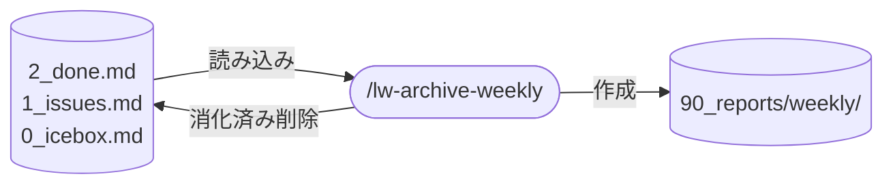

# llm-wiki-kit の lw-archive-weekly skill 設計

sprint review として、完了・確定・廃棄タスクを週次アーカイブに退避し盤面をリセットする `/lw-archive-weekly` の設計。
**本ページは決定根拠のみを持つ。**
実行手順・DONE / FADED の判定・エラーハンドリング表は `templates/.claude/skills/lw-archive-weekly/SKILL.md` が正本で、本ページに写さない。

## データフロー

図は入出力の要約。実際の読み書き対象は `templates/.claude/skills/lw-archive-weekly/SKILL.md` が正本。

## skill 名

`/lw-archive-weekly` 採用。
`lw-` prefix + 動作名(archive-weekly)で skill 群と整合。

## skill 配置

全 skill は project-local(`.claude/skills/` 配下)。
sprint review のソース(`2_done.md` / `1_issues.md` / `0_icebox.md`)と出力先(`90_reports/weekly/`)が llm-wiki-kit 固有のディレクトリ構造に依存するため global 化しない。

## 呼び出し制御

`disable-model-invocation: true`。
アーカイブは盤面をリセットする副作用の大きい操作。
週次の区切りで lead が明示的に起動する。

## 許可ツール

Read / Edit / Write の 3 つ。
Bash は不要(週次スパン計算は LLM が行い、ファイル操作は Read / Edit / Write で完結するため安全性が最大化される)。
`mkdir` も不要(Write ツールが親ディレクトリを自動作成するため `90_reports/weekly/YYYY/` が存在しなくても問題ない)。
具体的な用途は SKILL.md を参照。

## 要件

1 sprint = 1 week。
sprint の成果を `90_reports/weekly/` に退避し、盤面(`2_done.md`)をリセットする。
issue の `.90_fixed/` 保持(issue tracker 代替)とは別軸で、盤面は毎週リセット。
実行手順は SKILL.md が正本。

## 設計決定

### 階層構造保持

タスクは親子関係を持つことが多いため、セクション単位（ブロックベース）で抽出する。
行ベースで `[x]` だけ抽出すると親タスクが落ちて構造が崩れる。

### マージロジック(既存セクション名の尊重)

週次ファイルは手動編集される可能性がある。
標準形式に強制するとユーザー体験が悪化するため、パターンマッチで既存セクション名に対応付けて追記する。
具体的なセクション名は SKILL.md を参照。

### sprint review としての FIXED クリア

FIXED セクションを週次クリア対象にした理由: lead が scrum モデル（1 sprint = 1 week）を採用し、盤面を毎週リセットする運用を選択。
`.90_fixed/` にファイルとして保持する（issue tracker 代替）のは別軸の仕組みで、`2_done.md` の FIXED 一覧はスプリント単位の成果記録として weekly に退避する。

## エラーハンドリング

個別のケースは SKILL.md「エラーハンドリング」セクションが正本。

## 保守規律

- 本設計書と SKILL.md の同期: SKILL.md を変更したら本設計書の `updated:` も揃える
- アーカイブ対象ファイル(`2_done.md` / `1_issues.md` / `0_icebox.md`)の構造が変わったら SKILL.md の読み込み・削除ロジックを追従

## 関連

3 ファイル体制導入の経緯と scrum/sprint 運用の構想は、ワークスペース側の issue で検討された。
