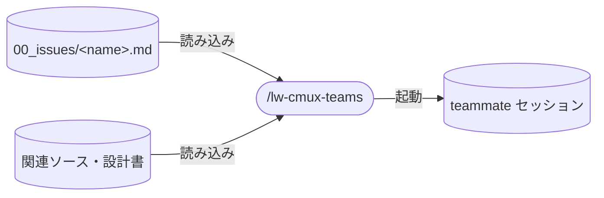

# llm-wiki-kit の lw-cmux-teams skill 設計

cmux 上で Agent Teams を使うための skill。
タスク内容を受け取りチーム構成を決定して teammate を spawn・管理する。
引数なしで呼ぶと fable advisor を 1 人立ち上げて待機する。

## データフロー

## skill 名

`/lw-cmux-teams` 採用。
`lw-` prefix + `cmux-teams` で Agent Teams の cmux 運用であることが名前で分かる。

## skill 配置

project-local(`.claude/skills/` 配下)。
チーム構成パターンやルール(触らないファイルリスト等)が llm-wiki-kit 固有の運用に依存するため global 化しない。

## 呼び出し制御

`disable-model-invocation: true`。
spawn のタイミングはユーザーが制御する。
teammate の起動は副作用が大きく(トークンコスト、ペイン占有)、自動起動は不適切。

## 許可ツール

Read + Agent + TaskCreate / TaskList / TaskUpdate + SendMessage。
teammate の spawn と管理に必要なツールに絞っている。
具体的な用途は SKILL.md を参照。

## 用語

用語定義は [[lw-kit-アーキテクチャ設計]] の用語集と SKILL.md を参照(lead / teammate / worker / advisor)。

## 要件

### 解決する課題

Agent Teams の lead セッションで毎回チーム構成や初期プロンプトを手打ちするのが面倒。
タスク内容を渡すだけで、チーム構成の決定から spawn・結果統合までやってほしい。
引数なしで呼んだ場合は fable advisor を立ち上げて issue の関連資料を読ませ、いつでも相談できる状態にしたい。

### ユーザー要件

1. `/lw-cmux-teams タスク内容` でチーム構成を決定し、teammate を spawn してくれる
2. `/lw-cmux-teams`（引数なし）で fable advisor を 1 人立ち上げ、WIP issue + 関連資料を読んで待機する
3. タスクの性質に応じてチーム構成（人数・役割）を提案してくれる
4. 全 teammate 完了後に結果を統合して報告してくれる

### 前提条件

- `cmux claude-teams` で起動済み（内部で `CLAUDE_CODE_EXPERIMENTAL_AGENT_TEAMS=1` + tmux shim + `--teammate-mode auto` が設定される。`--teammate-mode` を手動指定する必要はない）

## スコープ外

- cmux 本体の起動・セットアップ
- teammate として spawn されたあとの各エージェントの挙動制御

## 既知の制約

具体的な制約一覧は SKILL.md を参照。
設計上の注意点: session resume で in-process teammate は復元されない(再 spawn が必要)。チーム共有ディレクトリはセッション終了時に自動削除される。

## 実行フロー

全体像（3 ステップ）: `1. チーム構成決定` → `2. spawn` → `3. 結果統合`

TeamCreate / TeamDelete は v2.1.178 で廃止。暗黙チーム方式のため setup / cleanup ステップは不要。

### 1. チーム構成の決定

引数なし → advisor パターン。引数あり → チーム構成パターンから選択。

### 2. teammate の spawn

Agent ツール（foreground）で spawn する。cmux が各 teammate を別ペインに表示する。

具体的な引数・NG パターンは SKILL.md を参照。
NG の理由: cmux は tmux shim で `split-window` / `send-keys` 等を native API に翻訳しているため、Agent ツール経由でないとペイン連携が壊れる。

### 3. 結果の統合

全 teammate 完了後、結果をまとめて報告する。合意点・相違点がある場合は明示する。

## advisor パターン

引数なしのデフォルト動作。

設計意図: lead が issue ベースで作業する際、fable を advisor として常駐させておくことで、いつでも設計相談・レビュー・調査を依頼できる体制を作る。advisor は実行しない（lead が実行者）。

具体的な spawn 仕様は SKILL.md 参照。

advisor のモデルに fable を選んだ理由: 考え込まなくても賢い + コスト抑制（effort: medium と組み合わせ）。実作業は lead が行うので、advisor に opus は過剰。

## チーム構成パターン

具体的なパターン列挙は SKILL.md 参照。
パターン内で役割の抽象度は揃える（全員 `worker-N` か、全員役割名か）。

## ルール

具体的なルール一覧は SKILL.md が正本。

現行ルールの設計根拠:

- 最大 5 人: トークンコスト管理。公式推奨も 3-5 人
- 同一ファイル編集禁止: Agent Teams にはファイルロック機構があるが、競合検知は不完全。タスク分割で予防する方が確実
- モデル既定 sonnet / advisor は fable: コスト最適化。opus はユーザー明示指示時のみ
- 引数なし時に lead がタスクを決めない: 2026-05-22 の事故（文脈推測でタスクを勝手作成）の再発防止
- 二次委譲禁止: 同事故の派生（ユーザーが lead に直接依頼した作業を worker に回した）の再発防止
- 触らないファイルリスト: 2026-05-22 の事故（worker 4 名が log.md / index.md を勝手更新）の再発防止。fresh-context の teammate は CLAUDE.md のセルフチェックに従って正しく動くが、lead 集約方針と衝突する
- 一時 subagent の name なし spawn: `name` の有無が teammate（管理対象・SendMessage 宛先）と使い捨て subagent の境界になるため。name 付きで呼ぶと teammate 化する
- briefing に報告経路を書く: teammate のプレーンテキスト出力は lead に届かず、`SendMessage` を呼ばないと報告にならない。書かないと teammate は報告したつもりで待機し、lead 側には idle 通知だけが届く。idle は報告の不在を意味しないので、この状態は催促でも判別できない

## 運用 / Troubleshooting

v2.1.178+ の暗黙チーム + 自動 cleanup では、team_name 衝突 / leadSessionId 不整合 / inbox 誤配 / ゴースト累積は発生しない。

現行で起こり得る症状:

| 症状                       | 原因                                | 対処                                      |
| -------------------------- | ----------------------------------- | ----------------------------------------- |
| orphan tmux session が残る | セッション終了時の cleanup が不完全 | `tmux ls` + `tmux kill-session -t <name>` |
| teammate が応答しない      | API エラーで停止                    | teammate を再 spawn                       |
| 強制終了でプロセス残り     | Ctrl+C / kill で cleanup 未実行     | `ps` で確認・kill                         |

## 検証

3 ステップフローの smoke test。

### 前提

- `cmux claude-teams` で起動済み

### 手順

1. `/lw-cmux-teams`（引数なし）を実行
2. advisor（fable）が spawn され、cmux ペインに表示されることを確認
3. advisor が WIP issue + 関連資料を読んで「読み終わりました」と報告することを確認
4. advisor に質問を送り、応答が返ることを確認
5. セッション終了後、`ls ~/.claude/teams/` でチーム共有ディレクトリが自動削除されていることを確認

## 設計決定

### advisor パターンの採用

デフォルト（引数なし）を「汎用 worker 1 人」から「fable advisor 1 人」に変更。

却下した代替案:

- 汎用 worker 1 人（旧デフォルト）: advisor 専任でないため、lead が実作業を二次委譲する誘惑が生まれる。2026-05-22 の事故の一因
- advisor なし（skill 呼び出しのみ）: 引数なしの用途がなくなり、advisor 常駐の利便性を失う

### lead-prompt.md の廃止

パターン集を SKILL.md に統合し、lead-prompt.md を削除。

理由: Claude Code が標準でタスクリスト管理・セルフクレームを行うため、基本テンプレートの上乗せ価値がない。残るのはパターン列挙 40 行弱で、別ファイル + Read 1 回のコストに見合わない。

### TeamCreate / TeamDelete 廃止対応

v2.1.178 で両ツールが完全廃止。暗黙チーム方式に移行。

影響: team_name の命名規約・存在確認・registry 操作の作法が全て不要になり、フローが 3 ステップに圧縮された。

## 保守規律

- 本設計書と SKILL.md の同期: SKILL.md を変更したら本設計書の `updated:` も揃える。具体値(パターン列挙 / ルール一覧 / spawn 引数 / advisor 仕様)は SKILL.md が正本、設計書は why(設計根拠 / 却下代替案)を持つ
- Agent Teams API 変更時の追従: v2.1.178 で TeamCreate / TeamDelete が廃止されたように、API 変更があれば SKILL.md と設計書の両方を追従

## 関連

- [[lw-kit-アーキテクチャ設計]] — skill 群全体での位置づけ(ユーティリティ)

## 参考

### Agent Teams 公式ドキュメント

<https://code.claude.com/docs/en/agent-teams>

- チームサイズは 3-5 人が最適
- トークン消費は単一セッションの約 3-4 倍
- 表示モード: in-process（デフォルト）/ split panes（tmux / iTerm2）/ cmux

### everything-claude-code

Anthropic Hackathon 優勝。183 skill・48 エージェント搭載。
<https://github.com/affaan-m/everything-claude-code>

本 skill の設計に影響を与えたパターン:

- team-builder: discover → group → present → spawn → synthesize の流れ。結果統合ステップの着想元
- council: 4 視点（Architect / Skeptic / Pragmatist / Critic）を集約。アンチアンカリング機構あり
- dmux-workflows: tmux ベースの並列実行。lw-cmux-teams に最も近い構成
- エージェント定義: `agents/` に役割別 .md を配置し、spawn 時に読み込む方式
