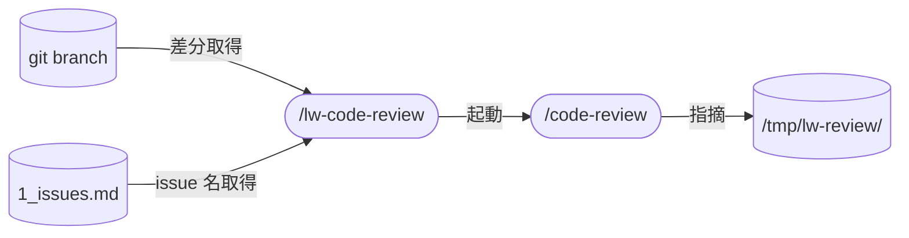

# llm-wiki-kit の lw-code-review skill 設計

組み込み `/code-review` のラッパー。
結果を `/tmp/lw-review/` に保存し、fix-review 経由で知見蓄積ループに乗せる。
本ページは設計判断の why を集約する。

## データフロー



## skill 名

`/lw-code-review` 採用。
組み込み `/code-review` のラッパーであることが名前で分かる。
`lw-` prefix で llm-wiki-kit skill 群と整合。

## skill 配置

project-local(`.claude/skills/` 配下)。
結果の保存先(`/tmp/lw-review/`)や fix-review との接続が llm-wiki-kit 固有の運用に依存するため global 化しない。

## 呼び出し制御

`disable-model-invocation: true`。
コードレビューは lead が明示的に起動する操作。
自動起動すると意図しないタイミングで `/code-review` が走り、トークンコストが発生する。

## 許可ツール

Read / Write + scoped Bash(`git branch:*` / `git symbolic-ref:*` / `date:*` / `mkdir:*`) + `Skill(code-review *)`。
最小権限に絞っている。
具体的なリストと用途は SKILL.md を参照。

## 要件

### 解決する課題

`/code-review --fix` は指摘を直接適用するため、採否判定を経由しない。
却下理由が残らないので、知見として蓄積できない。

fix-review を経由すれば、指摘ごとに採否 + 理由が記録され、一般化テストを通った知見が `feedback-知見-*.md` に蓄積される。
蓄積した知見のうち規則文に落とせるものを対象 repo の CLAUDE.md に昇格させれば、次回の `/code-review` が自動で引用・報告する。

このループを回すために、`/code-review` の結果を fix-review が拾える形で保存するラッパーが必要。

### ユーザー要件

1. `/lw-code-review` でブランチ差分を `/code-review` にレビューさせる
2. effort level を指定できる（デフォルト medium）
3. レビュー結果を `/tmp/lw-review/<issue-name>/` に Markdown で保存する
4. fix-review がその結果を拾い、採否判定 → 知見蓄積 → CLAUDE.md 昇格のループを回せる

## 知見蓄積ループ

ラッパーの存在意義の全体像。

```
/lw-code-review
    ↓
[1] /code-review 起動 → findings
    ↓
[2] /tmp/lw-review/ に保存
    ↓
[3] fix-review で採否判定（採用 / 却下 + 理由）
    ↓
[4] 蓄積判定（一般化テスト + 再導出テスト）
    → 通過した知見を feedback-知見-*.md に追記
    ↓
[5] 昇格判定: 規則文に落とせるか？
    → 候補を lead に相談
    → 承認されたら対象 repo の CLAUDE.md に追記
    ↓
[6] 次回 /code-review が CLAUDE.md から自動で拾う
    → ループが閉じる
```

役割分担:

- 知見ファイル(`feedback-知見-*.md`): why 込みの詳細台帳（llm-wiki-kit に集約）
- CLAUDE.md: 照合可能な規則だけの要約（対象 repo に配布）

ステップ 1-2 がラッパーの責務。ステップ 3-5 は fix-review の責務。ステップ 6 は組み込み `/code-review` の既存動作。

### なぜ CLAUDE.md 昇格か

組み込み `/code-review` のフィルタ基準は「確実なバグ」か「CLAUDE.md の正確なルールを引用できる違反」の 2 種のみ。
CLAUDE.md にない基準はフィルタで落とされる。
知見を次回レビューに注入する公式チャネルは CLAUDE.md だけ。

独自の注入機構を作ると組み込みのバージョンアップで壊れる脆い結合になる。
CLAUDE.md 昇格なら追加機構ゼロでループが閉じる。

### 昇格の判断基準

規則文に落とせるものを昇格候補とする（操作的テスト・判定基準の詳細は [[lw-kit-スキル設計-lw-fix-review]]）。
昇格候補は自走追記せず lead 相談に回す。

## スコープ外

- `--fix` の受け付け: fix-review の採否判定・蓄積導線を素通りするため
- `--comment` の受け付け: PR インラインコメントは `/code-review --comment` を直接使えばよい
- ultra effort: ユーザー起動限定・課金ありのため、ラッパーからは起動不可（直接 `/code-review ultra` を案内する）
- レビュー結果の自動コミット
- レビュー指摘の自動修正（fix-review の責務）

## 実行フロー

具体的な 3 ステップ(引数パース → `/code-review` 起動 → 結果保存 + サマリ報告)の手順・引数仕様・出力フォーマットは SKILL.md を参照。

## fix-review との接続

重要度は起動時の定型文で 4 段（必須 / 推奨 / 任意 / 確認）を要求し、fix-review のルーティング入力にそのまま渡す。
判定基準の文面と、要求する出力フォーマットは SKILL.md が正本。

`ReportFindings` は fork された agent に渡らないため、指摘は inline のテキストで返る。
構造化ツールのスキーマに依存せず、フォーマットの指示だけで契約を保つ設計になっている。

## 設計決定

### なぜ `/code-review` ラッパーか

組み込み `/code-review` は 8 角度 finder + verify の多段検証で品質が高い。
API キー管理も不要。
ラッパーの役割は結果の永続化と知見蓄積ループへの接続に絞る。

自前で観点別のエージェントを回す実装（peer 実装）と比較して選んだ。
同一 commit に両方をかけた実測で、組み込みは 1/4 のコストで同等以上の指摘を出し、peer 実装の finder が誰も出さなかった指摘も 1 件出した。
観点セットと effort の設計を自前で持たなくてよいぶん、skill の責務も小さくなる。

### なぜ重要度を引数で要求するか

fix-review のルーティングは重要度ラベルを入力にするが、組み込みが自主的に付けるラベルは 3 段（high / medium / low）で、プロンプトが要求したものではないため保証がない。
起動時の定型文で 4 段を指定すれば、そのとおりに返る。
同じ定型文で出力フォーマットまで指定することで、保存時の変換も不要になる。

ラベルが欠落した場合に skill 側で推測して補うことはしない。
欠落のまま保存して報告し、採否は fix-review が lead 相談に回す。

### なぜ `--fix` を受け付けないか

`--fix` は findings を直接 working tree に適用する。
採否判定を経由しないため、却下理由が残らず知見として蓄積できない。
知見蓄積ループがラッパーの存在意義なので、`--fix` を受け付けるとラッパーの目的と矛盾する。
修正は fix-review 経由で行う。

### なぜフォーマット統一をしないか

doc-review の 6 要素（層 / 位置 / 引用 / 指摘 / 提案 / 根拠）と code-review の 4 要素（位置 / 指摘 / 失敗シナリオ / 提案）は指摘の性質が異なる。
コードの指摘は引用より失敗シナリオが判断材料になり、層を持たない。

揃えるのは重要度ラベルの 4 段と、ヘッダ・見出し・サマリーの畳み方まで。
重要度は fix-review のルーティング入力なので揃える必要があり、その他は同じ読み方で扱えるようにするため。
指摘本体のフィールドは各 skill 固有のまま使う。

## オープン議題

- CLAUDE.md の肥大化対策: 昇格した規則が増えた場合の棚卸し（retro の走査対象に含める等）
- ラッパー独自の「知見 finder」追加: 規則文に落とせない知見（cross-file 検査、設計書との突合等）を検出する独自 finder を組み込みの後に追加で走らせる案。昇格方式でカバーできない残余が実際に出てから判断する

## 保守規律

- 本設計書と SKILL.md の同期: SKILL.md を変更したら本設計書の `updated:` も揃える
- `/code-review` の仕様変更時の追従: 組み込み skill の effort 体系や出力形式が変わったら SKILL.md と出力フォーマットセクションを追従

## 関連

- [[Claude-Code-Review-Plugin]] — `/code-review` の実装詳細（effort 別構成等）
- [[lw-kit-スキル設計-lw-doc-review]] — doc-review 設計書（出力フォーマットの参照）
- [[lw-kit-スキル設計-lw-fix-review]] — fix-review 設計書（入力形式の接続先、昇格判定の追加先）
