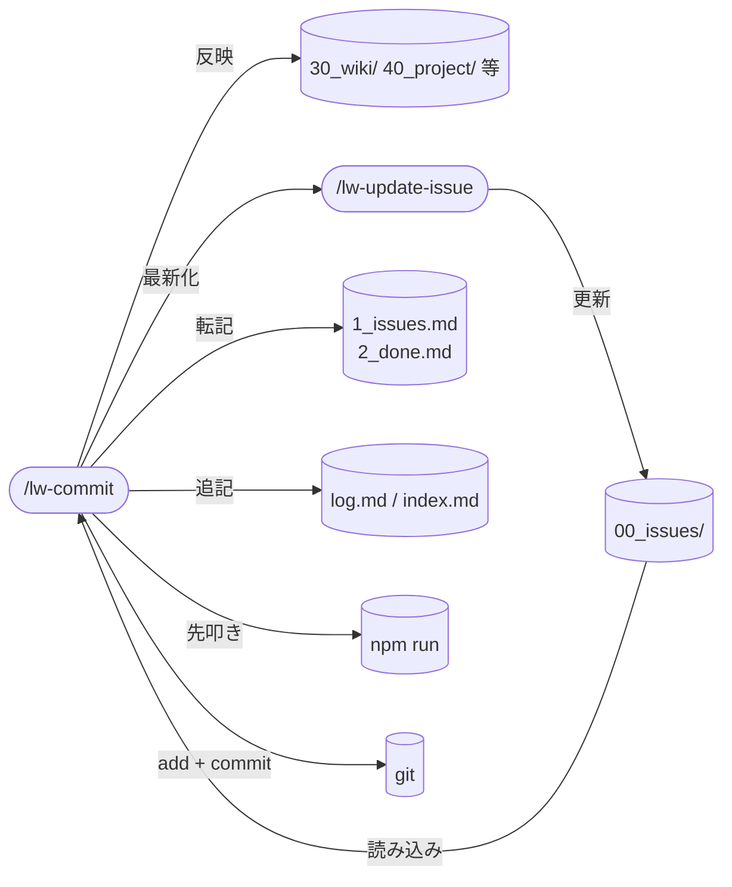

# llm-wiki-kit の commit skill 設計

`/lw-commit` skill の設計書。
commit という lead 発火の区切りに「観察の反映 + 最新化 + lint 先叩き + commit」を一括で実行する、畳む（活用）に専念する skill。現状の `commit plz` を 1 語に畳み、観察の反映 / issue 最新化 / `1_issues.md` / `2_done.md` / log・index / lint 先叩き / add / commit までを束ねる。
観察の掘り起こし・候補提示（棚卸し）は探索の所作として [[lw-kit-スキル設計-lw-retro]]（`/lw-retro`）が持つ。反映の実行（page / memory への書き込み）は `/lw-commit` の step1 が持つ。何を反映すべきかを見つける探索と、反映の実行を含む一括の活用（commit）を分ける（探索・活用の分離）。
本ページは設計判断の why を集約する。実行手順の how は SKILL.md を参照。

型は [[lw-kit-スキル設計-lw-fix-review]]（why 集約）+ [[lw-kit-スキル設計-lw-render]]（project-local skill 設計書 + SKILL.md スケルトンの先例）に倣う。

## データフロー



## skill 名

`/lw-commit` 採用。現状の `commit plz` の置き換えとして動作が最も素直で直感的。

| 候補         | 意味                     | 採否                                                                                       |
| ------------ | ------------------------ | ------------------------------------------------------------------------------------------ |
| `/lw-commit` | コミット（動作そのまま） | 採用。`commit plz` の直接の置き換え、何が起きるか名前で分かる                              |
| `/seal`      | 封をする（世界観案）     | 不採用。llm-wiki-kit の雨 / 制作工程の世界観には合うが「commit」より動作が一段わかりにくい |

[[lw-kit-スキル設計-lw-render]] の `/lw-render` は世界観名（wiki で絵を完成させる比喩）を採ったので命名方針が不揃いになるが、commit は副作用が重く lead が「いま何が起きるか」を取り違えると事故るため、世界観の統一より直感性を優先する。

## skill 配置

全 skill は project-local（`.claude/skills/` 配下）。

- 実体: SKILL.md（`.claude/skills/lw-commit/SKILL.md`）
- 設計書: 本ページ（`docs/lw-kit/40_スキル設計/`、[[lw-kit-スキル設計-lw-render]] が拓いた project-local skill の設計書 wiki 化の先例に倣う）
- ディレクトリ名 `commit` と frontmatter `name: commit` を揃える

global 化しない理由: 手順の中身が llm-wiki-kit 固有規約に密結合している。

- `type(project)` の project を主旨で決めるルール（CLAUDE.md の Git 規約、[[lw-kit-詳細設計-CLAUDE.md]]）
- issue（`00_issues/`）の 💧 進行中 / 🌂 中断点 / ☔ TODO 更新
- log.md / index.md のターン終了前セルフチェック
- `1_issues.md` / `2_done.md` / `0_icebox.md` 運用

他プロジェクトに持ち出してもこれらが無く意味をなさない。

旧 skill のような `30_series/.../skill/<name>/` 同居はしない（project-local 配置、`.claude/skills/` 配下）。

## 呼び出し制御

`disable-model-invocation: true` を付け、Claude の自動起動を禁止する（`/lw-commit` のユーザー明示起動のみ）。

根拠:

- commit は副作用が極めて大きい（複数ファイルの Edit + `git add` + `git commit`）
- 「commit は作業完了で lead 判断を委ねる」が大前提（`50_feedback/feedback-観察-作業スタイル.md`（ワークスペース側） の観察）。自動起動すると lead 判断の区切りを skill が奪う
- `/lw-commit` を叩く = 今の `commit plz` の置き換え、という運用に限定すれば自動 commit を避ける運用と完全整合
- 先例: 同じく副作用の大きい [[lw-kit-スキル設計-lw-fix-review]] / `/lw-render` も `disable-model-invocation: true`

SKILL.md の `description` は [[Claude-Code-Skillの書き方]] の英語・third person 規約に反して日本語のまま維持する。
`disable-model-invocation: true` で description は model の自動起動判定 context に載らない（手動 `/lw-commit` 起動のみ）ため、英語化の実利が無いと判断した。
将来 model 自動起動を有効化する場合は英語・三単現に直す。

## 許可ツールの最小化

汎用 `Bash` は使わず、コマンド単位で粒度を絞る（[[lw-kit-スキル設計-lw-render]] の `Bash(wc:*)` 限定と同方針）。

Read / Edit / Write + scoped Bash(`git add` / `git status` / `git diff` / `npm run` / `grep` / `ls`)。
Write の用途: 反映ステップ(1)での新規 page 作成(`30_wiki/<title>.md` / `40_project/<案件>/<title>.md`)。既存 page への軽微な反映は Edit、新規作成は Write を使う。
具体的なリストと用途は SKILL.md を参照。

### `git commit` を意図的に非許可にする

`Bash(git commit:*)` は allowed-tools に**含めない**。これが本 skill の設計上の要点。

- allowed-tools に列挙したコマンドは skill 実行中 permit prompt なしで通る。`git commit` を外すと commit 実行時だけ通常の permit gate に落ち、ユーザー確認が走る
- これは「skill には最新化 / add / lint 先叩きまで自走させてよいが、commit 時だけはユーザーが別ターミナルで作業内容を確認してから通す」という運用要件（`50_feedback/feedback-観察-作業スタイル.md`（ワークスペース側） / CLAUDE.md の add は allow / commit は deny 規約、[[lw-kit-詳細設計-CLAUDE.md]]）を、skill 自身の宣言として明示する形
- ユーザー側 permit 設定（settings.json の deny）にも依存せず、skill 単体で gate が成立する。「skill は自動 commit しない」を allowed-tools が自己文書化する
- 全 8 ステップの step 8（commit）は message を生成して `git commit` を呼ぶが、ここで必ずユーザー確認に止まる。初回 add（step 5）と commit（step 8）を別ステップにする設計（`&&` で繋がない）と整合する

## 既存 commit 規約との関係（参照と転記のレイヤー分け）

commit 関連の記述は 6 箇所に散らばっている。`/lw-commit` はこれを束ねるが、全部コピーはしない。

| 箇所                                                            | 内容                                                                                                                                                        | 性質                           |
| --------------------------------------------------------------- | ----------------------------------------------------------------------------------------------------------------------------------------------------------- | ------------------------------ |
| CLAUDE.md グローバル（[[lw-kit-詳細設計-CLAUDE.md]]）           | git 運用（add と commit を別呼び出し、`&&` 禁止 = permit gate）/ メッセージの書き方（Conventional Commits 風 / 本文日本語 / `Co-Authored-By` trailer 英語） | 全プロジェクト共通の普遍ルール |
| CLAUDE.md Git 節（[[lw-kit-詳細設計-CLAUDE.md]]）               | `type(project)` 形式 / type 一覧 / project 決定ルール（主旨優先）/ remote push 禁止                                                                         | llm-wiki-kit 固有規約          |
| `lefthook.yml`                                                  | pre-commit: format（`prettier --write` + `git add`）/ lint:md（`markdownlint-cli2`）                                                                        | 実行コマンドの実体             |
| [[lw-kit-詳細設計-CLAUDE.md]]                                   | commit 規約の why（type 好み / project 命名根拠 / ブランチ戦略 / push 禁止理由）                                                                            | 規約の設計判断                 |
| [[lw-kit-詳細設計-Markdown環境]]                                | lefthook の設計判断（pre-commit のみ / 2 ジョブ / push 禁止整合）                                                                                           | hook の設計判断                |
| `50_feedback/feedback-観察-作業スタイル.md`（ワークスペース側） | commit type 好み / add・commit 別コマンド / 「commit は作業完了で lead 判断を委ねる」                                                                       | 観察データ                     |

### レイヤーで分ける（全コピーでも全参照でもない）

- 規約の why → SSOT は [[lw-kit-詳細設計-CLAUDE.md]]（CLAUDE.md グローバル / プロジェクト双方を含む）。SKILL.md は参照を向けるだけ。手動 commit でも効く普遍ルールを skill にコピーすると、skill を使わない commit で規約が二重管理になり実態と乖離する
- 実行時に必要な確定文言 → SKILL.md に転記する。実行時 context として手元に無いと動けないもの:
  - type 一覧（`feat` / `fix` / `refactor` / `chore` / `docs`）
  - project 決定の判断手順（主旨優先 / 変更数で上書きしない）
  - 先叩きコマンド（`npm run format:fix` / `npm run lint:md`、package.json scripts 経由。permit 集約・スコープ差・再 add 分岐は「lefthook 先叩きの狙い」が正本、lefthook hook 側の staged コマンドは `lefthook.yml` が SSOT）
- `Co-Authored-By:` trailer は転記も手書きもしない → Claude Code の attribution（`settings.json` の `attribution.commit`、未設定ならデフォルトで自動付与）が commit 時に付ける。message 本文に手書きすると二重付与になる。trailer のモデル名・バージョン文字列は Claude Code 内部が決めるので、固定文字列を持つと保守漏れにもなる（[[Claude-Code-settings.json]] 参照）

[[lw-kit-スキル設計-lw-render]] の保守規律「SKILL.md は実行時 context なので確定文言の重複保持が必要」（[[Progressive-Disclosure]] の限界）と同じ理屈。

## 全 8 ステップの実行順と why

```text
1. 反映 → 2. issue 最新化 → 3. 1_issues/2_done → 4. log/index
  → 5. git add（permit gate）→ 6. lefthook 先叩き → 7. 差分確認 gate → 8. 再 add・commit（permit gate）
```

| #   | ステップ               | 内容                                                                                                                                                   | 順序の根拠                                                                                                                                                                                          |
| --- | ---------------------- | ------------------------------------------------------------------------------------------------------------------------------------------------------ | --------------------------------------------------------------------------------------------------------------------------------------------------------------------------------------------------- |
| 1   | 反映                   | 前回 commit 以降のセッション観察を反映先 page へ反映（自走度 2 段、後述「反映の自走度」）                                                              | 先頭に置く。観察の反映を実作業の add より前に済ませておくと、以降の issue 最新化・転記・log/index 更新とあわせてハウスキーピング編集が出揃い、step5 の add で一度に staged 化できる                 |
| 2   | issue 最新化（ガード） | issue が最新化されているか確認し、未更新なら `/lw-update-issue` を起動。自分では issue を編集しない。TODO 全完了の issue は FIXED 化判断を lead に確認 | 反映（1）の直後に置く。反映で洗い出した作業内容を踏まえて issue の整合を確認する流れが自然。更新ロジックは `/lw-update-issue` に一本化し、🪣 経緯への降ろしが commit 前に必ず行われることを保証する |
| 3   | 1_issues/2_done        | step2 の結果を転記（FIXED 化 → `1_issues.md` 削除 + `2_done.md` 追記、TODO 全完了 → `[x]`）。step2 変化なしなら skip                                   | step2 の状態変化に連動して機械的に転記。判定は step2 の結果に依存し曖昧さがない                                                                                                                     |
| 4   | log / index            | ターン終了前セルフチェック相当                                                                                                                         | 1-3 のファイル増減を記録、add（5）に含める直前に確定                                                                                                                                                |
| 5   | git add（初回）        | 反映・issue 最新化・転記・log/index で動いた実作業ファイルを関連ファイル明示列挙で staged に上げる（permit gate）                                      | ハウスキーピング編集（1-4）が出揃った後に置く。一度の add 呼び出しで今回セッションの変更を網羅でき、以降の先叩き・commit の前提が固定される                                                         |
| 6   | lefthook 先叩き        | `npm run format:fix`（精査せず自走）+ `npm run lint:md`（内容確認）、repo 全体                                                                         | pre-commit hook で弾かれる前に潰す、commit 前に置く                                                                                                                                                 |
| 7   | 差分確認 gate          | 先叩き（6）の `format:fix` で staged 済みファイルに変更が出た場合、再 add の前に `git diff` を提示して lead 確認を待つ。差分なしならそのまま 8 へ      | `format:fix` は内容を書き換えうるため、再 add に進む前に変更内容をその場で lead に見せる。commit permit gate（terminal）任せにせず、format 整形起因の差分に絞った専用の確認点を置く                 |
| 8   | 再 add・commit         | 7 を通過したら再 `git add` → `type(project)` で message 生成 → `git commit`                                                                            | add（5）と別ステップにして permit gate を維持、最後。commit 自体の最終確認は commit permit gate（terminal）が担う                                                                                   |

順序の根拠は上表の「順序の根拠」列に集約した（先叩きを commit 前に挟む理由の詳細は「lefthook 先叩きの狙い」）。

本文で 2 点だけ補強する。

1. 初回 add（5）と commit（8）を別ステップにするのは permit gate を維持するため。CLAUDE.md の git 運用規約（[[lw-kit-詳細設計-CLAUDE.md]]）/ `50_feedback/feedback-観察-作業スタイル.md`（ワークスペース側） の「add は allow / commit は deny で `git diff` 確認の gate」運用を skill 内でも崩さない（`&&` で 1 行にまとめない）。この commit permit prompt が最終的な内容確認 gate として機能する（先叩き起因の差分は 7 の差分確認 gate が別途担う。詳細は「ハウスキーピング差分の扱い」）。
2. 観察の掘り起こし（棚卸し）自体は探索の所作で [[lw-kit-スキル設計-lw-retro]]（`/lw-retro`）が持つが、反映の実行（page / memory への書き込み）は `/lw-commit` の step1 が持つ（探索・活用の分離、[[探索・活用ジレンマ]]）。
   当初は反映の実行そのものも retro 側へ完全に移す案を検討した（棚卸し＝探索の所作で、活用フロー `/lw-commit` に同居させると greedy に倒れて autopilot が機能しない懸念があったため）。ただし実装では反映の実行を commit の step1 に残し、retro は観察の掘り起こし・候補提示に閉じる形に落ち着いている。完全移管に至らなかった経緯は記録に残っていない（設計書側だけが移管を前提に書かれ、実装が追従しないまま乖離していた）。同じ議論を再燃させる前に、まず現行の自走度 2 段（新規 page / memory 保存は lead 確認必須）で反映漏れが実際に起きているかを見ること。

## 反映の自走度

`/lw-commit` step1（反映）の自走度は 2 段に分かれる（具体的な判定・手順は SKILL.md「反映」節が SSOT、本節は why のみ）。

- 軽微（既存 page への事例追記レベル）→ 自走 Edit（確認なし）。rules の骨子確認規律（[[lw-kit-詳細設計-rules]]）の「既存ファイルへの軽微な Edit / 行追記」に相当
- 新規 page 作成 / memory 保存 / 主要セクション書き換え → 骨子・要点を提示して lead 確認を挟む（同規律の骨子確認必須側に相当）。memory 保存は今回限りの指示と長期方針の区別が lead にしか付かないため、必ず確認する

step2（issue 最新化）以降で触る issue 最新化 / TODO・ICEBOX / log・index の更新は、いずれも既存ファイルへの軽微な Edit / 行追記に相当し自走 OK（rules の骨子確認規律の「log・index の都度追記」も参照）。

## lefthook 先叩きの狙い

pre-commit hook は 2 ジョブ（`lefthook.yml`、設計判断は [[lw-kit-詳細設計-Markdown環境]]）:

- `format`: `npx prettier --write {staged_files}` の後 `git add {staged_files}`
- `lint:md`: `npx markdownlint-cli2 {staged_files}`（エラーで commit 停止）

commit が hook で弾かれる前に、同じツールを先に走らせる。先叩きは package.json scripts 経由で叩く:

- `npm run format:fix`（= `prettier --write . --log-level warn`）
- `npm run lint:md`（= `markdownlint-cli2 '**/*.md'`）

先叩きが意味を持つ前提として、hook と先叩きは同一 version を使う。hook 側を `npx markdownlint-cli2`（ローカル `node_modules` の project-pin 版）にしてあり、`npm run lint:md` と同じバイナリを叩く（裸の `markdownlint-cli2` だと PATH 上の global を拾って version がずれ、先叩き 0 error でも hook で落ちる。詳細は [[lw-kit-詳細設計-Markdown環境]]「hook は project-pin のローカル版を使う」）。

`format:fix` の `--log-level warn` は先叩き時の全ファイル列挙が context window を埋めるのを防ぐため（根拠は [[lw-kit-詳細設計-Markdown環境]] の prettier 設定根拠）。

`npm run` 経由にする理由: permit を `Bash(npm run:*)` 一本に集約でき、コマンド定義を package.json に一本化できる（先叩きと lefthook で個別文言を二重管理しない）。`git commit` 非許可と組み合わせて「add・先叩きは自走 / commit だけ確認」が成立する。

スコープの注意: package.json scripts は repo 全体対象（`.` / `**/*.md`）で、lefthook hook の `{staged_files}`（staged のみ）とは範囲が違う。先叩きは「commit 前の網羅チェック + format 差分の事前確認」が役割なので repo 全体で問題なく、最終的な staged-only の権威チェックは commit 時の lefthook が担う。

狙いは 2 つ:

- commit 失敗前にエラー把握: markdownlint エラーがあれば commit が止まる。先叩きで潰してから commit すればやり直しが減る
- format 差分の事前把握: `format:fix` が走ると内容が変わる。Claude は動いたファイルを `git status` で把握し一言報告する（差分の扱いは「ハウスキーピング差分の扱い」が正本）

### 先叩きの確認粒度を分ける

先叩き 2 ジョブで lead 確認の重みを変える:

- `format:fix` の再整形差分は精査せず自走で扱う（prettier は内容を大きく変えない前提、空白パディング等が主）
- `lint:md` は内容を確認してエラーを潰す

### ハウスキーピング差分の扱い

反映・issue 最新化・転記・log/index（1-4）のハウスキーピング編集は初回 add（5）で staged に固定される。
その後 lefthook 先叩き（6）の `format:fix` が staged 済みファイルを書き換えることがあり、これは commit permit gate 任せにせず、差分確認 gate（7）で独立に確認する。

- `format:fix` は内容を書き換えうる（prettier は空白パディング等が主だが、書き換えが起きた事実そのものは commit 前に lead へ明示する）ため、再 add に進む前にその場で `git diff` を提示し lead 確認を待つ
- 対象を絞る効用: ハウスキーピング編集自体は 1-4 の各ステップで都度「該当なし / 変更あり」を一言報告済みなので、7 の `git diff` は「先叩き整形が staged ファイルに加えた差分」に絞られ、レビュー対象が明確になる
- 「format のみは自動 / 内容変更は確認」のような if 分岐は作らない。差分が出たら一律 lead 確認に倒す
- lead ok を待つまで再 add（8）に進まない

再 add の流れ:

- 先叩き整形で差分ゼロ → そのまま 8（commit）へ
- 差分あり（`format:fix` 整形）→ `git status` で `MM` のファイルを特定し `git diff` を提示 → lead 確認を待つ → 再 add → commit

## 各ステップ該当なし時の挙動

ステップ 1-4 は該当なしが普通（軽い commit では観察の反映 / issue 最新化 / `1_issues.md` / `2_done.md` 更新 / log 増減が不要なケースが多い）。

- 各ステップは「該当なければ skip + 一言報告」設計にする
- 暗黙完了しない（[[lw-kit-スキル設計-lw-fix-review]] の「採用 0 件もサマリーを出す」と同思想）
- 例: 「反映: 該当なし」「issue 最新化: 未完了 issue 一巡、変化なし」「1_issues / 2_done: 該当なし」と明示してから次へ

## エラーハンドリング

具体的なケース表は SKILL.md を参照。
方針: リトライ / 自動回復は持たない(lead 投げで十分)。
反映（step1）で判断に迷う場合は要確認側に倒す(聞く方が安い、「反映の自走度」参照)。

## Skill 化を採る根拠

[[lw-kit-詳細設計-CLAUDE.md]] は「commit の Skill 化: CLAUDE.md に数行書けば足りる → 不要」を不採用案として挙げるが、本ページは Skill 化を採る。根拠:

1. commit という区切りの定型作業（観察の反映 / issue 最新化 / `1_issues.md` / `2_done.md` / log・index / lint 先叩き / add / commit）を 1 語に束ねられ、毎回の手作業の漏れ（log 追記忘れ等）を防げる
2. `commit plz` の置き換えとして起動が素直で、permit gate（add allow / commit deny）を skill の allowed-tools として自己文書化できる
3. 模倣 dry-run（`60df941`）で手順を検証済み

[[lw-kit-詳細設計-CLAUDE.md]] の当該不採用案は本ページ採用に伴い解消する（追従はワークスペース側の issue が持つ）。

## 保守規律

- 本設計書と SKILL.md の同期: SKILL.md を変更したら本設計書の `updated:` も揃える。why が変われば設計書、how が変われば SKILL.md、どちらかが変わったら他方も確認
- `lefthook.yml` 変更時の追従: pre-commit のジョブ / `run` コマンドが変わったら SKILL.md の lefthook 先叩きコマンドと「lefthook 先叩きの狙い」を更新
- commit 規約変更時の追従: CLAUDE.md の type 一覧 / project 決定ルール（[[lw-kit-詳細設計-CLAUDE.md]]）が変わったら SKILL.md の転記文言を追従（trailer は attribution 自動付与に委ねるので追従不要、[[Claude-Code-settings.json]] 参照）
- ミスドリブン更新: `/lw-commit` を回して失敗が見つかったら、該当する設計セクション（「各ステップ該当なし時の挙動」/「lefthook 先叩きの狙い」/「エラーハンドリング」等）か SKILL.md の手順に平坦に溶かし込む（Boris Cherny 方式）。発見の日付や commit 履歴を積み上げる形では書かない
- 探索・活用の境界追従: `/lw-retro` 側で観察の掘り起こし・候補提示の範囲が変わったら [[lw-kit-スキル設計-lw-retro]] と本ページの探索・活用の分離の記述を相互に追従
- `/lw-commit` 自身は反映先 / issue / log / index / `1_issues.md` / `2_done.md` の更新以外のファイルを触らない（commit フローに閉じる）

## 関連

- [[lw-kit-スキル設計-lw-retro]] — 観察の掘り起こし・候補提示の委譲先（探索・活用の対、畳む前の振り返り。反映の実行自体は本 skill の step1 が持つ）
- [[探索・活用ジレンマ]] — 観察の掘り起こし（探索）と反映の実行（活用）を分ける理論的裏づけ（exploration collapse）
- [[lw-kit-スキル設計-lw-fix-review]] — 設計書の型（why 集約）+ 呼び出し制御 + 自走採否の先例
- [[lw-kit-スキル設計-lw-render]] — project-local skill の設計書 wiki 化 + SKILL.md スケルトンの先例
- [[lw-kit-詳細設計-CLAUDE.md]] — commit 規約の why（「Skill 化を採る根拠」で当該不採用案を覆す）
- [[lw-kit-詳細設計-Markdown環境]] — lefthook の設計判断
- `50_feedback/feedback-観察-作業スタイル.md`（ワークスペース側） — commit type 好み / add・commit 別コマンド / lead 判断委譲の観察データ
- [[lw-kit-詳細設計-CLAUDE.md]] — commit 規約（`type(project)` 主旨優先）+ ターン終了前セルフチェック
- `lefthook.yml` — pre-commit の実行コマンド実体
- [[lw-kit-アーキテクチャ設計]] — skill 群全体での位置づけ（背骨チェーンの「畳む」段）
