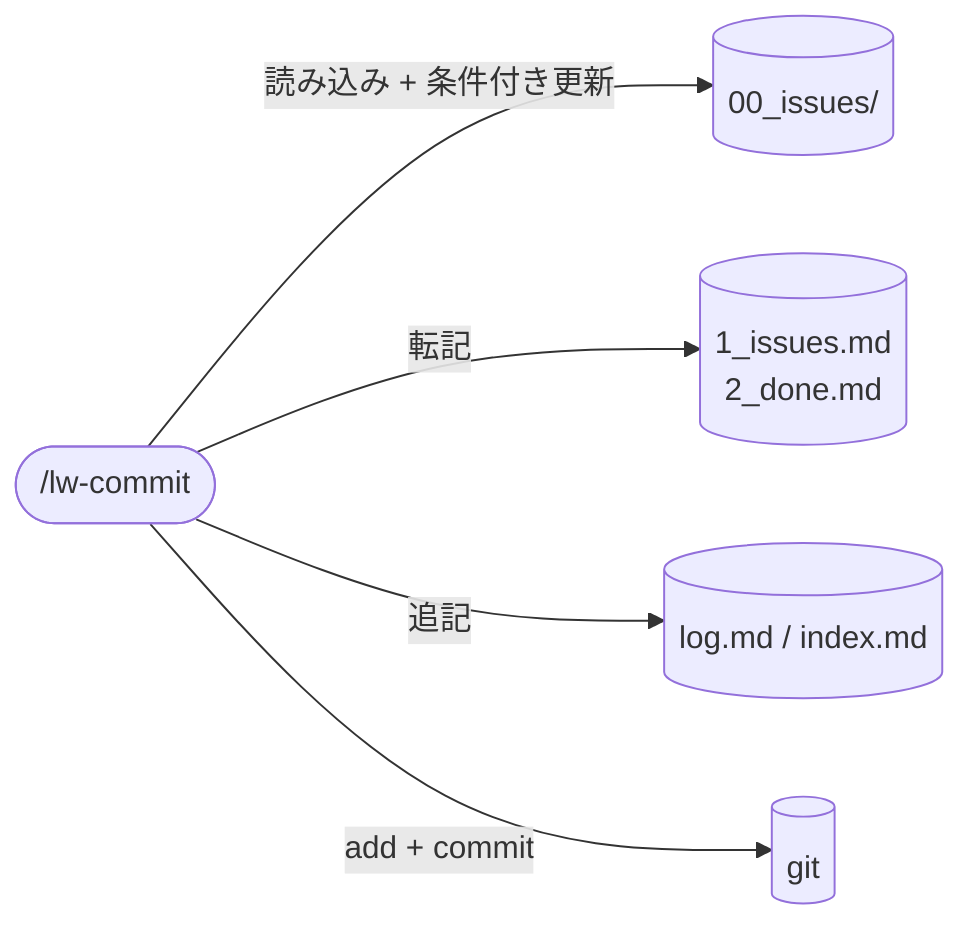

# llm-wiki-kit の commit skill 設計

`/lw-commit` skill の設計書。
commit という lead 発火の区切りに「issue 最新化の確認 + 記録 + add + commit」を一括で実行する、畳む（活用）に専念する skill。
現状の `commit plz` を 1 語に畳み、issue 最新化の確認 / `1_issues.md` / `2_done.md` / log・index / add / commit までを束ねる。
観察の掘り起こしと反映の実行（page / memory への書き込み）は探索の所作として [[lw-kit-スキル設計-lw-retro]]（`/lw-retro`）が持つ。
何を反映すべきかを見つける探索と、畳む活用（commit）を分ける（探索・活用の分離、[[探索・活用ジレンマ]]）。
**本ページは決定根拠のみを持つ。**
実行手順・確定文言・エラーケースは `templates/.claude/skills/lw-commit/SKILL.md` が正本で、本ページに写さない。

型は [[lw-kit-スキル設計-lw-fix-review]]（why 集約）+ [[lw-kit-スキル設計-lw-render]]（project-local skill 設計書 + SKILL.md スケルトンの先例）に倣う。

## データフロー

## skill 名

`/lw-commit` 採用。
現状の `commit plz` の置き換えとして動作が最も素直で直感的。

| 候補         | 意味                     | 採否                                                                                       |
| ------------ | ------------------------ | ------------------------------------------------------------------------------------------ |
| `/lw-commit` | コミット（動作そのまま） | 採用。`commit plz` の直接の置き換え、何が起きるか名前で分かる                              |
| `/seal`      | 封をする（世界観案）     | 不採用。llm-wiki-kit の雨 / 制作工程の世界観には合うが「commit」より動作が一段わかりにくい |

[[lw-kit-スキル設計-lw-render]] の `/lw-render` は世界観名（wiki で絵を完成させる比喩）を採ったので命名方針が不揃いになるが、commit は副作用が重く lead が「いま何が起きるか」を取り違えると事故るため、世界観の統一より直感性を優先する。

## skill 配置

全 skill は project-local（`.claude/skills/` 配下）。

- 実体: SKILL.md（`.claude/skills/lw-commit/SKILL.md`）
- 設計書: 本ページ（`docs/lw-kit/40_スキル設計/`、[[lw-kit-スキル設計-lw-render]] が拓いた project-local skill の設計書 wiki 化の先例に倣う）
- ディレクトリ名 `lw-commit` と frontmatter `name: lw-commit` を揃える（`lw-` prefix は built-in skill との衝突回避、[[Claude-Code-Skillの書き方]]「配置場所」）

global 化しない理由: 手順の中身が llm-wiki-kit 固有規約に密結合している。

- `type(project)` の project を主旨で決めるルール（CLAUDE.md の Git 規約、[[lw-kit-詳細設計-CLAUDE.md]]）
- issue（`00_issues/`）の 💧 進行中 / 🌂 中断点 / ☔ TODO 更新
- log.md / index.md のターン終了前セルフチェック
- `1_issues.md` / `2_done.md` / `0_icebox.md` 運用

他プロジェクトに持ち出してもこれらが無く意味をなさない。

## 呼び出し制御

`disable-model-invocation: true` を付け、Claude の自動起動を禁止する（`/lw-commit` のユーザー明示起動のみ）。

根拠:

- commit は副作用が極めて大きい（複数ファイルの Edit + `git add` + `git commit`）
- 「commit は作業完了で lead 判断を委ねる」が大前提（`50_feedback/feedback-観察-作業スタイル.md`（ワークスペース側） の観察）。自動起動すると lead 判断の区切りを skill が奪う
- `/lw-commit` を叩く = 今の `commit plz` の置き換え、という運用に限定すれば自動 commit を避ける運用と完全整合
- 先例: 同じく副作用の大きい [[lw-kit-スキル設計-lw-fix-review]] / `/lw-render` も `disable-model-invocation: true`

SKILL.md の `description` は日本語のまま維持する。
[[Claude-Code-Skillの書き方]]「呼び出し制御」セクションが `disable-model-invocation: true` の skill に認めている例外に従う（description は model の自動起動判定 context に載らないので、英語化の実利がない）。
将来 model 自動起動を有効化する場合は英語・三単現に直す。

同じ制御が `/lw-update-issue` と `/lw-retro` にも掛かっている。
`/lw-commit` から他 skill を呼び出す設計にはできないので、issue の最新化は手順の有無で動きを分ける（「全 3 ステップの実行順と why」参照）。

## 許可ツールの最小化

汎用 `Bash` は使わず、コマンド単位で粒度を絞る（[[lw-kit-スキル設計-lw-render]] の `Bash(wc:*)` 限定と同方針）。

Read / Edit + コマンド単位に絞った Bash。
Write は持たない（page の新規作成は `/lw-retro` の責務で、本 skill が触るのは既存ファイルへの追記だけ）。
issue の一巡と日時の実測に要るコマンドだけを個別に許可する。
許可リストの具体値は SKILL.md が正本。
設計書に写すと、SKILL.md 側で増減したときに気づかず乖離する。

### `git commit` を意図的に非許可にする

`Bash(git commit:*)` は allowed-tools に**含めない**。
これが本 skill の設計上の要点。

前提にしている運用要件は「`git add` は許可、`git commit` は毎回ユーザー確認」。
利用側の観察台帳を読まなくてもこの 1 行で設計判断が辿れるよう、ここに書いておく。

- allowed-tools に列挙したコマンドは skill 実行中 permit prompt なしで通る。`git commit` を外すと commit 実行時だけ通常の permit gate に落ち、ユーザー確認が走る
- これは「skill には最新化 / add まで自走させてよいが、commit 時だけはユーザーが別ターミナルで作業内容を確認してから通す」という運用要件（`50_feedback/feedback-観察-作業スタイル.md`（ワークスペース側） / CLAUDE.md の add は allow / commit は deny 規約、[[lw-kit-詳細設計-CLAUDE.md]]）を、skill 自身の宣言として明示する形
- ユーザー側 permit 設定（settings.json の deny）にも依存せず、skill 単体で gate が成立する。「skill は自動 commit しない」を allowed-tools が自己文書化する
- ステップ 3（commit）は message を生成して `git commit` を呼ぶが、ここで必ずユーザー確認に止まる。add（ステップ 2）と commit（ステップ 3）を別ステップにする設計（`&&` で繋がない）と整合する

## 既存 commit 規約との関係（参照と転記のレイヤー分け）

commit 関連の記述は、規約と実行の実物 4 つと、その why を持つ設計書 2 本に分かれている。
`/lw-commit` はこれを束ねるが、全部コピーはしない。

| 実物                                                                                | 内容                                                                                                                        | 性質                   | why の所在                       |
| ----------------------------------------------------------------------------------- | --------------------------------------------------------------------------------------------------------------------------- | ---------------------- | -------------------------------- |
| `~/.claude/CLAUDE.md`（kit の配布対象外）                                           | git 運用（add と commit を別呼び出し、`&&` 禁止 = permit gate）/ メッセージの書き方（Conventional Commits 風 / 本文日本語） | 利用者個人の普遍ルール | —                                |
| `.claude/CLAUDE.md` Git 節                                                          | `type(project)` 形式 / type 一覧 / project 決定ルール（主旨優先）                                                           | llm-wiki-kit 固有規約  | [[lw-kit-詳細設計-CLAUDE.md]]    |
| `lefthook.yml`                                                                      | pre-commit: format（`prettier --write` + `git add`）/ lint:md（`markdownlint-cli2`）                                        | 実行コマンドの実体     | [[lw-kit-詳細設計-Markdown環境]] |
| `50_feedback/feedback-観察-作業スタイル.md`（利用側で蓄積する観察台帳。配布版は空） | commit type 好み / add・commit 別コマンド / 「commit は作業完了で lead 判断を委ねる」                                       | 観察データ             | —                                |

why 列が指す設計書 2 本は規約そのものを持たない。
[[lw-kit-詳細設計-CLAUDE.md]] は type 選好・project 命名の根拠を、[[lw-kit-詳細設計-Markdown環境]] は hook を pre-commit のみ 2 ジョブにした判断を持つ。

例外が 1 つある。remote push 禁止は実物側に規約文が無く、[[lw-kit-詳細設計-CLAUDE.md]] の判断と、`setup.sh` が remote を設定しないことで担保される。

### レイヤーで分ける（全コピーでも全参照でもない）

- 規約の why → SSOT は [[lw-kit-詳細設計-CLAUDE.md]]（CLAUDE.md グローバル / プロジェクト双方を含む）。SKILL.md は参照を向けるだけ。手動 commit でも効く普遍ルールを skill にコピーすると、skill を使わない commit で規約が二重管理になり実態と乖離する
- 実行時に必要な確定文言 → SKILL.md に転記する。実行時 context として手元に無いと動けないもの:
  - type 一覧
  - project 決定の判断手順（主旨優先 / 変更数で上書きしない）
- `Co-Authored-By:` trailer → 転記も手書きもしない。根拠は「trailer を付けない」

[[lw-kit-スキル設計-lw-render]] が言い訳対戦表の確定文言を SKILL.md へ転記しているのと同じ理屈で、実行時に手元に無いと動けないものだけを重複させる。

## trailer を付けない

`Co-Authored-By:` trailer は commit message に付けない。
方針そのものであり、本節が正本。

理由は 2 つ。

- kit を public リポジトリとして公開しており、commit 履歴に attribution を残す実利が薄い
- 誰がどう書いたかは commit の内容と issue の 🪣 経緯が持つ。trailer は同じ情報を弱い形で重複させる

SKILL.md 側の対応は「message に手書きしない」。
環境側で付与を止めるなら `settings.json` の `attribution.commit` を空文字列にする（[[Claude-Code-settings.json]]）。
設定が無くても方針は成立するので、設定は必須にしない。

**旧根拠を撤回した。** かつては「trailer は手書きしない。Claude Code の attribution が自動付与するから」と書いていた。
この前提は kit のリポジトリでも利用側ワークスペースでも成立していない（実測でどちらも付与されない）。
対策（手書きしない）は変わらず、根拠が「自動で付くから書く必要がない」から「方針として付けない」に変わっている。
再検討の前に、attribution が実際に付与される環境かどうかを測ること。
前提を測らずに「自動付与される」と書いたことが齟齬の原因だった。

## 全 3 ステップの実行順と why

ステップの並びと文言は SKILL.md が正本。
以下はその順序にした根拠。

| #   | ステップ                   | 順序の根拠                                                                                                                                                         |
| --- | -------------------------- | ------------------------------------------------------------------------------------------------------------------------------------------------------------------ |
| 1   | issue 最新化               | 先頭に置く。issue と台帳の整合が付いていない状態で add に進むと、commit の単位と issue の記録がずれる。転記は issue の状態変化に完全従属するので同じステップに置く |
| 2   | log / index を追記して add | 記録を書いてから add すると、その記録自体が同じ commit に入る。分けると log だけ次の commit に落ちる                                                               |
| 3   | commit                     | add（2）と別ステップにして permit gate を維持、最後。commit 自体の最終確認は commit permit gate（terminal）が担う                                                  |

補強が 2 点。

1. add（2）と commit（3）を別ステップにするのは permit gate を維持するため。CLAUDE.md の git 運用規約（[[lw-kit-詳細設計-CLAUDE.md]]）/ `50_feedback/feedback-観察-作業スタイル.md`（ワークスペース側） の「add は allow / commit は deny で `git diff` 確認の gate」運用を skill 内でも崩さない（`&&` で 1 行にまとめない）。この commit permit prompt が最終的な内容確認 gate として機能する。
2. issue の更新ロジックは `/lw-update-issue` が持つが、同 skill も `disable-model-invocation: true` なので `/lw-commit` からは起動できない。ステップ 1 の未反映時は手順の有無で分岐する。今セッションで `/lw-update-issue` が起動済みなら手順が context にあるので自分で更新し、無ければ lead に起動を依頼して止まる。
   分岐の線を「手順を持っているか」に引くのは、止めたいのが更新そのものではなく手順を持たない更新だから。`/lw-update-issue` は 🪣 経緯に何を書くかの選別基準と書式を持っており、それを持たないまま推測で更新すると、書式は揃っていても選別が効いていない記録が積まれる。

### 反映の実行を `/lw-retro` に一本化した

観察の反映（page / memory への書き込み）は `/lw-retro` が持ち、`/lw-commit` は持たない。

commit フローは畳む動作だけを持つ。

副作用として、`/lw-retro` を回さない回は反映が走らない。
反映するかどうかの判断は lead が `/lw-retro` を起動するかどうかで表す。
commit の側から反映を促す仕組みは置かない（促すと、探索の所作が活用フローに引き戻されて exploration collapse が再発する）。

## 完了報告（暗黙完了しない）

ステップ 1 は該当なしが普通（軽い commit では issue が動いていないことが多い）。
該当なしを個別に報告させると、軽い commit ほど中身のない報告が並ぶ。

報告は skill 全体の完了報告 1 回に寄せ、個別ステップの「該当なし」は出さない。

- lead が skip を検出できる可視性は完了報告が担う
- 手順を駆動するのは Process がステップを列挙している構造であって、個別報告ではない（個別の「該当なし」は自己申告で、見た証拠にならない）
- 暗黙完了しない原則は維持する（[[lw-kit-スキル設計-lw-fix-review]] の「採用 0 件もサマリーを出す」と同じサマリー 1 回型で、構造が揃う）

## commit 時の検査は lefthook に委ねる

pre-commit hook のジョブ定義は `lefthook.yml` が正本で、設計判断は [[lw-kit-詳細設計-Markdown環境]] が持つ。
整形は自動で staged に戻り、lint 違反は commit を止める。

`/lw-commit` はこの検査を先回りして叩かない。
commit 実行時に hook が走り、それが唯一の検査点になる。

副作用を 2 つ許容している。

- **format 差分が permit の後に入る。** `format` ジョブは prettier の整形結果を `git add` で staged に戻すので、ユーザーが permit 時に terminal で見た diff と実際に commit される内容が format 分ずれる。format 差分だけなら止めずに通す
- **lint エラーの発覚が commit 実行時になる。** markdownlint エラーは permit を通過した後に hook が出す。修正 → 再 add → 再 commit で、permit は 2 回目が走る

### 先叩きと差分確認 gate を撤回した

以前は commit の前に同じ検査を `npm run format:fix` / `npm run lint:md` で先に走らせ（先叩き）、そこで出た整形差分を独立ステップの gate で lead に見せて待つ設計だった。
どちらも撤回した。
理由は 2 つ。

- 先叩きは pre-commit hook と同じ検査を二度走らせる構造で、権威は常に hook 側にあった
- 差分確認 gate の目的（整形差分を commit 前に lead が見る）が実運用で果たされていない。lead は差分確認を行わなくなっており、gate は待ち時間だけを生んでいた

撤回した明文は 3 つ。
いずれも本設計書が持っていた判断で、消すと同じ議論が再燃するのでここに残す。

- 「format のみは自動 / 内容変更は確認」のような if 分岐は作らない。差分が出たら一律 lead 確認に倒す
- lead ok を待つまで再 add に進まない
- 先叩き 2 ジョブで lead 確認の重みを変える（`format:fix` は自走 / `lint:md` は内容確認）

**同種の gate を撤去するのは 2 度目になる。**
過去にも差分確認 gate を独立ステップから撤去し、その後復活させて元の形に戻している。
3 度目に置き直す前に、gate が要求する確認が実際に行われるかを先に測ること。
gate の価値は「差分が出たときに lead が見るか」で決まり、見ないなら置いても待ち時間が増えるだけになる。

## エラーハンドリング

具体的なケース表は SKILL.md を参照。
方針: リトライ / 自動回復は持たない（lead 投げで十分）。

## Skill 化を採る根拠

手順を CLAUDE.md に数行書いて済ませる案は採らない。根拠:

1. commit という区切りの定型作業（issue 最新化の確認 / `1_issues.md` / `2_done.md` / log・index / add / commit）を 1 語に束ねられ、毎回の手作業の漏れ（log 追記忘れ等）を防げる
2. `commit plz` の置き換えとして起動が素直で、permit gate（add allow / commit deny）を skill の allowed-tools として自己文書化できる

## 保守規律

- 本設計書と SKILL.md の同期: SKILL.md を変更したら本設計書の `updated:` も揃える。why が変われば設計書、how が変われば SKILL.md、どちらかが変わったら他方も確認
- `lefthook.yml` 変更時の追従: pre-commit のジョブが増減したら「commit 時の検査は lefthook に委ねる」の記述と SKILL.md のエラーハンドリング表を更新する。コマンド文言そのものは `lefthook.yml` が SSOT なので写さない
- commit 規約変更時の追従: CLAUDE.md の type 一覧 / project 決定ルール（[[lw-kit-詳細設計-CLAUDE.md]]）が変わったら SKILL.md の転記文言を追従（trailer は「trailer を付けない」が正本）
- ミスドリブン更新: `/lw-commit` を回して失敗が見つかったら、該当する設計セクションか SKILL.md の手順に平坦に溶かし込む（Boris Cherny 方式）。発見の日付や commit 履歴を積み上げる形では書かない
- 探索・活用の境界追従: `/lw-retro` 側で反映の範囲が変わったら [[lw-kit-スキル設計-lw-retro]] と本ページの探索・活用の分離の記述を相互に追従
- `/lw-commit` 自身が触ってよいのは issue（手順が context にある場合のみ）/ `1_issues.md` / `2_done.md` / log / index まで（commit フローに閉じる）

## 関連

- [[lw-kit-スキル設計-lw-retro]] — 観察の掘り起こしと反映の実行の担い手（探索・活用の対、畳む前の振り返り）
- [[探索・活用ジレンマ]] — 観察の掘り起こし（探索）と畳む動作（活用）を分ける理論的裏づけ（exploration collapse）
- [[lw-kit-スキル設計-lw-fix-review]] — 設計書の型（why 集約）+ 呼び出し制御 + 自走採否の先例
- [[lw-kit-スキル設計-lw-render]] — project-local skill の設計書 wiki 化 + SKILL.md スケルトンの先例
- [[lw-kit-詳細設計-CLAUDE.md]] — commit 規約の why（type 選好 / project 命名の根拠 / push 禁止理由）+ ターン終了前セルフチェック
- [[lw-kit-詳細設計-Markdown環境]] — lefthook の設計判断
- [[Claude-Code-settings.json]] — `attribution.commit` の設定（「trailer を付けない」の環境側）
- `50_feedback/feedback-観察-作業スタイル.md`（ワークスペース側） — commit type 好み / add・commit 別コマンド / lead 判断委譲の観察データ
- `lefthook.yml` — pre-commit の実行コマンド実体
- [[lw-kit-アーキテクチャ設計]] — skill 群全体での位置づけ（「issue 管理」セクションの「畳む」段）
