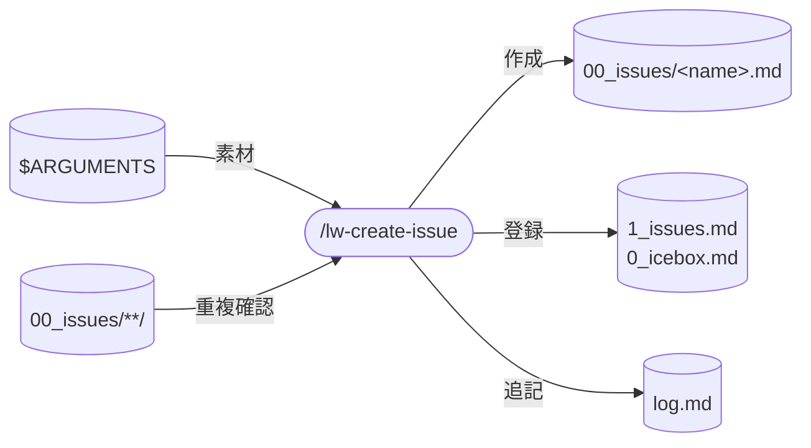

# llm-wiki-kit の lw-create-issue skill 設計

`/lw-create-issue` skill の設計書。
手作業では「ファイルは作るが `1_issues.md` / `log.md` への登録を忘れる」非対称が起きる。
これを起票 3 点セット（ファイル生成 + 盤面登録 + `log.md` 追記）で塞ぐ。
本ページは設計判断の why を集約する。実行手順の how は SKILL.md を参照。

## データフロー



## skill 名

`/lw-create-issue` 採用。

| 候補               | 意味                 | 採否                                                                                                                       |
| ------------------ | -------------------- | -------------------------------------------------------------------------------------------------------------------------- |
| `/issue`           | issue を開く         | 不採用。zsh alias `issue`（worktree ランチャ）が同名で存在し、層が違う別物。名前だけでは「起票」か「入場」か区別がつかない |
| `/lw-create-issue` | issue を新規作成する | 採用。`lw-` prefix で llm-wiki-kit skill 群と揃い、`create` で「新規起票」が名前で分かる                                   |

`/lw-commit`（畳む）/ `/lw-render`（wiki 化）/ `/lw-create-issue`（起票）と並ぶことで、skill ファミリーの意図が一目で読める。

## skill 配置

全 skill は project-local（`.claude/skills/` 配下）。

- 実体: SKILL.md（`.claude/skills/lw-create-issue/SKILL.md`）
- 設計書: 本ページ（[[lw-kit-スキル設計-lw-commit]] が拓いた project-local skill 設計書 wiki 化の先例に倣う）

global 化しない理由: 手順の中身が llm-wiki-kit 固有運用に密結合している。

- `00_issues/` のディレクトリ構造（WIP / `.10_todo/` / `.00_icebox/` 等）
- `1_issues.md` のカテゴリ分類（🌊 llm-wiki-kit 開発 / 🏗️ プロジェクト 等）
- `log.md` の `checkpoint` type 規約
- 命名規則（`<project>-<subproject>-<verb>-<object>` kebab-case）

他プロジェクトに持ち出してもこれらが無く意味をなさない。

## 呼び出し制御

`disable-model-invocation: true` を付け、手動 `/lw-create-issue` 起動のみにする。

根拠:

- issue 起票は lead の意図ある開始判断であり、Claude が自動で起票すると「知らないうちに `1_issues.md` に増えていた」という副作用になる
- Write（新規ファイル作成）を含むため副作用が大きく、自動起動を避ける方針は `/lw-commit` / `/lw-render` と同じ
- 先例: 同じく副作用の大きい [[lw-kit-スキル設計-lw-commit]] / [[lw-kit-スキル設計-lw-render]] も `disable-model-invocation: true`

description は日本語のまま維持する（`disable-model-invocation: true` で description は model の自動起動判定 context に載らないため、英語化の実利がない）。

## 許可ツールの最小化

Read / Edit / Write / Glob の 4 つ。
Bash を使わない理由: `Glob` 1 つで `00_issues/**/*.md`(全状態のサブディレクトリ含む)を取得でき、`Bash(ls:*)` / `Bash(find:*)` を追加する必要がない(最小権限の原則)。
具体的な用途は SKILL.md を参照。

## 責務の境界（worktree を持たない根拠）

`/lw-create-issue` は「起票」に専念し、worktree 操作（入場・チェック）は持たない。

分担の根拠:

- シェル `issue` alias（`~/.dotfiles/zsh/zshenv.local`）が「WIP / TODO / ICEBOX の issue を fzf で選んで worktree 付きで Claude 起動 or 会話継続」を担っている
- worktree の紐付けは Claude 起動時にしか効かない（走っている session の中で worktree を切り替えることはシェル層でないと実現できない）。session 内 Claude ができるのは案内まで

よって `/lw-create-issue` が worktree チェックを持つと責務が重複する。
「`issue <name>` でレーンを切れる」案内は rules の issue 規律（[[lw-kit-詳細設計-rules]]）に記述する方が適切（常時ロードで session 全体に効くため）。

## 3 点セットの実行順と why

3 点セット（Write / 登録 / `log.md` 追記の 3 出力）を、内容解釈・骨子生成の 2 前段ステップで挟む計 5 ステップ構成。

```text
1. 内容解釈 → 2. 骨子生成 + lead 確認 → 3. Write → 4. 登録 → 5. log.md 追記
```

| #   | ステップ             | why                                                                                                                            |
| --- | -------------------- | ------------------------------------------------------------------------------------------------------------------------------ |
| 1   | 内容解釈             | 素材（会話文脈 or 貼り付けテキスト）と配置キーワード（`wip` / `icebox`）を特定する。骨子生成の入力を先に固める                 |
| 2   | 骨子生成 + lead 確認 | `skeleton-confirm` 規約の必須対象（新規 issue ファイル）。名前も内容から自動生成し、まとめて提示。lead 合意なしで Write しない |
| 3   | Write                | `00_issues/.10_todo/<name>.md` に作成（デフォルト）。WIP / ICEBOX は Step 1 で検出したキーワードに従う                         |
| 4   | 登録                 | デフォルト / `wip` は `1_issues.md`、`icebox` は `0_icebox.md`（別ファイル）。「ファイルはあるが盤に乗っていない」非対称を防ぐ |
| 5   | `log.md` 追記        | CLAUDE.md ターン終了前セルフチェック相当。ファイル作成を操作履歴に残す                                                         |

3 点セットを分割・後回しにしない設計にする。特に 4・5 を「後でやる」にすると「手書きで issue を作って起票を忘れる」現状と同じ非対称が再発する。

### 命名生成の判断

lead は名前を提案しない(「勝手に付けて、変だったら直す」運用)。
Claude が内容から自動生成し、骨子提示時にまとめて確認を受ける。
命名規約の SSOT は [[lw-kit-詳細設計-issue]]「ファイル名規約」セクション。
具体的な生成ロジック・カテゴリ推定・骨子テンプレート・エラーケースは SKILL.md を参照。

## 保守規律

- 本設計書と SKILL.md の同期: SKILL.md を変更したら本設計書の `updated:` も揃える
- 命名規則変更時の追従: [[lw-kit-詳細設計-issue]]「ファイル名規約」が変わったら SKILL.md の命名生成ステップを追従
- カテゴリ変更時の追従: [[lw-kit-詳細設計-issue]]「カテゴリ」が変わったら骨子確認ステップのカテゴリ推定表を追従
- `1_issues.md` 構造変更時の追従: WIP セクションのカテゴリ並びが変わったら SKILL.md の登録ステップを追従

## 関連

- [[lw-kit-詳細設計-issue]] — issue 概念 + 命名規則 + カテゴリの SSOT
- [[lw-kit-スキル設計-lw-commit]] — 設計書の型（why 集約）+ 呼び出し制御の先例

本設計書の検討過程と issue 運用全体設計（skill ファミリー構想）は、ワークスペース側の issue で扱われた。
