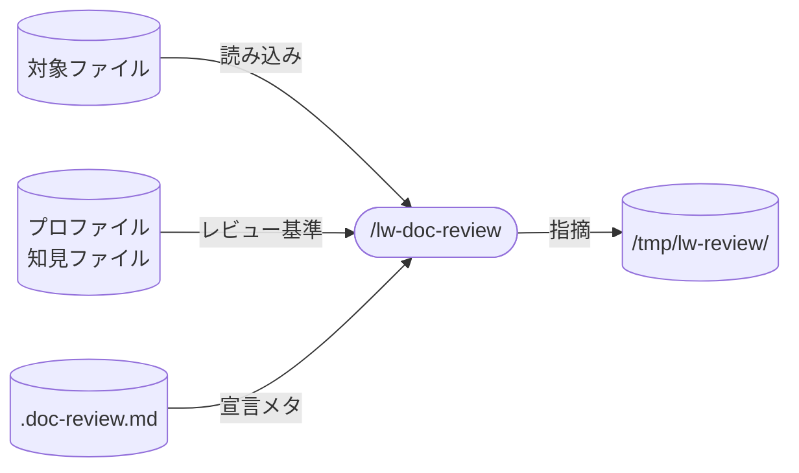

# lw-doc-review 設計

層別 finder 並列レビューの設計書。
**本ページは決定根拠のみを持つ。**
手順・finder プロンプト・層の定義・レポート形式は `templates/.claude/skills/lw-doc-review/SKILL.md` が、読み手の定義と成功基準は `templates/50_feedback/` のレビュープロファイルが正本で、本ページに写さない。

## データフロー

図は入出力の要約。実際の読み書き対象は `templates/.claude/skills/lw-doc-review/SKILL.md` が正本。

## skill 名

`/lw-doc-review` 採用。
`lw-` prefix + `doc-review` で文書レビューであることが名前で分かる。
`/lw-code-review` と対になる命名。

## skill 配置

全 skill は project-local(`.claude/skills/` 配下)。
プロファイル設計(`50_feedback/feedback-プロファイル-*.md`)や知見ファイル(`50_feedback/feedback-知見-*.md`)が llm-wiki-kit 固有の構造に依存するため global 化しない。

## 呼び出し制御

`disable-model-invocation: true`。
並列 finder を起動する副作用の大きい操作(トークンコスト)。
lead が対象ファイルとプロファイルを意図的に選んで起動する。

## 許可ツール

Agent は並列 finder の起動に使う（unnamed subagent）。
汎用 Bash は持たない。要る操作（出力先の作成 / 日時 / 引用の再検索）だけを scoped Bash で許す。
具体的なリストと用途は SKILL.md を参照。

## 層定義

4 層モデル（骨格 / 中身 / 文章 / 表記）。
反映順は骨格→中身→文章→表記（上位ほど先に反映、下位は上位確定後に再評価）。
各層は「見るもの」「見ないもの」を明示し、レビュー時の観点分離を実現する。
各層は fix-review が反映順序を決めるための層タグとしても機能する。

層外 finder（読み手 / 通例）はこの 4 層に入らない。
「直す順序」の軸に乗らない出力を返すので層タグを持たず、merge を通さずレポートとして lead に渡る。

具体の見る/見ないリストは SKILL.md の finder テンプレートが正本。

なぜ 4 層か: 出版業界の Developmental Editing（骨格・中身）/ Line Editing（文章）/ Copy Editing・Proofreading（表記）を LLM の並列 finder に対応させた。
各層の境界は「直す順序」で決まる — 骨格が変われば中身の前提が変わり、中身が変われば文章の表現が変わるので、上位確定前に下位を直しても手戻る。

### 境界事例

| 指摘例                                                             | 帰属           | 判定理由                                                                                |
| ------------------------------------------------------------------ | -------------- | --------------------------------------------------------------------------------------- |
| 「この段落は論理が飛んでいる」                                     | 中身           | 論理の飛躍そのもの。読みにくさの原因が論理なら中身が引き取る                            |
| 「用語が統一されていない」（同じ概念に別名）                       | 中身           | 意味レベルの不統一                                                                      |
| 「用語が統一されていない」（半角全角・送り仮名）                   | 表記           | 表記レベルの不統一                                                                      |
| 「この節、要らなくない？」                                         | 骨格           | スコープ判断                                                                            |
| 「この文、回りくどい」                                             | 文章           | 表現の冗長さ                                                                            |
| 「憲法 AI と Constitutional-AI が混在」                            | 表記           | 概念の同定は済んでおり、レンダリングだけが違う。パターン照合で拾える                    |
| 「非目標セクションがない」                                         | 骨格           | 判定基準がプロファイル（内部）にある。通例はプロファイルにある観点を出さない            |
| 「この種の設計書には一般的にリスク分析があるが、この文書にはない」 | 通例           | 判定基準が外部の一般的期待にあり、プロファイルに観点がない                              |
| 「背景セクションの根拠が不十分」                                   | 中身           | 書かれている主張の裏付けの問題。欠落でなく質                                            |
| 「実態は制作ノートなのに wiki の観点で見ている」                   | 通例           | 種別の同定。プロファイルの当たり外れは内部基準では検出できない                          |
| 「一般的にこの種の文書は X と書くが、ここでは Y と書いてある」     | 中身または文章 | 書かれているものの是非。通例は書かれていないものだけを出す                              |
| 「読んでも次の作業に着手できない。X が足りない」                   | 読み手         | 1 人の読者の反応として報告する。同じ X を「この種の文書なら通常ある」として出すなら通例 |

帰属は基準の出所で決まる。
通例の指摘が seed に昇格すると、同じ指摘は次回から骨格に移る。
境界は固定でなく蓄積で動くので、判定理由の列には必ず基準の出所を書く。

### 備考: 表記層と lw-lint の分担

表記層の「見る」リストのうち、機械的に判定できるもの（`。` 改行、コードスパン、`[[link]]`、丸数字禁止等）は `lw-lint` が既にカバーしている。
LLM に表記層を見させる場合、`lw-lint` と重複する指摘は省き、機械では拾えない表記判断（例: どこまでをコードスパンで囲むべきか）に集中させる。

## エージェント構成

6 ステップパイプライン（入力解決とロード → effort 判定 → 並列 finder → merge → 指摘ファイル Write → サマリー報告）。
code-review（Anthropic 公式 `/code-review`）の finder パターンを文書レビューに適用する。
具体の手順・テンプレート・出力形式は SKILL.md が正本。

### 設計判断

**指摘と修正の分離**: doc-review は指摘ファイルの出力まで。修正は `/lw-fix-review` が担う。
全 finder が同一スナップショットを読むので、R1→R2 で未反映文書を読む矛盾が構造的に消える。

**Agent 戻り値方式**: finder は Agent サブエージェントとして起動し、戻り値で回収する。
却下した代替案: teammate（`cmux-teams`）+ SendMessage 方式。finder が自発的に送信しない不具合が観測された。
Agent 戻り値方式は「返さない」状態が構造的に存在しないため回収が決定論的。
teammate/`cmux-teams` は advisor 相談（対話が本質の場面）専用とする。

**コンテキストの 3 分類**: レビュー宣言(`.doc-review.md`)で指定するコンテキストは性質によって渡し先が異なる。
規範的(スタイルガイドの禁止事項、表記規約) → finder + fix-review に渡す。finder に渡さないと検出できない指摘がある。
記述的(目次・章構成の意図) → fix-review のみ。finder に渡すと「初見読者を演じる」価値が壊れる。
範例的(清書済み章、著者の声のサンプル) → fix-review のみ。fix 実行者が著者の声を模倣するために使う。

**知見の振り分け**: 知見ファイルのエントリは層フィールドで自層の finder にだけ渡す。
finder が使うのは自層のエントリだけで、全文を渡すと 4 体が同じファイルを読む（実測では、4 体の合計で読む量が 5 分の 1 に下がった。1 体あたりの削減率は層の偏りによって変わる）。
対策の宛先が finder でなく fix-review や lead の手順になっている知見は `なし` を付け、どの finder にも渡さない。指摘を生まない知見は finder の入力にならない。
採用判断の参考リストなどエントリ以外の部分も渡さない。採否は fix-review の責務で、採否の履歴を finder が持つと指摘の段階で採否を先取りする。
層フィールドを持たないエントリは渡さずに報告へ挙げる。データ側の欠落を全文渡しで吸収すると、逸脱が見えないまま定着する。
却下した代替案: 層外（読み手・通例）を値に持つこと。層外 finder に知見を渡す経路が無く、付けても届かない。

**モデル割当の根拠**: 層ごとに要求される能力が異なるため、骨格・中身は推論力（opus）、文章は表現の良し悪しの判断（fable）、表記はチェックリスト照合（sonnet）で分ける。
具体的な体制表は SKILL.md を参照。

宣言ファイル(`.doc-review.md`)が walk-up でもルーターでも見つからない場合はエラーではなく正常系として扱い、宣言なし（ベースラインのみ）で続行する。

### effort 制御

デフォルトの自動判定は「迷ったら quick 側」に倒す。
full が必要な場合は明示オプトイン（`--full`）とする。
quick は 1 体が 4 層を見るため合議マークが出ない。検証代替がないモードなので重要文書は full を使う。

### merge の不変条件

- merge はメインの機械処理で行う。追加エージェントを立てない（指摘は構造化済みなので LLM 判断は不要）
- finder は Write しない。出力ファイルは merge 後の 1 本のみ（fix-review の入口を 1 本化 + 並列 Write の命名衝突回避）
- 合議マーク（複数 finder が同一箇所を指摘）は重複統合で消さず、件数として残す。合議マークが検証の代替として機能するため、素朴な重複削除で潰さない

### 読み手 finder(ベータリーダー)

4 層 finder が編集職能(指示を出す側)であるのに対し、読み手 finder はベータリーダー(反応を返す側)。
`--full` でもプロファイルゲートを維持する理由: 読み手はベースラインとなる層定義を持たないためフォールバック対象外。
起動条件は doc-review の SKILL.md、fix-review での扱い（指摘と分離して lead に全文渡す）は fix-review の SKILL.md を参照。

### 通例 finder

判定基準を文書の外に置く finder。
4 層と読み手が「書かれているもの」に対して指示や反応を返すのに対し、通例は「書かれていないもの」を外部の一般的期待から問う。
web search で「この種の文書に一般的に求められる要素」を調べ、対象文書に丸ごとない要素を根拠付きで挙げる。

**なぜ層外か**: 4 層の境界は「直す順序」で決まるが、通例の出力は「何を足すか」であって「何をどの順で直すか」ではない。
加えて欠落の指摘は引用すべき原文を持たないので、merge 規則（引用 grep での行番号再計算）が構造的に成立しない。
読み手と同じ層外レポートとして merge を通さず lead に渡す。

**名前の由来**: 判定基準の名前。骨格が「文書内の論理とプロファイル」を基準にするのに対し、通例は「外部の通例」を基準にする、と名前だけで境界が言える。
却下した候補: 「欠落」は骨格の「セクション構成の抜け」と混同され、重なりが最大の骨格との境界が名前で崩れる。「類例」は書かれているものの比較に読める。

**プロファイル seed との関係**: 既存プロファイルの seed 自体が web 調査から作った「一般的に求められる要素」の静的キャッシュで、通例はそれを動的にやる。
二重化を防ぐため、通例にはプロファイル全文を渡して「既にある観点は出すな」とする。
採用された欠落は 1 回で seed 昇格候補になる（既存の昇格 3 条件は適用しない。毎回 web search するので同じ観点の再現が保証されず、「複数回再現」を待つと昇格しないため）。
通例はプロファイルの動的な穴埋め装置で、seed が埋まった観点は次回から骨格が内部基準で見る。

**帰属は基準の出所で決まる**: 帰属が蓄積で動く仕組みと、判定理由に基準の出所を書く理由は「境界事例」セクション末尾が持つ。

**起動条件が他と違う理由**: `--full` でのみ起動する。
web search の待ち時間とトークンコストが乗るので、デフォルトに常時載せると、レビューを回すこと自体を避ける方向に働く。
内部基準にない欠落を拾う価値は、重要な文書を `--full` で見る回に出るものと見て、明示オプトインに寄せた。

プロファイルの `## 通例` は起動ゲートではない。
他の層はセクションの有無が起動を決めるが、通例だけは `--full` 時に探す方向のヒントとして渡す役割になる。
セクションの有無で起動を決めると、5 プロファイル全部に足した時点で実質「常に起動」になり、明示オプトインの設計と食い違うため。

## プロファイル設計

ペルソナ（人格）を廃止し、文書種別プロファイルに置き換える。
配置先: `50_feedback/feedback-プロファイル-*.md`
定義済みの種別は実在ファイルが正本（宣言ファイル側で追加できるので、本書にも SKILL.md にも列挙を持たない）
プロファイルスキーマと自動判定の手順は SKILL.md が正本。

### 起動判定の原則

プロファイル内に層のセクションがあれば、その層の finder を起動する。
セクションがなければ起動しない。
観点の量が finder の「重さ」を自然に制御する（1 行なら 1 軸だけ見る、5 行なら 5 軸見る）。

体制パラメータ（起動/skip の表）を別に持たない。
観点テキスト自体が体制を決めるので、二重管理が不要になる。

### 起動する層をプロファイルから決める理由

起動する層はプロファイルの節構成から決まる（`## <層名>` があればその層を起動する）。
設計書側は体制の一覧を持たない。プロファイルを編集するたびに写しがずれるため。

種別ごとに層を変える判断の例:

- wiki で骨格を起動する: concept / synthesis は構成自由度が高く、骨格レビューの価値がある（ドッグフーディングで確認）
- wiki の文章観点を絞る: 主語欠落・曖昧な指示語は永続文書で実害がある。トーン・リズムは不要

### 蓄積との接続

チェックリスト項目が昇格してきた時、該当する層のセクションに追記する。
新しい層を起動したくなったらセクションを足すだけ。
調査から植えた初期観点は `[seed]` マーク、実戦で確認されたものは `[confirmed]` マーク。
seed の品質評価は件数ではなく採用率で行う（fix-review で採用/却下された比率）。

### 却下した代替案

- ファイルパスからの推定: パスと内容が乖離する場面で誤判定する。frontmatter type は著者の意図を直接反映しており信頼性が高い
- LLM が内容を読んで判定: 判定自体にコストがかかる上に非決定性が入る。frontmatter type は 1 行読むだけで決定論的に判定できる

## 変更量で指摘の性質が変わる

同じ文書に doc-review を回しても、直前の変更が数行の追記か、セクション単位の書き換えかで指摘の内訳が変わる。

- 数行の追記: 指摘の大半は変更と無関係な既存負債になる。実測で 4 本に回して 39 件出たうち、変更に触れていたのは 2 件
- セクション単位の書き換え: 大半が変更由来になる。実測で 7 本を書き換えた回は必須 12 件のうち 9 件が今回の変更由来

fix-review でスコープの線を引く前に、指摘が変更前から在ったものか変更で入ったものかを数えると、どちらに重心を置くか決められる。
既存負債が主なら、線を引いて外に出した分の扱いをユーザーに委ねる。変更由来が主なら、線を引かずに全件直す方が早い。

## fix-review との接続

指摘フォーマット(6 要素)と適用順序の具体は SKILL.md を参照。

アンカー無効化時の扱い（骨格修正で下位層の引用が壊れた場合）は、注記でなく、引用が対象ファイルに見つかるかどうかで判定する。
doc-review は指摘ファイルのヘッダに「再評価: あり / なし」を常に書き、fix-review が骨格の Edit 後に下位層の引用を grep し直して、見つからないものをスキップする。

指摘 1 件ずつに注記を付けない理由: merge 規則 4 の条件は文書単位（骨格に必須があるか）で対象は下位層の全件なので、指摘ごとに違う値が入らない。
粒度が文書単位の情報は文書単位の場所に置く。
「あり / なし」を常に書く形にしたのは、条件に当てはまらない回に何も書かないと、条件に該当しなかったのか判定を飛ばしたのかが区別できないため。

未決:

- 検証段の要否（並列 finder の合議マークで部分代替できる可能性）

## エラーハンドリング

設計方針:

- 対象が特定できない、出力先が作れない時は聞いて停止する。推測で対象を決めて走らせない
- finder 1 体の失敗や空返しは 0 件として続行し、サマリーに明記する。再 spawn しない（1 体の失敗で全体を止めない、黙って欠けさせない）
- 判定できない入力（未知のオプション語、原文に無い引用）は捨てずに記録して続行する。捨てると失敗が成功と同じ見た目になる

具体的なケース表は SKILL.md 参照。

## 保守規律

- 本設計書と SKILL.md の同期: SKILL.md を変更したら本設計書の `updated:` も揃える。4 層の見る/見ないリストは SKILL.md が正本、設計書は why(層の設計判断)を持つ
- プロファイル変更時の追従: プロファイルスキーマが変わったら SKILL.md の自動判定ロジックを追従
- `/lw-fix-review` との接続: 指摘フォーマット(6 要素)を変更したら fix-review 側の入力パーサも追従
- 層フィールドの値集合: `lw-fix-review` SKILL.md の新規知見の完了条件が正本。変えたら知見ファイル冒頭の schema 宣言も追従

## 関連

- [[lw-kit-スキル設計-lw-fix-review]] — 指摘の反映先(fix-review が層順で適用)
- [[lw-kit-スキル設計-lw-code-review]] — 対になるコードレビュー skill(出力フォーマットの参照)
- [[lw-kit-スキル設計-lw-lint]] — 表記層との分担(機械的に判定できるものは lw-lint がカバー)
- [[lw-kit-アーキテクチャ設計]] — skill 群全体での位置づけ(ナレッジ蓄積ワークフロー)
