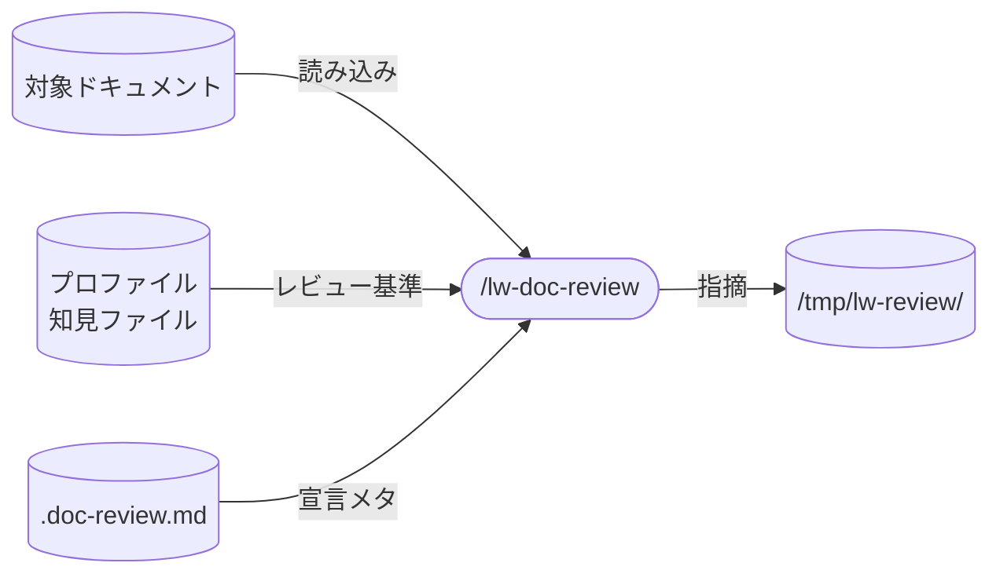

# lw-doc-review 設計

層別 finder 並列レビューの設計書。
設計判断の why を本ファイルが持ち、SKILL.md が how + 具体値の正本。

## データフロー

## skill 名

`/lw-doc-review` 採用。
`lw-` prefix + `doc-review` で文書レビューであることが名前で分かる。
`/lw-code-review` と対になる命名。

## skill 配置

全 skill は project-local(`.claude/skills/` 配下)。
プロファイル設計(`50_feedback/feedback-プロファイル-*.md`)や知見ファイル(`50_feedback/feedback-知見-*.md`)が llm-wiki-kit 固有の構造に依存するため global 化しない。

## 呼び出し制御

`disable-model-invocation: true`。
並列 finder を起動する副作用の大きい操作(トークンコスト)。
lead が対象ファイルとプロファイルを意図的に選んで起動する。

## 許可ツール

Read / Write / Edit / Agent / Glob + scoped Bash(`mkdir` / `date` / `grep`)。
Agent は並列 finder の起動に使う(unnamed subagent)。
汎用 Bash は持たない。
具体的なリストと用途は SKILL.md を参照。

## 層定義

4 層モデル（骨格 / 中身 / 文章 / 表記）。
反映順は骨格→中身→文章→表記（上位ほど先に反映、下位は上位確定後に再評価）。
各層は「見るもの」「見ないもの」を明示し、レビュー時の観点分離を実現する。
各層は fix-review が反映順序を決めるための層タグとしても機能する。

具体の見る/見ないリストは SKILL.md の finder テンプレートが正本。

なぜ 4 層か: 出版業界の Developmental Editing（骨格・中身）/ Line Editing（文章）/ Copy Editing・Proofreading（表記）を LLM の並列 finder に対応させた。
各層の境界は「直す順序」で決まる — 骨格が変われば中身の前提が変わり、中身が変われば文章の表現が変わるので、上位確定前に下位を直しても手戻る。

### 境界事例

| 指摘例                                           | 帰属 | 判定理由                                                             |
| ------------------------------------------------ | ---- | -------------------------------------------------------------------- |
| 「この段落は論理が飛んでいる」                   | 中身 | 論理の飛躍そのもの。読みにくさの原因が論理なら中身が引き取る         |
| 「用語が統一されていない」（同じ概念に別名）     | 中身 | 意味レベルの不統一                                                   |
| 「用語が統一されていない」（半角全角・送り仮名） | 表記 | 表記レベルの不統一                                                   |
| 「この節、要らなくない？」                       | 骨格 | スコープ判断                                                         |
| 「この文、回りくどい」                           | 文章 | 表現の冗長さ                                                         |
| 「憲法 AI と Constitutional-AI が混在」          | 表記 | 概念の同定は済んでおり、レンダリングだけが違う。パターン照合で拾える |

### 備考: 表記層と lw-lint の分担

表記層の「見る」リストのうち、機械的に判定できるもの（`。` 改行、コードスパン、`[[link]]`、丸数字禁止等）は `lw-lint` が既にカバーしている。
LLM に表記層を見させる場合、`lw-lint` と重複する指摘は省き、機械では拾えない表記判断（例: どこまでをコードスパンで囲むべきか）に集中させる。

## エージェント構成

6 ステップパイプライン（入力解決とロード → effort 判定 → 並列 finder → merge → 指摘ファイル Write → サマリー報告）。
code-review（Anthropic 公式 `/code-review`）の finder パターンを文書レビューに適用する。
具体の手順・テンプレート・出力形式は SKILL.md が正本。

### 設計判断

**指摘と修正の分離**: doc-review は指摘ファイルの出力まで。修正は `/lw-fix-review` が担う。
全 finder が同一スナップショットを読むので、R1→R2 で未反映文書を読む矛盾が構造的に消える。

**Agent 戻り値方式**: finder は Agent サブエージェントとして起動し、戻り値で回収する。
却下した代替案: teammate（`cmux-teams`）+ SendMessage 方式。finder が自発的に送信しない不具合が観測された。
Agent 戻り値方式は「返さない」状態が構造的に存在しないため回収が決定論的。
teammate/`cmux-teams` は advisor 相談（対話が本質の場面）専用とする。

**コンテキストの 3 分類**: レビュー宣言(`.doc-review.md`)で指定するコンテキストは性質によって渡し先が異なる。
規範的(スタイルガイドの禁止事項、表記規約) → finder + fix-review に渡す。finder に渡さないと検出できない指摘がある。
記述的(目次・章構成の意図) → fix-review のみ。finder に渡すと「初見読者を演じる」価値が壊れる。
範例的(清書済み章、著者の声のサンプル) → fix-review のみ。fix 実行者が著者の声を模倣するために使う。

**モデル割当の根拠**: 層ごとに要求される能力が異なるため、骨格・中身は推論力(opus)、文章は判断駆動(fable)、表記はチェックリスト照合(sonnet)で分ける。
具体的な体制表は SKILL.md を参照。

宣言ファイル(`.doc-review.md`)が walk-up でもルーターでも見つからない場合はエラーではなく正常系として扱い、宣言なし（ベースラインのみ）で続行する。

### effort 制御

デフォルトの自動判定は「迷ったら quick 側」に倒す。
full が必要な場合は明示オプトイン（`--full`）とする。
quick は 1 体が 4 層を見るため合議マークが出ない。検証代替がないモードなので重要文書は full を使う。

### merge の不変条件

- merge はメインの機械処理で行う。追加エージェントを立てない（指摘は構造化済みなので LLM 判断は不要）
- finder は Write しない。出力ファイルは merge 後の 1 本のみ（fix-review の入口を 1 本化 + 並列 Write の命名衝突回避）
- 合議マーク（複数 finder が同一箇所を指摘）は重複統合で消さず、件数として残す。合議マークが検証の代替として機能するため、素朴な重複削除で潰さない

### 読み手 finder(ベータリーダー)

4 層 finder が編集職能(指示を出す側)であるのに対し、読み手 finder はベータリーダー(反応を返す側)。
`--full` でもプロファイルゲートを維持する理由: 読み手はベースラインとなる層定義を持たないためフォールバック対象外。
起動条件・fix-review での扱いは SKILL.md を参照。

## プロファイル設計

ペルソナ（人格）を廃止し、文書種別プロファイルに置き換える。
配置先: `50_feedback/feedback-プロファイル-*.md`
種別: エッセイ / 技術ブログ / 設計書 / wiki
プロファイルスキーマと自動判定の手順は SKILL.md が正本。

### 起動判定の原則

プロファイル内に層のセクションがあれば、その層の finder を起動する。
セクションがなければ起動しない。
観点の量が finder の「重さ」を自然に制御する（1 行なら 1 軸だけ見る、5 行なら 5 軸見る）。

体制パラメータ（起動/skip の表）を別に持たない。
観点テキスト自体が体制を決めるので、二重管理が不要になる。

### 種別ごとの想定体制と根拠

| 種別       | 骨格 | 中身 | 文章               | 表記 | 読み手 | 合計 |
| ---------- | ---- | ---- | ------------------ | ---- | ------ | ---- |
| エッセイ   | 起動 | 起動 | 起動（フル）       | 起動 | 起動   | 5 体 |
| 技術ブログ | 起動 | 起動 | 起動（フル）       | 起動 | 起動   | 5 体 |
| 設計書     | 起動 | 起動 | なし               | 起動 | なし   | 3 体 |
| wiki       | 起動 | 起動 | 起動（明確さ限定） | 起動 | なし   | 4 体 |

- wiki の骨格を起動する理由: concept / synthesis は構成自由度が高く、骨格レビューの価値がある（ドッグフーディングで確認）
- 設計書の文章がない理由: 中身層が重く、明確さの観点が中身層に吸収される
- wiki の文章が限定の理由: 主語欠落・曖昧な指示語は永続文書で実害がある。トーン・リズムは不要

### 蓄積との接続

チェックリスト項目が昇格してきた時、該当する層のセクションに追記する。
新しい層を起動したくなったらセクションを足すだけ。
調査から植えた初期観点は `[seed]` マーク、実戦で確認されたものは `[confirmed]` マーク。
seed の品質評価は件数ではなく採用率で行う（fix-review で採用/却下された比率）。

### 却下した代替案

- ファイルパスからの推定: パスと内容が乖離する場面で誤判定する。frontmatter type は著者の意図を直接反映しており信頼性が高い
- LLM が内容を読んで判定: 判定自体にコストがかかる上に非決定性が入る。frontmatter type は 1 行読むだけで決定論的に判定できる

## fix-review との接続

指摘フォーマット(6 要素)と適用順序の具体は SKILL.md を参照。

未決:

- アンカー無効化時の扱い（骨格修正で下位層の行番号・引用が壊れた場合のスキップルール）
- 検証段の要否（並列 finder の合議マークで部分代替できる可能性）

## エラーハンドリング

| ケース                                  | 方針                                                |
| --------------------------------------- | --------------------------------------------------- |
| `$ARGUMENTS` 未指定                     | 対象ファイルのパスを案内して停止                    |
| 対象ファイルが存在しない                | ファイルパスを確認して停止                          |
| finder がエラーで戻った(Agent 失敗)     | 失敗した finder を報告し、残りの結果で merge を続行 |
| 出力先 `/tmp/lw-review/` が書き込めない | mkdir で作成を試み、失敗したら報告して停止          |

## 保守規律

- 本設計書と SKILL.md の同期: SKILL.md を変更したら本設計書の `updated:` も揃える。4 層の見る/見ないリストは SKILL.md が正本、設計書は why(層の設計判断)を持つ
- プロファイル変更時の追従: プロファイルスキーマが変わったら SKILL.md の自動判定ロジックを追従
- `/lw-fix-review` との接続: 指摘フォーマット(6 要素)を変更したら fix-review 側の入力パーサも追従

## 関連

- [[lw-kit-スキル設計-lw-fix-review]] — 指摘の反映先(fix-review が層順で適用)
- [[lw-kit-スキル設計-lw-code-review]] — 対になるコードレビュー skill(出力フォーマットの参照)
- [[lw-kit-スキル設計-lw-lint]] — 表記層との分担(機械的に判定できるものは lw-lint がカバー)
- [[lw-kit-アーキテクチャ設計]] — skill 群全体での位置づけ(ナレッジ蓄積ワークフロー)
