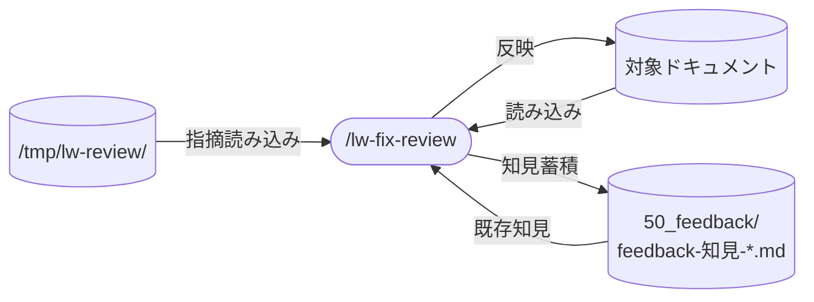

# llm-wiki-kit の lw-fix-review skill 設計

`/lw-fix-review` skill の設計書。
レビュー結果（lw-doc-review / lw-code-review / inline）を lead がコンテキスト持ち採否判断で対象ファイルに反映する skill で、reviewer (fresh context) と対象ファイル (lead context) をブリッジする役割を担う。

本ページは設計判断の why と却下した代替案を集約する。
具体値・条件式・手順は SKILL.md が正本（設計書と SKILL.md の SSOT 境界は「具体値」で引く方針、ワークスペース側の知見蓄積で確認済み）。

## データフロー

## skill 名

`/lw-fix-review` 採用。`xxx-review` 系命名（`/lw-doc-review` / `/lw-code-review`）と揃えて、レビュー結果を反映する動作を素直に表す。
公式 skill `/autofix-pr` との autocomplete 干渉も回避できる。

検討した他の候補:

| 候補             | 不採用理由                                                                       |
| ---------------- | -------------------------------------------------------------------------------- |
| `/auto-fix`      | 公式 skill `/autofix-pr` と autocomplete で干渉、`xxx-review` 系命名群とも不整合 |
| `/apply-review`  | 「適用」が機械的、lead 判断のニュアンスが弱い                                    |
| `/fix-by-review` | 動作は明確だが長い、`-by-` の前置詞が読みづらい                                  |
| `/review-fix`    | review が主役に見える、fix が主役なのでズレる                                    |

## skill 配置

project-local 配置（`.claude/skills/` 配下）。
プロジェクト跨ぎで再利用される（レビュー → 修正フローは llm-wiki-kit 外でも有用）。

## 呼び出し制御

`disable-model-invocation: true` で Claude 自動起動を禁止、ユーザー明示の `/lw-fix-review` のみ起動可能にする。

理由: 自走採否判断は副作用が大きい（対象ファイルの Edit）。意図しないタイミングで起動するとリスクが高い。レビュー直後にユーザーが明示的に走らせるフローに限定する。

## 許可ツール

Bash は追加しない。Bash は書き込み面が原理的に無制限になり、`disable-model-invocation` にするほど慎重な本 skill の性格と合わない。走査は Glob と Grep で足りる。

書き込み面を allowlist で制限する理由: 自走範囲を広げた（相談トリガーを閉じた条件に限定した）代わりに、書き込み面の予測可能性で安全性を担保する。
`Write` も持たない。反映は既存ファイルへの Edit だけで、新規ファイルの作成は自走範囲の外に置く。
allowlist と、lead が後から `git diff` で確認できることの 2 つが自走拡大の前提条件。

具体的な tool リストと allowlist の内容は SKILL.md 参照。

## 役割分担

レビュー → 修正フローの 3 ロール:

| ロール   | 担当                                                                 | 性格                                  |
| -------- | -------------------------------------------------------------------- | ------------------------------------- |
| reviewer | 周辺コンテキストを切った fresh 視点でレビュー（subagent / 外部 LLM） | 指摘を出す（[[ReAct]] の acting 役）  |
| lead     | コンテキスト持ちで採否判断 + Edit 反映                               | 取捨選択（[[ReAct]] の reasoning 役） |
| ユーザー | 最終成果物のみ確認、途中の採否判断には不介在                         | レビュー全体の発注者                  |

bias 回避のため reviewer は別 agent / 外部 LLM、反映側 (lead) はコンテキスト持ち。
人間のレビュー → 反映ループを、[[Self-Refine]] が有効とする「生成とレビューを別の呼び出しに分ける」形で Claude 内に置いたもの。

## 入力

複数形式を受け付ける理由: レビュー結果ファイルを経由しない指摘（会話内で出たもの、外部 LLM に貼って返ってきたもの）もそのまま流せるようにするため。
具体的な入力形式と特定ロジックは SKILL.md 参照。

## 採否判断

### ルーティング区分（自走 / スキップ / 相談）にした理由

単純な「採用 / 不採用」の 2 区分ではグラデーションを表現できない。
スキップ（迷いの受け皿）があることで中断ゼロで情報が残る。
lead 相談を独立区分にすることで、lead 単独判断のラインを明示する。

### 「確認」ラベルを無条件の lead 送りにしない

reviewer が「確認」を付けるのは fresh context の自分に判断材料が無いからで、lead にも無いとは限らない。
無条件に回すと、次の作業予定・参照先文書の目的・過去の決定のように lead が知っていることまで質問になる。

分岐は材料の有無で引く。手元にあれば自走し、根拠をサマリー表の理由欄に残す。実測やユーザーの意図が要るものだけ相談に回す。
自走した場合の検証可能性は理由欄が担保する（材料が何だったかが書かれていれば、後から誤りを指摘できる）。

### コスト判定を導入した理由

reviewer は対象ファイルしか読んでおらず、修正コストを見積もれない。
コスト（小 / 大）は fix-review が判定し、重要度ラベル（reviewer が付与）と組み合わせてルーティングする。

コスト判定の操作的定義は SKILL.md 参照。

### 相談トリガーを閉じた条件にした理由

「迷ったら相談」だと、新規ファイルの修正など lead が自走すべきケースでも相談が発生し、ユーザーの手間が増える。
AI が書いた新規ファイルを AI がレビューして直す場合、初回生成と 2 回目の差がない。確定度が低いファイルは勝手に直してよい。
ユーザーは後から `git diff` で確認できるので、事後チェックが効く。

迷いの受け皿はスキップ（推奨・任意の場合）にし、中断ゼロで情報だけ残す設計にした。

具体的なルーティングルール・トリガー条件・受け皿の分岐は SKILL.md 参照。

## 実行フロー

蓄積判定を 2 パスに分離した理由は「蓄積ステップ」セクション参照。

設計上の判断:

- コスト判定を採否判断の前に追加。重要度ラベル × コストの 2 軸でルーティングを機械的に決定する
- 完了条件を設ける。理由は「蓄積ステップ」セクション。条件はサマリー表の記入項目そのもの（全指摘への蓄積ラベル / 却下指摘への却下理由テストの痕跡）が担い、独立したチェック手順は置かない

ステップの詳細は SKILL.md 参照。

## エラーハンドリング

設計方針:

- 部分成功を許容する。1 件の Edit 失敗で全停止すると成功分まで巻き添えになり、再実行コストが上がるため
- 採用 0 件や全件相談でもサマリーは出す。「全件不採用」という判断自体が記録に値する成果で、暗黙完了しない原則の適用
- 蓄積先が見つからない場合は追記せず相談に乗せる。新規ファイル作成は allowlist の外

具体的なケース表は SKILL.md 参照。

## 中間ファイル管理

レビュー結果ファイルは監査ログとして残す。削除提案は出さない。
`/tmp/` は repo 外なので放置しても害がなく、後で辿れる価値の方が高い。
全 review skill の出力先は `/tmp/lw-review/<issue-name>/` に統一している（ファイル名の書式は各 review skill の SKILL.md が正本）。

## 蓄積ステップ

fix-review はレビュー知見の補助導線（主導線は retro）。
反映完了後に「この指摘は知見として蓄積する価値があるか？」を判定し、知見ファイルに追記する。

### なぜ蓄積を skill に組み込むか

意識に頼る蓄積は回らない。事例集に「lead 自走で追記」と書いても、fix-review の完了フローに追記ステップがなければ実行されない（[[レビューワークフローの設計原則]] の原則 5「蓄積はワークフローに組み込む」）。

### なぜデフォルト「なし」の加点方式か

全指摘を貯めると肥大化する。蓄積の価値は fresh reviewer では気づけないもの（プロジェクト固有の規約・過去の決定・暗黙の好み）にだけある。
積極的な根拠がある時だけ昇格する加点方式で、大半が「なし」になるのが正常。

### なぜ 2 パスに分離するか

lead の相談回答（コスト大の指摘をなぜ蹴るか / 通すか）は、自明でない判断そのもので蓄積入力として最も価値が高い。
自走分は相談前に保存を完了させ（話が流れても蓄積が消えない）、相談分は lead 回答後に保存する。
相談 0 件の典型ケースでは第 1 パスのみで完結し、複雑化のコストは相談がある時だけ。

### 却下パターンの蓄積

却下理由が一般化可能なら記録に残す。
捨てると同種の却下を毎回再判定することになるため（台帳の 2 フェーズモデルと同じ考え方）。
具体的な記録先・昇格判断は SKILL.md 参照。

具体的な蓄積ラベル判定基準・操作的テスト・ノイズ制御は SKILL.md 参照。

### 昇格判定

蓄積した知見のうち、レビューで繰り返し再現・採用されるものを上流に昇格させる。
昇格先はレビュー種別で異なる:
code-review → 対象 repo の CLAUDE.md（組み込み `/code-review` が CLAUDE.md のルールだけをフィルタ通過させるため）。
doc-review → `feedback-プロファイル-<種別>.md`(finder が毎回読むプロファイル観点行に昇格)。

昇格対象は「新規知見」ではなく「既存知見が今回のレビューでまた再現され、また採用された」ケース。
蓄積判定では「なし（既存の記述だけで再現できた → 追記しない）」に落ちる場所が昇格のシグナル源。
蓄積ラベル（今回の指摘の分類）とは軸が違い、昇格は知見エントリの分類。

昇格を 3 条件の AND にしたのは、1 回の再現で昇格させると偶然の一致が規則になり、規則文に落とせないものを昇格させると照合できない規約が増えるため（条件の列挙は SKILL.md が正本）。

昇格候補はステップ 6 のサマリー時に別枠で提示する。
fix の完了を妨げず、lead が後日でも判断できる形にする。
CLAUDE.md / プロファイルへの追記は fix-review の allowlist 外のまま維持し、SKILL.md は「提案するだけ」に留める。

「複数回再現」の数え方は当面 lead の体感判断で始め、判定に迷う実例が出たら知見エントリに再現日付の追記を足す。

## 不変条件

SKILL.md を書き直す際に壊してはいけない条件:

- 蓄積はワークフローに組み込まれていること — 外れると意識頼みになり蓄積が回らなくなる
- 書き込み面が allowlist で制限されていること — 外れると自走拡大の前提（予測可能性）が崩れる
- 確認（事実確認）は、判断材料が手元にないなら lead に回すこと — 外れると幻覚修正が起きる
- 完了サマリーが必ず出ること — 外れると蓄積の完了条件がチェックされなくなる
- レビュー結果ファイルを削除しないこと — 外れると監査ログが失われ「あの指摘どうだっけ」が辿れなくなる

## 保守規律

- 具体値のみの変更（閾値調整・リスト追加）なら設計書は触らない。設計判断が変わった時だけ設計書を更新
- 共有インターフェースの正本: 入力フォーマットの正本は出力側 SKILL.md（doc-review: 6 要素形式 / code-review: findings 形式）。出力側が変わったら fix-review SKILL.md の入力解決ロジックを追従する

## 関連

- [[lw-kit-アーキテクチャ設計]] — skill 群全体での位置づけ（「開発ワークフロー」のナレッジ蓄積とコード開発に共通して使う）
- [[Claude-Code-Skillの書き方]] — SKILL.md ベストプラクティス
- [[プロンプト設計原則]] — [[ReAct]] / [[Self-Refine]] の llm-wiki-kit 内応用根拠

`/lw-fix-review` skill 仕様の検討過程と、採否判断の実例蓄積は、ワークスペース側の issue / feedback で扱われている。
