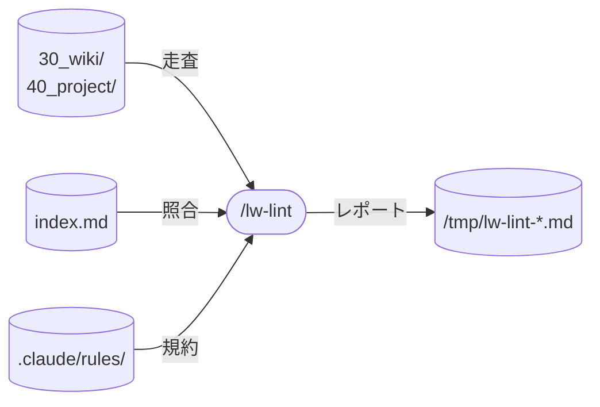

# llm-wiki-kit の lint skill 設計

llm-wiki-kit の `/lw-lint` skill（wiki の健全性チェック）の設計書。
4 OSS 実装（[[wiki-skills]] / [[karpathy-wiki]] / [[claude-obsidian]] / [[llmwiki]]）の lint 機能を横断調査し、llm-wiki-kit に必要な検出項目と出力形式を決定する。
SKILL.md 一般論は [[Claude-Code-Skillの書き方]] を参照。

**本ページは決定根拠のみを持つ。**
検出手順・数値閾値・レポート形式・除外リストは `templates/.claude/skills/lw-lint/SKILL.md` と `scripts/broken-links.sh` が正本で、本ページに写さない。

## データフロー

図は入出力の要約。実際の読み書き対象は `templates/.claude/skills/lw-lint/SKILL.md` が正本。

## 4 OSS の lint 設計比較

| 軸             | [[wiki-skills]]              | [[karpathy-wiki]]                         | [[claude-obsidian]]               | [[llmwiki]]           | llm-wiki-kit 選択        |
| -------------- | ---------------------------- | ----------------------------------------- | --------------------------------- | --------------------- | ------------------------ |
| lint 形態      | 独立 skill                   | ingest 中に JSONL 記録 + CLI スクリプト群 | 独立 skill + subagent             | 独立 MCP ツール       | 独立 skill               |
| 検出項目数     | 9（3 severity）              | 8 type（3 severity）                      | 10 + 文体 + 命名規約              | 19 code（2 severity） | 8（3 severity）          |
| 出力形式       | `wiki/pages/lint-<date>.md`  | `.ingest-issues.jsonl`                    | `wiki/meta/lint-report-<date>.md` | LintIssue リスト      | `/tmp/lw-lint-<date>.md` |
| 修正方針       | diff 提示 + 確認後に適用     | レポートのみ                              | 安全なものは自動修正可            | レポートのみ          | レポートのみ             |
| 自動実行       | 手動（5-10 ingest ごと推奨） | ingest 中に自動記録                       | 手動（10-15 ingest ごと推奨）     | オンデマンド          | 手動                     |
| コミットゲート | なし                         | `wiki-commit.sh` で validator 統合        | なし                              | なし                  | なし                     |

### 採用根拠

- [[wiki-skills]] の独立 skill 方式をベースにする。最もシンプルで llm-wiki-kit の規模（500 page 未満）に合う
- [[karpathy-wiki]] の issue type 体系（8 type）を severity 分類の参考にする
- [[claude-obsidian]] / [[llmwiki]] の高度な機能（Semantic Tiling / footnote 検証 / コミットゲート）は初版では不要

### 採用しないもの

| 機能                                                   | 不採用理由                                                             |
| ------------------------------------------------------ | ---------------------------------------------------------------------- |
| Semantic Tiling（[[claude-obsidian]]）                 | embedding + ollama が必要、500 page 未満で重複検出の実益なし           |
| footnote 系チェック（[[llmwiki]]）                     | llm-wiki-kit の citation 規約と異なる（frontmatter `sources:` で完結） |
| Address validation（[[claude-obsidian]]）              | DragonScale 不使用                                                     |
| コミットゲート（[[karpathy-wiki]]）                    | llm-wiki-kit は remote push 禁止、コミット前の自動検証は過剰           |
| JSONL ログ（[[karpathy-wiki]]）                        | 構造化ログの保守コスト > 利得（lint は手動実行、頻度が低い）           |
| Writing Style チェック（[[claude-obsidian]]）          | rules の wiki 規約（[[lw-kit-詳細設計-rules]]）で別途カバー済み        |
| chronological update sections（[[wiki-skills]]）       | llm-wiki-kit では発生しにくい（wiki rule で時系列追記を禁止済み）      |
| Dataview dashboard / Canvas map（[[claude-obsidian]]） | Obsidian 固有機能                                                      |

## skill 名

`/lw-lint` 採用。llm-wiki-kit の skill 命名規約（`lw-` prefix）に従う。

## skill 配置

全 skill は project-local（`.claude/skills/` 配下）。

- 実体: SKILL.md（`.claude/skills/lw-lint/SKILL.md`）
- 設計書: 本ページ（`docs/lw-kit/40_スキル設計/`）

## 呼び出し制御

`disable-model-invocation: true` を frontmatter に付け、Claude の自動起動を禁止する。

根拠:

- lint は全 page を走査する操作で、意図しないタイミングで走ると context を大量消費する
- lead が「今 lint したい」と判断したときだけ実行するのが適切
- [[wiki-skills]] の「Run after every 5-10 ingests」は運用ガイドとして SKILL.md に記載、自動起動とは別

## 実行タイミング

試走 2 回（手動 + skill 実起動）で観測した broken の発生源に基づく優先順:

1. rename / mv / page 削除を伴う作業の直後（最優先）。旧名 link の残留が broken の最大発生源。rename 検出の自動化（`git log --diff-filter=R`）を将来候補に回したぶん、このタイミングの手動起動が代替になる
2. lw-render 5-10 回ごと（[[wiki-skills]] 準拠）。render 時の「あとで作る」つもりの未作成 entity link が溜まる
3. 月 1 回程度の定期。stale claims と index 掲載漏れは時間経過・作業漏れでしか発生せず、定期実行だけが拾える

worktree 並行作業の merge 後も有効（レーン A で rename・レーン B で旧名 link 追加という不整合は、個別レーン内では検出できない）。

## 許可ツールの最小化

Read / Glob / Grep / Write + scoped Bash(`find` / `awk` / `sort` / `comm` / `wc` / `grep` / `date`)。
Edit は持たない理由: lint は読み取り専用で修正しない(修正は lead 判断)。
Write は `/tmp/` へのレポート出力のみ。
具体的なリストと用途は SKILL.md を参照。

## 検出項目

検出項目は severity で 3 段に分ける。
error は修正しないと参照が解決しないもの、warn は発見可能性が落ちるもの、info は機械判定できず lead の解釈が要るもの。
以下は各項目の設計判断(なぜこの項目を入れたか / なぜこの severity か)。

### error(修正必須)

#### 1. broken `[[link]]`

`log.md` を抽出元から除外する理由: 追記専用の履歴で rename 前の旧名 link が大量に残っており、修正対象にならないノイズ源のため。
awk を SKILL.md 本文に直書きしない理由: `$0` / `$2` が skill の `$ARGUMENTS` 展開に食われてスクリプトが壊れるため、別スクリプトファイルに切り出した。

#### 2. frontmatter 必須 field 欠落

必須 field を SKILL.md にハードコーディングしない理由: rules の wiki schema を Read して取得すれば、rules 側の変更に自動追従できるため。

### warn(修正推奨)

#### 3. orphan page

[[wiki-skills]] は index を link source から除外する(本文相互リンクだけで判定)が、llm-wiki-kit は採らない。
llm-wiki-kit は「case root は主要入口のみ、全列挙は index に委譲」方針のため、index からのみリンクされる page(案件の派生 page 群)が大量に正常存在する。
index = 全 page カタログの運用では「index に載っていない」が発見不能の実質条件なので、orphan = index にも載っていない完全な迷子として検出する。

#### 4. stale claims

閾値は [[wiki-skills]] 準拠。

#### 5. 規約違反の `[[link]]`

severity を error でなく warn にした理由: broken link 検出で自然に拾えるが、原因が「page 未作成」でなく「命名規約違反」であることを明示分類する必要があるため。

#### 6. index.md 未掲載

orphan 検出(inbound link 0)とは別軸の問題。
orphan でなくても index に載っていない page は発見困難になる(「全列挙は index に委譲」方針のため)。

#### 7. ファイル名規約違反

`40_project/` 配下のみ対象。`30_wiki/` は命名自由度が高いため対象外。

### info(検討)

#### 8. missing cross-references

grep ベースの検出には false positive 3 類型がある(部分文字列一致 / エスケープ済み alias / code 内の言及)。
結果は機械確定せず、出現箇所の文脈を見て判断する。

## レポートを `/tmp/` に出して永続化しない理由

- lint レポートは再実行すれば再生成できる情報
- [[wiki-skills]] / [[claude-obsidian]] は `wiki/pages/` にレポートを永続化するが、レポート自体が orphan page になりやすい
- [[karpathy-wiki]] の JSONL 方式は構造化ログとして有用だが、llm-wiki-kit の頻度(月 1-2 回程度)では保守コストが上回る
- `/tmp/` なら lead が必要なら手動で保存、不要ならそのまま消える

## 修正方針

レポートのみ提示し、修正は lead 判断。
lint skill 自身はファイルを編集しない（Write は `/tmp/` へのレポート出力のみ）。

理由:

- orphan page の削除 / contradictions の解消 / stale claims の更新はいずれも lead の判断が必要
- broken link の修正も per-entity で対応が分かれる（plain text 化 / code span 化 / alias 書き換え / 新規 entity 作成）

`index.md` 未掲載（検出項目 6）も自動修正しない。
載せ先の type セクションは page の `type` で決まるが、セクション内の位置と一行説明には判断が残る。
`templates/.claude/rules/log-index.md`「index.md の記入」が、type 内をテーマ別に隣接配置すること（既存の隣接グループに合うか判断し、合わなければ末尾）と `- [[title]] — 一行説明` を要求しているため。
自動修正はこの 2 つを skip する形になる。

この項目を明示するのは、8 項目の中で唯一「修正が一意に決まる」ように見え、自動化の検討が繰り返し起きるため。
線は多解性そのものでなく、規約が判断を要求しているかどうかに引く。

## Process の設計判断

broken link 検出と frontmatter 検証は確定的なチェックなので、Bash スクリプトで実行する方が速く正確。
orphan / stale claims / index 未掲載 / ファイル名規約 / missing cross-references は grep 結果を LLM が解釈して判断する。
ステップの並びは SKILL.md が正本。

## 将来の拡張候補

初版では見送るが、将来追加を検討する項目:

- path 参照の broken 検出: 本文中の code span 内 path 文字列（wiki link ではない）の存在確認。`mv` / `rmdir` 後に解決しなくなった参照の検出に有用だがスコープが広い
- rename 検出の自動化: `git log --diff-filter=R` で rename を取得し、旧名 link を新名に置換提案。有用だが `git log` が遅い
- missing concept pages: 同じ `[[link]]` が一定回数以上出現するが page なし（閾値は [[wiki-skills]] 準拠）。llm-wiki-kit では entity 作成判断が lead に属するため初版では省略
- empty sections: 見出しの下に内容がない。[[claude-obsidian]] にある検出項目
- tag 一貫性チェック: [[karpathy-wiki]] の `wiki-lint-tags.py` 参考。llm-wiki-kit では `tags` の体系がまだ固まっていないため保留

## 保守規律

SKILL.md と本設計書はペアで更新する。

- rules の wiki schema（[[lw-kit-詳細設計-rules]]）「broken link チェック対象外」の除外パターン追加 → `scripts/broken-links.sh` の除外処理を同期
- 検出項目の追加・削除 → 本設計書と SKILL.md の両方を更新

## 関連

- [[wiki-skills]] — wiki-lint の checks 一覧（error / warn / info）、本設計のベース
- [[karpathy-wiki]] — lint 関連スクリプト群（`wiki-lint-tags.py` / `wiki-validate-page.py` / `wiki-commit.sh`）
- [[claude-obsidian]] — wiki-lint の 10 項目チェック + 文体 + Semantic Tiling
- [[llmwiki]] — `lint` MCP ツール（19 チェックコード）
- [[LLM-Wiki-ingest-skillのパターン]] — 4 実装横断のパターン
- [[lw-kit-スキル設計-lw-render]] — 同じ二段階階層の先例
- [[Claude-Code-Skillの書き方]] — SKILL.md 一般論
- [[lw-kit-詳細設計-rules]] — rules の wiki schema / wiki 規約のハブ
