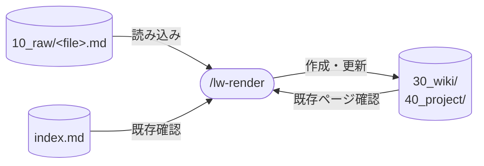

# llm-wiki-kit の render skill 設計

llm-wiki-kit の `/lw-render` skill（raw → wiki に render する動作を自動化）の設計書。
横断パターンは [[LLM-Wiki-ingest-skillのパターン]]、SKILL.md 一般論は [[Claude-Code-Skillの書き方]] を参照。

**本ページは決定根拠のみを持つ。**
Process の手順・定型句・数値閾値・よくあるミスと言い訳対戦表の項目は `templates/.claude/skills/lw-render/SKILL.md` が正本で、本ページに写さない。

各設計判断の上位原則は [[プロンプト設計原則]] にまとめてあり、本ページの各節では該当する原則への `[[link]]` で根拠を示す。

## データフロー

図は入出力の要約。実際の読み書き対象は `templates/.claude/skills/lw-render/SKILL.md` が正本。

## skill 名

`/lw-render` 採用。llm-wiki-kit の世界観（雨 / 水 / イラストレーター制作工程）に揃える観点で、wiki で絵を完成させる比喩が最もフィット。

検討した他の候補:

| 候補       | 意味                      | 不採用理由                                       |
| ---------- | ------------------------- | ------------------------------------------------ |
| `/ingest`  | 取り込み（Karpathy 用語） | 技術寄り、llm-wiki-kit の世界観に合わない        |
| `/pour`    | 注ぐ                      | 動作は直感的だが「絵を完成させる」感が弱い       |
| `/distill` | 蒸留                      | 動作のニュアンスが「絞り出す」寄りで写経感が薄い |

skill 名だけでなく動作概念としても「render」を使う（`/lw-render` skill が render 動作を実行する、という関係）。

## skill 配置

全 skill は project-local（`.claude/skills/` 配下）。

- 実体: SKILL.md（`.claude/skills/lw-render/SKILL.md`）
- 設計書: 本ページ（`docs/lw-kit/40_スキル設計/`）
- ディレクトリ名 `lw-render` と frontmatter `name: lw-render` を揃える

## 呼び出し制御

`disable-model-invocation: true` を frontmatter に付け、Claude の自動起動を禁止する（`/lw-render <path>` のユーザー明示起動のみ）。

根拠:

- render は 1 回で 5-10 ページを書き換える副作用の大きい操作で、議論ステップ / 矛盾保持 / バックリンク走査すべてが lead 判断を前提にしている
- raw ファイルを開いただけで自発起動すると、言い訳対戦表で抑止しているはずの「とりあえず render」が逆方向から発生する
- 副次効果として description（~200 char 前後）が常時 context に積まれなくなる
- 対比: 同様の「特定タイミングで必ず実行」要件は [[Claude-Code-Hook]] で扱う（LLM を介さない決定論的処理）。render は「対話 + lead 判断」が必須なので Hook ではなく手動起動が筋

## 許可ツールの最小化

許可ツールの列挙は SKILL.md の `allowed-tools` が正本。

最小権限の原則([[Claude-Code-Skillの書き方]]「allowed-tools」セクション)に従い、Process で実際に必要なものに絞っている。
汎用 `Bash` は使わない(`rm` / `mv` / `git` 等まで暗黙に許可されてしまう)。
`Bash(wc:*)` を入れた理由: 本文長 / 行数は Read 後の文字列計測でも代替可だが、`wc` の方が確定的で実装が短い。
`Bash(tail:*)` を入れた理由: Process 9 の log.md 追記が append-only で、rule が追記前の末尾確認を要求する。log.md は数千エントリまで育つので Read で全体を読む代替は重い。
具体的な用途は SKILL.md を参照。

## SKILL.md の構造設計

セクション順序は 言い訳対戦表(skip 抑止) → 事前条件(停止判定) → Process(実行) → 参照節 の認知順序に沿わせる。
複数の step から使われる判断基準（生成パターン / 数値閾値）と、完了後に見るチェック（よくあるミス）は Process の外に出し、step からは名前で参照させる。
step の中に基準を埋めると、前方 / 後方参照が発生して読む順序が崩れる。
[[Lost-in-the-Middle]] のサンドイッチ戦略(先頭と末尾に重要情報、本文中央に手順) + [[Chain-of-Thought]] のスキャフォールディング(9 ステップへの分解)に基づく。
実際の並びは SKILL.md が正本。

`description` は third person の action description で書く（Anthropic 公式 best practice の "Always write in third person" に準拠）。
[[CO-STAR]] の Response(出力形式) + Audience(受け手) 設計の skill 版で、Audience は「raw を render しようとしている lead」。
description に載せるのは起動判断に要る情報だけで、命令は本文側に書く。

事前条件を Process の手前に置くのは [[赤ずきんの原則]] の「停止条件を明示する」の skill 化。
条件を満たさなければ Process に入らせない。

## 議論ステップの設計

書き始める前に 4 判断項目(出力先 / type / title / 関連 entity 置き場)を確定するのが目的。
書いた後で出力先や type を変えると、生成済みの page 群とバックリンクを作り直すことになる。

判定の基準そのものは設計書が持たない。
type / ファイル名 / case root の title 規約は rules([[lw-kit-詳細設計-rules]])、定型句と提示項目は SKILL.md が正本。

escape hatch として `just render` で議論を skip できる。
skip できないと、lead が既に判断を済ませている場合にも対話が挟まって邪魔になる。

source page の title に raw の生表現を使わせないのは、raw の表記が素材の入手経路（対談ログ / メモ）を指すのに対し、wiki 側で要るのはその素材が何をした記録かだから。
入手経路は frontmatter `sources:` が持つので、title が重ねて持つ必要がない。

raw に明示されていない上位概念を entity 化する場合も、この議論ステップで採否を仰ぐ。
採用したら公式ドキュメント等で内容を調べてから書く。
推測で本文を書くと、raw にも一次情報にも根拠がない記述が wiki に入る。

## log / index を skill 側で更新する理由

render 完了後、同じセッションで log.md / index.md を更新する。
ユーザーの指示を待たず、CLAUDE.md のターン終了前セルフチェック準拠で追記する。

同タイミングで case root(`40_project/<案件>/<案件>.md`)の「関連 raw」セクションの状態ラベルも切り替える。

当初は「skill は log.md / index.md に触らない、lead が自走更新する」と書いていた。
用語集の `lead` はメインの Claude Code セッションを指すが、この表現が「ユーザーが更新する」と読まれ、render 後に log / index が更新されない事故が起きた。
更新の責務は CLAUDE.md のターン終了前セルフチェックが持っており、[[lw-kit-スキル設計-lw-commit]] のステップ 2 も同じ立場を取る。

## 引用は frontmatter sources で完結させる

規定そのものは SKILL.md の Process 4 が正本。

`sources:` の path 列挙だけで出典追跡を完結させ、本文中に行・セクション参照を書かせない理由:

- raw は基本的に永続的(path は不変、ファイル削除も基本なし)だが、行数 / セクション名は raw 編集で変動しうる
- 本文中の細かい行・セクション引用は wiki page が「源泉に依存して読む」形になり、wiki 自立性を損なう
- frontmatter `sources:` の path 参照だけで「どの raw から来たか」は追える、これで十分という関係性で運用する

## 数値閾値の設計根拠

具体値は SKILL.md「数値閾値」セクションが正本。

- 本文長下限: [[karpathy-wiki]] の `chat-only` floor 準拠
- ページ分割: [[karpathy-wiki]] 準拠 + [[Progressive-Disclosure]]
- 波及範囲: llm-wiki-kit はフラット運用なので [[claude-obsidian]] より少なめに取る。render で新規作成 / 編集される wiki page の合計(backlink 化は含めない)
- backlink 走査前 grep: 閾値ではなく必須動作。「省略可」の選択肢を作らない

## entity の参照セクションに粒度ガイドが要る理由

entity page の「<ワークスペース名> での参照」セクションは不変な事実のみ書き、案件側変更で wiki 追従が要求される情報は書かない。
判定基準と例は SKILL.md の Process 5 が正本。

このガイドが要る理由:

- テストケース数 / version / phase 番号 / 時系列ステータスは案件側で変動する
- case page を変えるたびに entity wiki の追従が要求され、保守負荷が積み上がる
- entity は wiki グラフのハブで、case 数 × 流動属性数の倍数で更新負荷が増える

## WebSearch 補完時に一次情報を優先する理由

優先順位そのものは SKILL.md の Process 5 が正本。

raw と lead 直接情報を最上位に置くのは、この 2 つだけが「いま lead が持っている状態」を反映しているため。
WebSearch は補完で、検索結果が古いままインデックスされている可能性が常にある。

事例: とある企業の本社住所を entity 化した際、WebSearch は旧本社、raw は新本社を指していた。
user 訂正で raw を採用した。
この事例は wiki 側に痕跡が残らないので設計書が持つ。

## よくあるミス / 言い訳対戦表の上位原則

項目そのものは SKILL.md が正本。
各項目が存在する理由の上位原則を設計書が持つ。

- 「書く前に読む」「既存に追加(時系列追記しない)」は [[赤ずきんの原則]]「7 つの実践ガイドライン」セクションの 1 番目「既知の形式を模倣する」の render 適用。既存 page の構造を読まずに上書きすると、訓練データの「道」から外れた形式になる
- 「矛盾保持(解消しない)」は両方残して別タイミングの解決に委ねる方針。render 中に解決すると、判断材料が揃っていない状態で片方を消すことになる
- 「バックリンク走査必須」は [[Lost-in-the-Middle]] の context 中央劣化を補完する構造的検査。新出 entity を本文中央で言及した既存 page は LLM の注意から漏れやすいため、grep で機械的に拾う
- 「言い訳対戦表」は [[Self-Refine]] のメタトリガー設計の起動前版(Process に入る前に skip したい誘惑を自己抑止)

## 生成パターンの判断軸

判断基準そのものは SKILL.md の Process 5 が正本。

### 大型 raw を 3 ファイルに分解する理由

切り口が混在した raw を 1 ファイルに render すると、汎用知識と案件固有の戦略が同じ page に同居する。
汎用側だけを他案件で使い回したい時に、案件固有の記述ごと引くことになる。
分解の軸は使い回しの単位で、ファイルサイズではない。

事例: 51KB の対談 raw を、テーマの異なる 3 ファイルに分解（ワークスペース側の実例）。

### case root を後回しにする場合がある理由

案件の方針が断片的にしか語られていない場合、render 過程で素材が集まる。
集まった素材を俯瞰する形で case root を書く方が、先に書いて後から直すより無駄が少ない。

事例（ワークスペース側の実例、案件名は伏せる）:

- プロジェクト方針 raw 先行 → case root を 1 番目に起こしたケース
- 受験経緯まとめ raw → case root に集約したケース
- 明示的方針なし、前半で派生 source 5 件先行 → 最後に case root で俯瞰したケース

## エラーハンドリング

リトライ / 自動回復は持たない(lead 投げで十分)。
skill が触らないのは raw 元ファイルのみ。

## 採用しなかった機能

新 entity 群（[[Dynamic-Context-Injection]] / [[context-fork]] / [[Sub-Agent]] / [[Claude-Code-Hook]]）について、render skill では採用しなかった理由を記録する。

| 機能                          | 不採用理由                                                                                                                                               |
| ----------------------------- | -------------------------------------------------------------------------------------------------------------------------------------------------------- |
| [[Dynamic-Context-Injection]] | raw は path 引数で指定、起動時の動的シェル実行は不要。`!`ls 10_raw/`` 等のメニュー化案も考えられるが、議論ステップで lead が明示指定する設計なので冗長   |
| [[context-fork]]              | 議論ステップで lead 対話が必須、fork すると親会話履歴を失って対話が成立しない。inline 実行が前提                                                         |
| [[Sub-Agent]]                 | 矛盾保持判断 / バックリンク per-file 確認は lead 自身が担う、Sub Agent に委譲すると判断ループが分断される。空 context Sub Agent も会話履歴を失うので不可 |
| [[Claude-Code-Hook]]          | enforcement が必要なら検討余地あり（`PostToolUse` で log.md 自動追記 / `Stop` で影響範囲レポート差し込み等）、現状は手動 lead 確認に集中。将来の拡張候補 |

## 保守規律

- ミスドリブン更新(Boris-Cherny 方式): 試運転で見つかった失敗は SKILL.md のよくあるミス / 言い訳対戦表に追記し、設計書には上位原則のみ反映する
- 本設計書と SKILL.md の同期: 具体値(数値閾値 / よくあるミス / 言い訳対戦表 / 議論ステップ定型句)の正本は SKILL.md。設計書は why のみ。具体値のみの変更なら設計書は触らない

## 関連

- [[LLM-Wiki-ingest-skillのパターン]] — 4 実装横断のパターン。本設計はこの 12 要件を出発点にした
- [[Claude-Code-Skillの書き方]] — SKILL.md 一般論
- [[lw-kit-詳細設計-log-index]] — log / index 更新トリガー
- [[lw-kit-詳細設計-issue]] — issue から永続知識を wiki へ移す動線の出発点
- [[プロンプト設計原則]] — 本設計書の各判断の上位原則
- [[赤ずきんの原則]] / [[Lost-in-the-Middle]] / [[Chain-of-Thought]] / [[Self-Refine]] / [[CO-STAR]] / Boris-Cherny / [[Progressive-Disclosure]] — 設計判断の根拠（個別 entity）
- [[Claude-Code-Hook]] / [[Sub-Agent]] / [[context-fork]] / [[Dynamic-Context-Injection]] — 採用しなかった機能（「採用しなかった機能」セクション参照）
- [[lw-kit-詳細設計-rules]] — rules の構成（wiki / wiki / project / issue / skeleton-confirm の設計・運用・改訂の起点）
- [[lw-kit-アーキテクチャ設計]] — skill 群全体での位置づけ（wiki render ファミリー）
