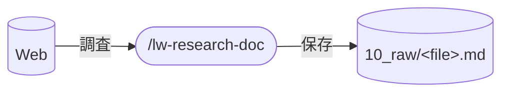

# llm-wiki-kit の lw-research-doc skill 設計

Web上の情報を調査してマークダウンドキュメントを生成する `/lw-research-doc` スキルの設計。

**本ページは決定根拠のみを持つ。**
入力判定・実行フロー・保存ルール・ドキュメント構成・エラーハンドリングは `templates/.claude/skills/lw-research-doc/SKILL.md` が正本で、本ページに写さない。

## データフロー

保存先の正本は SKILL.md「保存ルール」。下図は既定の経路。

## skill 名

`/lw-research-doc` 採用。
`lw-` prefix + `research-doc` で Web 調査によるドキュメント生成であることが名前で分かる。

## skill 配置

全 skill は project-local(`.claude/skills/` 配下)。
保存先(`10_raw/`)のディレクトリ構造や frontmatter スキーマが llm-wiki-kit 固有の規約に依存するため global 化しない。

## 呼び出し制御

`disable-model-invocation: true`。
Web 調査は lead が意図的に起動する操作。
外部 API(WebFetch / WebSearch)を呼ぶため自動起動は不適切。

## 許可ツールの最小化

許可ツールの列挙は SKILL.md の `allowed-tools` が正本。
Bash を入れていないのは、外部 API を呼ぶ skill に汎用 Bash を持たせると、調査の副作用でファイル操作まで許すことになるため。

## 入力の種類をユーザーに意識させない

URL とキーワードで処理は分かれるが、起動時にどちらかを宣言させない。
調べたいものが URL の形をしているかどうかは、調べる側の関心事ではない。
判定は skill 側で機械的に行う（判定方法は SKILL.md「入力判定」）。

## ソースの信頼性で順位を付ける理由

どのソース種別を優先するかは SKILL.md の「実行フロー」が正本。

`10_raw/` は後で `/lw-render` が wiki に変換する素材なので、ここで掴んだ情報の質がそのまま wiki まで伝播する。
調査の時点で順位を付けておかないと、変換の段階では出典の質が見えなくなっている。

## 保守規律

- 本設計書と SKILL.md の同期: SKILL.md を変更したら本設計書の `updated:` も揃える
- frontmatter スキーマ変更時の追従: `10_raw/` の frontmatter 規約が変わったら SKILL.md の出力テンプレートを追従

## 関連

- [[lw-kit-スキル設計-lw-render]] — research-doc の出力(`10_raw/`)を wiki に変換する後続 skill
- [[lw-kit-アーキテクチャ設計]] — skill 群全体での位置づけ(ナレッジ蓄積ワークフロー)
