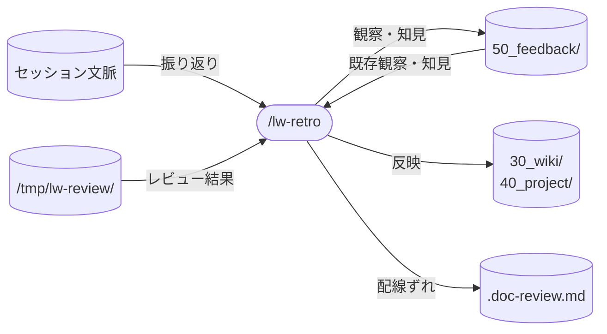

# llm-wiki-kit の retro skill 設計

`/lw-retro` skill の設計書。
`/lw-commit` から「反映＝振り返り」を剥がし、振り返りを探索（exploration）の所作として独立させる skill。
単なる引っ越しではなく、探索を強制する装置として設計するのが要点。
本ページは設計判断の why を集約する。
実行手順の how は SKILL.md を参照。

型は [[lw-kit-スキル設計-lw-commit]]（why 集約、対になる活用側 skill）に倣う。

## データフロー



## なぜ /commit から剥がすか（exploration collapse との同型）

反映を畳む文脈（`/lw-commit`）に置くと慣性が働き、反映対象を拾わないまま終わりやすい。
実例として、あるセッションで「反映: 該当なし」と報告したが、改めて問い直すと観察が複数出てきた。

理論的裏づけは [[探索・活用ジレンマ]]。
LLM は放っておくと greedy（活用）に倒れ、十分な情報収集なしに一見最適な選択肢を繰り返す。
`/lw-commit` を回すほど反映が該当なしで終わるようになるのは、RL ポストトレーニングで起きる exploration collapse（探索の崩壊）と同型の現象。

反映＝棚卸しは探索の所作。
活用フロー（`/lw-commit` = 畳む）に同居させると、活用に倒れて崩壊する。
対策は、別の所作として明示的に Temperature を上げる（探索モードに切り替える）装置を外付けすること。
[[探索・活用ジレンマ]] の含意「LLM は放っておくと活用に倒れるので、探索は明示的な足場で外付けする必要がある」をそのまま skill 設計に適用する。

## skill 名

`/lw-retro` 採用。

| 候補        | 意味                      | 採否                                                       |
| ----------- | ------------------------- | ---------------------------------------------------------- |
| `/lw-retro` | 振り返り（retrospective） | 採用。動作そのまま、`/lw-commit` と並べて対が分かる        |
| `/reflect`  | 内省                      | 不採用。retro より動作の射程が曖昧（自己批判寄りに読める） |

`/lw-commit`（活用）と `/lw-retro`（探索）を探索・活用ジレンマの対として並べると、skill family の役割分担が名前で見える。

## skill 配置

全 skill は project-local（`.claude/skills/` 配下）。

- 実体: SKILL.md（`.claude/skills/lw-retro/SKILL.md`）
- 設計書: 本ページ（`docs/lw-kit/40_スキル設計/`）
- ディレクトリ名 `lw-retro` と frontmatter `name: lw-retro` を揃える（`lw-` prefix は built-in skill との同名衝突回避、[[Claude-Code-Skillの書き方]] 参照）

project-local に留める理由は `/lw-commit` と同じく、反映先が llm-wiki-kit 固有構造に密結合しているため。

- 反映先の領域（作業スタイル `50_feedback/feedback-観察-作業スタイル.md` / 汎用 `30_wiki/` / 案件固有 `40_project/` / memory）が llm-wiki-kit のディレクトリ構造に依存
- リファクタ検討の判断軸（type 役割 / 陳腐化しない書き方 / 出典規約 / wiki 編集規約）が llm-wiki-kit の wiki 規約に依存

他プロジェクトに持ち出してもこれらが無く意味をなさない。

## 呼び出し制御

`disable-model-invocation: true` を付け、Claude の自動起動を禁止する（`/lw-retro` のユーザー明示起動のみ）。

根拠:

- 振り返りは「畳む前に lead が区切る」タイミングで起動するもの。自動起動すると区切りの主導権を skill が奪う
- `/lw-commit`（畳む）の前に `/lw-retro`（振り返る）を回す運用に限定する。振り返りの反映でファイルが動くと差分が `/lw-commit` の対象に入るため、この順序でなければならない
- 先例は副作用や区切り判断を持つ skill（`/lw-commit` / `/lw-render` / `/lw-fix-review`）すべて `disable-model-invocation: true`

description は日本語のまま維持する。
[[Claude-Code-Skillの書き方]]「呼び出し制御」セクションが `disable-model-invocation: true` の skill に認めている例外に従う（description は model の自動起動判定 context に載らないので、英語化の実利がない。[[lw-kit-スキル設計-lw-commit]] と同じ判断）。
将来 model 自動起動を有効化する場合は英語・三単現に直す。

## 許可ツールの最小化

汎用 Bash は持たない。
Glob を選ぶのは、dot ファイルが `ls` 走査に出ないため。`Bash(find)` を足すより doc-review 側と手段を揃える方が一貫する。
Write を含むのは反映で新規 page / memory を作る場合があるため（要確認側、「反映の自走度」参照）。
git は read-only（add / commit は `/lw-commit` の責務）。
許可リストの具体値は SKILL.md が正本。設計書に写すと、SKILL.md 側で増減したときに気づかず乖離する。

## 全 5 責務の実行順と why

```text
1. セッション読み返し → 2. 観察収集（探索強制）→ 3. リファクタ検討
  → 4. 反映先判断 → 5. 骨子提示・lead 確認・反映
```

| #   | 責務                 | 内容                                                                                                                                | 順序の根拠                                                                          |
| --- | -------------------- | ----------------------------------------------------------------------------------------------------------------------------------- | ----------------------------------------------------------------------------------- |
| 1   | セッション読み返し   | 既定はセッションの context window から読む。lead が明示指示した時だけ jsonl を読む                                                  | 探索の材料を集める。context が greedy に縮んだ時の外部記憶として jsonl は明示時のみ |
| 2   | 観察収集             | 領域別走査 + 探索モード宣言で観察を集める。セッション外の材料（レビュー結果 / 宣言）も走査対象に含める。Edit はせず候補を挙げるまで | 本 skill の肝。読み返した材料から探索的に観察を引き出す                             |
| 3   | リファクタ検討       | `git diff --stat` + `git status` で変更ファイルを洗い出し、優先的に見直す                                                           | 棚卸し＝探索の所作。変更量ベースの優先順位で無駄な走査を防ぐ                        |
| 4   | 反映先判断           | 反映先を判断（作業スタイル / `50_feedback/` / `30_wiki/` / `40_project/` / memory / `.doc-review.md`）                              | 再発は事例行 +1、新規は骨子提示                                                     |
| 5   | 骨子提示・確認・反映 | 反映の骨子を lead に提示 → 確認 → 反映（自走度 2 段、本ページ「反映の自走度」セクション）                                           | 反映は副作用があるので確認を挟む。探索の出口                                        |

責務 3 のリファクタ検討は棚卸し＝探索の所作。
活用フロー（`/lw-commit`）に同居させると、反映と同じく autopilot が「該当なし」で流すため `/lw-retro` が持つ（[[lw-kit-スキル設計-lw-commit]] の「反映の実行を `/lw-retro` に一本化した」と同じ理由）。
優先順位を変更量で決めるのは、大きく直したファイルほど複数回の Edit で不整合が入りやすいため。
判断軸を設計書に再掲せず既存の規約に参照させるのは、編集規約が動いたときに追従先を 1 箇所に保つため。
リファクタ検討も探索の所作なので、観察収集と同じ探索強制（「探索の入口」）/ 過剰探索の歯止め（「探索の入口」と「探索の出口」の二段構え）を共有する。

## 探索の入口: 探索を強制する構造（本 skill の肝）

責務 2（観察収集）と責務 3（リファクタ検討）で、autopilot が「該当なし」で済ませるのを構造で防ぐ。
領域別走査を骨格に、探索モード宣言を被せる。
これは探索の入口（広げる側）で、後述「探索の出口」（再発の扱い）と対をなす。
この入口と出口の対が過剰探索の歯止めの二段構え（収集は広げ、反映は重複検出で絞る）。
探索しすぎも活用しすぎと同じく劣化するため、広げる装置だけでなく絞る装置を対で持つ。

### 領域別走査

件数でなく「領域」を強制する。
反映先の各領域（作業スタイル / `50_feedback/` / `30_wiki/` / `40_project/` / memory）を「ここに反映すべきものは無いか?」と必ず一巡問う。
`50_feedback/` を独立領域にする理由: retro は蓄積の主導線（補助導線は fix-review）であり、`50_feedback/` の知見・観察・指針への追記判断を `40_project/` の一部として埋もれさせない。
各領域は「無し」で OK。

greedy が「全体ぼんやり該当なし」で逃げるのを、領域分割で塞ぐ。
分割すると各領域で具体的に考えざるを得ない。
各領域ゼロを許すので水増し（無理やり観察をひねり出す）を誘発しない。
各ステップで該当が無い場合は skip して次へ進む。
走査を駆動するのは領域を列挙する構造であって個別の「該当なし」報告ではないので、報告は skill 全体の完了報告 1 回に寄せる。

#### doc-review 宣言の扱い

doc-review 宣言（`.doc-review.md`）は独立領域にせず、feedback 領域の点検項目として持つ。
宣言は配線（プロファイル判定 / 知見参照 / 規範コンテキスト参照）であって観点の実体ではないため、独立領域にすると走査の行き先が結局プロファイル / 知見に戻り、feedback 領域と重複する。
蓄積の穴は観点側（プロファイルへの新規追記）と配線側（宣言の参照漏れ・注記の範囲・宣言未作成）の 2 種類あり、前者は feedback 領域の走査、後者は宣言の点検で別々に塞ぐ。
宣言は数が多く、毎回の全件走査は得られるものに対してコストが高いので、点検はレビューを回した、または設計書を worker に渡したセッションに限るゲートを掛ける（具体条件は SKILL.md）。
worker に渡した場合を含めるのは、レビューを回さなくても規範コンテキストの過不足に気づく機会がそこで生じるため。

#### TDD 自己点検の扱い

実装 TODO を含むセッションに限り、`/lw-tdd` の Red-Green-Refactor 規律が崩れていないか（Red を飛ばした / Green で過剰実装した / 型壊れを外側ループへ持ち越した）を点検する。
設定・文書だけのセッションでは skip する。

doc-review 宣言の点検と同じく、`/lw-tdd`（[[lw-kit-スキル設計-lw-tdd]]）自体は決定論的な規律を持つが、規律の遵守はセッション内で自己申告的に崩れうる（activity collapse）ため、独立領域にはせず条件付き点検として観察収集に組み込む。
全セッションを対象にすると文書オンリーのセッションでは点検対象がゼロのまま走査コストだけが出るため、実装 TODO の有無をゲートにする。

### 探索モード宣言

責務 2 / 3 の冒頭で「いまは活用でなく探索のフェーズ、Temperature を上げて発散しろ」とモードを明示宣言する。
[[探索・活用ジレンマ]] / [[Temperature]] の理論と素直に対応し、[[プロンプト設計原則]] の「停止条件・モードを明示する」（[[赤ずきんの原則]] 系）に乗る。
保守する固定リストを持たない軽い装置。

C で領域に分けたものを、D で「探索の目」で見る組み合わせ。

### 採否記録（A / B を残す理由）

ワークスペース側の知見蓄積で確立された採用判断リスト型で、検討した各案の採否を記録する。

| 案                          | 内容                                    | 採否     | 理由                                                                                                                 |
| --------------------------- | --------------------------------------- | -------- | -------------------------------------------------------------------------------------------------------------------- |
| C 領域別走査                | 反映先の各領域を必ず一巡問う            | 採用     | 全体ぼんやり逃げを領域分割で塞ぐ。各領域ゼロ許容で水増しを誘発しない                                                 |
| D 探索モード宣言            | 冒頭でモード切替を明示                  | 採用     | 理論と素直に対応、固定リスト不要。C と組み合わせる                                                                   |
| A 観察ゼロ禁止              | ゼロで次に進むなとだけ命じる            | C に内包 | 領域分割で全領域ゼロは稀、かつ各領域ゼロ許容で形骸化しない                                                           |
| B 最低 N 件ノルマ           | 最低 N 件掘るまで止まるな               | 不採用   | 軽い作業後に水増しを誘発、N の根拠が恣意的、過剰探索に直結                                                           |
| doc-review 宣言の独立領域化 | 宣言を第 6 の走査領域として一巡に加える | 不採用   | 宣言は配線であり走査の行き先がプロファイル / 知見に戻るため feedback 領域と重複する（「doc-review 宣言の扱い」参照） |

採用 / 不採用を全て残し、「これは検討して不採用だった」と後から参照できるようにする（ワークスペース側の知見蓄積における採否記録方針）。

具体プロンプト文言（領域走査の正確な問いかけ / モード宣言の文）は SKILL.md 実装時に詰める。
設計書は構造と why まで、文言は SKILL.md に置く（設計書 = why / SKILL.md = how の分担、[[Progressive-Disclosure]] 思想）。

## 探索の出口: 再発の扱い

既存項目と被る観察は drop せず、再発として台帳の追記ルールに従い事例行 +1 で記録する。
新規または迷うものは INBOX に投入し、分類は棚卸しに委ねる。
新規の成文化に値する差分だけ骨子提示 → lead 確認する。

この重複検出を効かせるため、収集の責務（責務 2）では Edit を行わず候補を挙げるまでに閉じる。
収集の段で直接書き込むと、その出力が重複検出・骨子確認・自走度判定を素通りし、出口の歯止めが 1 つ無効化される。
実際の反映は責務 5 に一本化する（具体の割り当ては SKILL.md）。

## 反映の自走度（2 段）

[[lw-kit-スキル設計-lw-fix-review]] の採否 3 区分（自走 / スキップ / 相談）はこの用途にはリッチすぎるので、軽微 / 要確認の 2 段に簡略化する。
`/lw-commit` は反映を持たないため、この 2 段は `/lw-retro` 固有。
2 段に割った理由の正本は本ページ、区分の適用基準（どの操作がどちらに落ちるか）は SKILL.md 責務 5。

why:

- 軽微 = rules の骨子確認規律（[[lw-kit-詳細設計-rules]]）の「既存ファイルへの軽微な Edit / 行追記」に相当、自走 OK の範囲
- 要確認 = 同骨子確認規律の「新規作成 / 大きい修正」+ memory 運用（CLAUDE.md の「auto memory 保存前に必ず確認」、[[lw-kit-詳細設計-CLAUDE.md]]）に該当
- memory 保存は特に「今回限りの指示と長期的な好み・ルールの区別がユーザー側にしかつかない」（CLAUDE.md、[[lw-kit-詳細設計-CLAUDE.md]]）ため、skill 内でも必ず確認を挟む
- 別リポジトリの `.doc-review.md` への書き戻しは要確認側に置く。外部 repo の宣言はルーター経由でしか辿れず、`Glob` のヒットにも出ないので、触る対象が lead の想定と食い違いやすい

## /commit との境界

`/lw-commit`（活用）と `/lw-retro`（探索）を探索・活用ジレンマの対として分離する。

- 観察の反映は `/lw-retro` が持ち、`/lw-commit` は持たない（`/lw-commit` は Write なしの畳む専念、[[lw-kit-スキル設計-lw-commit]]）
- リファクタ検討も `/lw-retro` が持つ（観察の反映と同じ探索 collapse 理由）
- `/lw-commit` に残るのは issue と台帳の記録 / add / commit まで（format / lint の検査は pre-commit hook が持つ）
- `/lw-commit` は畳む（活用）に専念、`/lw-retro` は振り返る（探索）に専念

skill family 全体での位置づけは [[lw-kit-アーキテクチャ設計]]「issue 管理」セクションが持つ。

## SKILL.md 実装の参照

実装ファイル: SKILL.md（`.claude/skills/lw-retro/SKILL.md`）

構造の先例は commit の SKILL.md。
設計書とは「設計判断の why」と「実装の how」で分担し、同じ情報を両方に書かない。

## 棚卸し起動条件チェック（責務 5 の後）

5 責務の完了後に、作業スタイル台帳の棚卸し起動条件を計測して lead に提案する。
棚卸し自体は実行しない（棚卸し = 整理は retro = 蓄積と責務が異なる、将来は独立 skill）。

retro の末尾に置く理由:

- retro がセッション終了時（畳む前）に走るため、棚卸しの提案タイミングとして自然
- retro は台帳への事例追記（蓄積）を責務に持つので、追記直後に起動条件を計測できる
- 棚卸しの実行を retro に入れると retro が重くなり、蓄積と整理の責務が混在する

実行しない制約の理由:

- 棚卸しは lead との対話型判断を伴い、retro のフロー内で完結しない
- retro の許可ツール範囲（本ページ「許可ツールの最小化」参照）で棚卸しの下流 Edit（行動指針・memory 等）をカバーするとスコープが膨張する

具体的な計測コマンドと閾値は SKILL.md 参照。

## 保守規律

- 本設計書と SKILL.md の同期: SKILL.md を変更したら本設計書の `updated:` も揃える。why が変われば設計書、how が変われば SKILL.md
- `/lw-commit` との境界変更時の追従: 反映・リファクタ検討の責務境界が動いたら [[lw-kit-スキル設計-lw-commit]] と本ページを相互に追従
- ミスドリブン更新: `/lw-retro` を回して失敗が見つかったら、該当する設計セクション（「探索の入口」/「探索の出口」等）か SKILL.md の手順に平坦に溶かし込む（Boris-Cherny 方式）。発見の日付や履歴を積み上げる形では書かない
- `/lw-retro` 自身は反映先（作業スタイル / page / memory / `.doc-review.md`）の更新以外のファイルを触らない（振り返りフローに閉じる、git は read-only）

## 未確定

確定事項は本文各セクションに溶かし込み、判定条件・文言は SKILL.md が持つ。
ここに残るのは、まだ決めていない 2 件。

- 重要度で間引く具体基準: UCB 的に変化の大きい領域を優先する等（歯止めの二段構えそのものは「探索の入口」「探索の出口」で確定済み）
- jsonl の抽出範囲（直近 N ターン / 全域）: 明示指示時のみ読む方針と、全文でなく `role` 別に抽出する方針は確定。全文ロードは context を greedy に縮めて探索を阻害するため、外部記憶としての jsonl は抽出経由で当たる

## 関連

- [[lw-kit-スキル設計-lw-commit]] — 対の活用側 skill（畳む側）。リファクタ検討・反映の委譲元、設計書の型
- [[探索・活用ジレンマ]] — 設計の理論的裏づけ（exploration collapse）
- [[Temperature]] — 探索モード宣言（D）のメタファ
- [[プロンプト設計原則]] — モード・停止条件の明示（探索強制の裏づけ）
- [[lw-kit-スキル設計-lw-doc-review]] — 蓄積の受け手（宣言・プロファイル・知見の仕様の正本）
- [[lw-kit-スキル設計-lw-tdd]] — TDD 自己点検の対象（Red-Green-Refactor 規律）
- [[Progressive-Disclosure]] — 設計書（why）/ SKILL.md（how）の分担思想
- [[lw-kit-アーキテクチャ設計]] — skill 群全体での位置づけ（「issue 管理」セクションの「振り返り」段）

本設計書の元 issue（検討過程・採否）と親 issue（作業スタイル蓄積の仕組み全般）は、ワークスペース側で管理されている。
