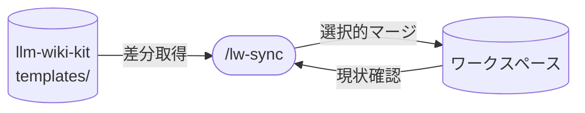

# llm-wiki-kit の lw-sync skill 設計

`/lw-sync` skill の設計書。
kit の upstream 更新をワークスペースに選択的に取り込む skill。

**本ページは設計判断と、実装時に満たす要件を持つ。**
実物は未実装（`templates/.claude/skills/` に実体なし。実装はワークスペース側の issue で予定）。
実装後は `templates/.claude/skills/lw-sync/SKILL.md` が手順・具体値の正本になり、その時点で how を本ページから移す。

やらないこと:

- ワークスペース側のカスタマイズを kit に逆流させること
- `docs/`(knowledge 含む)の同期(手動 cp で個別判断)
- kit ルートファイル(`README.md` / `setup.sh` 等)の同期

## データフロー

図は入出力の要約。実際の読み書き対象は `templates/.claude/skills/lw-sync/SKILL.md` が正本。

## skill 名 / 配置

`lw-` prefix と project-local 配置は [[lw-kit-アーキテクチャ設計]]「横断設計原則」が規定する。

## 呼び出し制御

(未記入)

## 許可ツール

(未記入)

## 処理フロー

1. sync 地点を特定する（機構は下記「sync 状態の管理」）
2. `git merge-base HEAD origin/main` で前回の sync 地点を特定する
3. sync 地点と `origin/main` の間の diff を取得する
4. diff のうち `templates/` 配下の変更を抽出する
5. 各変更ファイルについてワークスペース側の対応ファイルと比較する
6. LLM が diff 内容を見て merge 要否を判断する（反映 / スキップを選択）

## cp 対象の判定

境界定義は [[lw-kit-基本設計-ディレクトリ構成]] を参照。
`templates/` 配下のみが対象、`docs/` / kit ルートファイルは対象外。

## LLM の判断フロー

変更ファイルごとに以下を提示し、LLM が判断する:

- kit 側の diff（何が変わったか）
- ワークスペース側の現在の内容（カスタマイズされているか）
- 推奨アクション（反映 / スキップ / 手動確認）

判断の指針:

- ワークスペース側が未変更（kit のオリジナルのまま） → 自動反映
- ワークスペース側がカスタマイズ済み → diff の内容を見て判断。バグ修正なら反映推奨、機能追加なら選択
- 構造変更（セクション追加 / 削除） → 手動確認を推奨

## skip ポリシー

スキップした変更は再提案されない（git 履歴で sync 済みと判定される）。
理由: スキップは「この変更は自分には不要」という意思決定。毎回再提案されるのは煩わしい。

意図的に再取り込みしたい場合は kit 側のファイルを直接 cp する。

## sync 状態の管理

外部ファイルに記録しない。
sync 地点をどう記録するかは未決。

`setup.sh` は `templates/` を cp して `git init` するだけなので、生成されたワークスペースは kit と共通祖先を持たない。
remote を登録しても `git merge-base` は解決しないため、git の履歴に頼らない記録方式（cp 元の commit hash を残す等）を実装時に決める。
前回の sync 地点は git の commit 履歴から特定する（`git merge-base` 等）。
`setup.sh` が作った first commit が初回の sync 地点になる。

## 代替案

sync の仕組みとして検討した方式と不採用理由は [[lw-kit-要件定義]]「アーキテクチャ要件」が持つ。

## kit 側 rename への対応

kit 側でファイルが rename された場合、diff 上は delete + add として現れる。
ワークスペース側のカスタマイズ済みファイルとの対応が切れる。

対応方針:

- LLM が「旧ファイルの削除 + 新ファイルの追加」を rename として認識し、ワークスペース側で同等の rename を提案する
- ワークスペース側のカスタマイズ内容は新ファイルに引き継ぐ
- 自動判断が難しい場合は手動確認を促す

## kit の参照方法

ワークスペースから kit を参照する方法:

- `add-dir` で kit のローカルパスを追加する（開発時）
- git remote として kit の URL を登録する（Template Repository から作った場合）

`add-dir` の場合は kit 側リポジトリに対して `git -C <kit-path> log` 等で履歴を参照する。
git remote の場合は `git log` で一元的に見られる。

## エラーハンドリング

(未記入)

## 保守規律

(未記入)

## 関連

- [[lw-kit-基本設計-ディレクトリ構成]] — cp 対象の境界定義
- [[lw-kit-詳細設計-setup.sh]] — ワークスペース生成(初回 sync 地点)
- [[lw-kit-アーキテクチャ設計]] — skill 群全体での位置づけ
