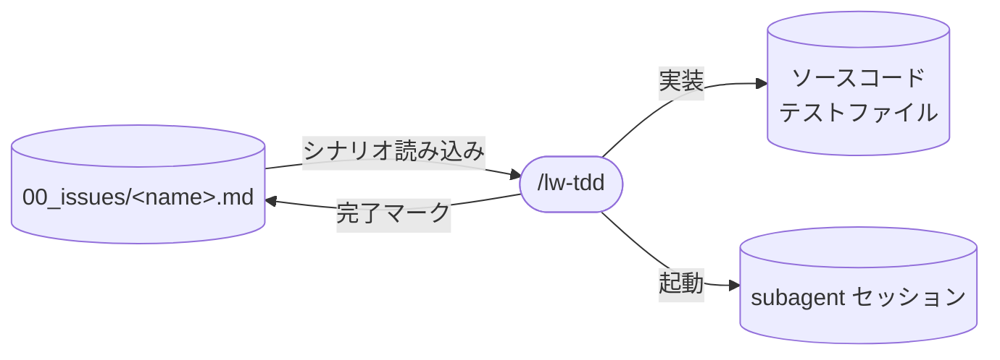

# llm-wiki-kit の TDD skill 設計

`/lw-tdd` skill の設計書。
内側ループ（Red-Green-Refactor）を 1 テストずつ回す手順 skill。
matlugert-tdd-skill の骨格（71 行、Baseline → サイクル）をベースに、superpowers の Verify RED/GREEN を移植する。
**本ページは決定根拠のみを持つ。**
サイクル手順・停止条件・briefing の文面は `templates/.claude/skills/lw-tdd/SKILL.md` と `briefing.md` が正本で、本ページに写さない。
実行手順の how は `SKILL.md` を参照。

## データフロー

図は入出力の要約。実際の読み書き対象は `templates/.claude/skills/lw-tdd/SKILL.md` が正本。



## 上位設計との関係

本設計書は [[dev-methodology-ワークフロー基本設計]] の TDD skill セクションを具体化する。
基本設計が決めた制約（二重ループ / ガードレール 3 層 / 遵守率テーブル）は前提として従い、本設計書では `SKILL.md` 固有の判断だけを追加する。
成果物ごとの設計判断は各設計書が持つ（[[dev-methodology-CLAUDE.md設計]] / [[dev-methodology-settings.json設計]] / [[lw-kit-ガイド設計-dev-guide]]）。

## skill 名

`/lw-tdd` 採用。TDD という行為そのものを名前にして直感的に呼べる。

`lw-` prefix は llm-wiki-kit の skill 群の命名規約。
配置場所を問わず統一する。

## skill 配置

project-local `.claude/skills/lw-tdd/`。

project-local にする理由:

- lead は開発時も llm-wiki-kit の worktree から add-dir で作業する。lw-tdd は常に llm-wiki-kit の context で起動される
- issue 連携（テストシナリオ拾い・チェックボックス更新）が llm-wiki-kit 固有の運用
- subagent の briefing に issue のセクションを同梱する構成も llm-wiki-kit 固有

## 呼び出し制御

`disable-model-invocation: true`（手動 `/lw-tdd` 起動のみ）。

根拠:

- lead が skill 制作者として TDD サイクルの開始タイミングを制御したい。
  自動発火すると lead の判断を skill が奪う
- `workflow.md` が「実装 TODO に着手するとき /lw-tdd を使う」と nudge するが、発火判断は lead に委ねる（nudge は助言、実行は lead）
- 将来 lead の運用が安定し自動発火が有用と判断されれば `disable-model-invocation` を外す（制約の緩和）

frontmatter `description` は英語・third person で書く（[[Claude-Code-Skillの書き方]] の third person 規約に準拠）。
`disable-model-invocation: true` なら日本語でも実利上問題ないが、自動発火に切り替えても修正不要にしておく。

## 許可ツール

Read / Edit / Grep / Glob / Task / `Bash(npm run:*)`。具体値は `SKILL.md` が正本。

matlugert との差分（判断）:

- Task を採用（1 シナリオ = 1 subagent。matlugert は Task を持つが subagent 分離の用途が不明瞭だった）
- Edit を追加（matlugert は実装コードの編集手段が不明瞭だった）。Write は不要（実装コードの新規作成は subagent が行い、skill の allowed-tools に縛られない）
- Bash は `Bash(npm run:*)` にスコープ制限（package.json scripts 経由に統一）

## 借りるもの / 借りないもの

借りる / 借りないの詳細は本セクションが正本。
実装判断書の TDD skill セクションは判断だけ残し、詳細は本設計書を参照する構成にする。

### matlugert から借りる骨格

- Baseline → RED → GREEN → REFACTOR → REPEAT の流れ
- テストランナー自動検出（package manifest を読む）
- ベースライン記録（既存テストの状態を記録し、既存失敗を Red/Green 判定から除外）
- Per-cycle checklist（テストの質を見る 5 項目）
- 三点セット出力（コマンド / exit code / 実出力。要約禁止）。全出力は貼らない（context 経済と証拠ガードレールの両立）。範囲の具体定義は `briefing.md` 参照
- Rules。基本設計の「外部依存だけモック」と重複するが、`briefing.md` に転記する（起動時に基本設計はロードされないため、subagent の briefing 単体で手順が成立する自立性が要る）。具体文言は `briefing.md` 参照
- Error handling（code error は続行、access/env error は停止報告）
- `$ARGUMENTS` でユーザー入力を受ける

### superpowers から移植するもの

- Verify RED: 失敗を確認する独立ステップ。AI は Red 確認を飛ばしがちなため必須。手順は `briefing.md` 参照
- Verify GREEN: テスト + typecheck の通過を確認する独立ステップ。transpile-only ランナー（tsx 等）では型壊れがサイレントになるため、typecheck を Green の定義に含める判断。手順は `briefing.md` 参照
- When Stuck 圧縮版: superpowers の長大な When Stuck を 1-2 行に圧縮した。具体文言は `briefing.md` 参照

### 借りないもの（理由付き）

| 要素                                      | 出典        | 借りない理由                                                                                                                                         |
| ----------------------------------------- | ----------- | ---------------------------------------------------------------------------------------------------------------------------------------------------- |
| Plan（テストシナリオ列挙 + 優先順位合意） | matlugert   | 形式的な Plan ステップは置かない。issue にシナリオがなければ skill がテスト案を提示し、lead が承認したら issue に書き込んでからサイクル開始する      |
| Iron Law「テスト前コードは削除」          | superpowers | 過剰。探索コードを削除して TDD で書き直すのは正論だが、個人開発では探索結果を参考にしながら TDD する方が現実的                                       |
| 言い訳対戦表 / Common Rationalizations    | superpowers | commit skill が既に同等の機能を持つ。二重に context を払わない                                                                                       |
| Red Flags（13 項目の停止シグナル）        | superpowers | 自動発火前提の superpowers の防御装置。lw-tdd は明示呼び出し + 証拠ゲート自走で足りる                                                                |
| Good/Bad コード例                         | superpowers | 行数と context 効率が資産。テストの質は Per-cycle checklist の原則文で担保する                                                                       |
| testing-anti-patterns.md 補助ファイル     | superpowers | 基本設計が「外部依存だけモック」「自分が書いたものだけテスト」を持ち、導入案件では DI 方針が確立済み。問題が繰り返されたら追加する（実績ベース昇格） |
| task-reviewer / fix subagent              | superpowers | /code-review が commit 前レビューを既に担う。サイクル毎レビューは二重払い                                                                            |

## 事前条件

具体的な確認項目は SKILL.md を参照。
設計意図: テストシナリオと設計仕様が無い状態でサイクルに入ると、Red の書き先が定まらず手戻りする。

## サイクル構造

```text
Baseline（初回のみ、テスト + typecheck）
  ↓
RED → Verify RED → GREEN → Verify GREEN（テスト + typecheck） → REFACTOR → REPEAT
          ↑ 失敗理由が                ↑ テスト or 型が落ちたら
          機能欠落でなければ            コードを直す、
          テストを書き直し             テストではない
```

matlugert の RED → GREEN → REFACTOR に Verify RED / Verify GREEN を挟んだ形。
Baseline はテスト pass 数 + typecheck 結果を記録し、既存失敗を Red/Green 判定から除外する。
サイクルの粒度は issue TODO の 1 行 = 1 サイクル。

図に現れない分岐が 1 つある。実装が先にあるシナリオでは RED → Verify RED が「壊して確認」に置き換わり、GREEN を通らずに Verify GREEN へ進む（次節）。

### 実装が先にあるシナリオは「壊して確認」に置き換える

matlugert / superpowers のどちらも持たない独自拡張。
両者は「テストを先に書く」前提なので、実装が既にある対象に Verify RED を当てる経路を持たない。

置き換える理由は、テストを書いた時点で緑になる対象に対して RED を諦めると、検知力が未検証のまま緑になるため。
RED の代わりに「壊して赤くなること」を確認すれば、テストが何を見ているかの証拠が残る。

**破壊操作の前に commit をゲートとして置く**（理由と手順は `briefing.md` が正本）。
サイクル中にリポジトリを意図的に壊す設計は他のステップに無く、復旧手段を先に用意しないと他サイクルの成果まで失う。

検知対象が複数ある場合に対象ごとの Red を要求するのは、まとめて 1 回にすると未検証の対象が緑に紛れるため。
Per-cycle checklist と同じく、証拠の粒度を検証対象の粒度に合わせる。

### サイクルごとの検証範囲は案件で変える

Green の定義（テスト + typecheck の複合）は崩さず、毎サイクルで回す**範囲**だけを可変にした。
ビルドを伴う E2E があると全スイートが数分かかり、待ち時間がサイクル数に比例するため。

回帰検出は Baseline（初回）と全体確認（最後の 1 回）で挟む形で成立させる。
どちらにするかは main が dispatch 時に指定し、絞った場合の最終確認は main の責務になる（SKILL.md の REPEAT が持つ）。

### 「このサイクルでやらないこと」に次シナリオを逐語で入れる

Per-cycle checklist の「投機的な機能を追加していないか」は事後チェックで、書いてしまった後にしか効かない。
次のシナリオを逐語で示すと、先取りの対象が具体物として見えるので事前抑止になる。

### ステップ間ゲート

自走（三点セット証拠が通過条件）。具体値は `briefing.md` のゲート表が正本。

設計判断: 全ゲートを自走にした理由は、lead 確認をデフォルトにすると subagent が毎ステップ停止して効率が落ちるため。
lead 確認に倒す例外（テスト側を直したい / export 変更 / シナリオ崩れ等）は subagent が自分で判断せず停止して main に報告する設計。

## subagent 分離

1 シナリオ = 1 subagent（implementer 相当）。
main loop は調整役に徹し、サイクル実行は subagent に委譲する。

採用理由: TODO 完了まで自走する設計では、サイクルを重ねるほど三点セット証拠（コマンド出力）が context に積まれる。
毎サイクル新規に spawn するなら `SKILL.md` の手順がプロンプト先頭に入り直すので、遵守率の維持装置として機能する（Lost in the Middle で後半サイクルに Red 飛ばしが再発するリスクを構造的に排除）。

採用範囲:

- implementer のみ。task-reviewer / fix subagent は借りない（/code-review が commit 前レビューを担う）
- 直列実行。同一 worktree でファイルとテストスイートを共有するので並列化しない
- 常時 subagent。「N 行以上なら subagent」の閾値分岐は `SKILL.md` を複雑にするだけなので、小 issue でも常に subagent を使う。小 issue では spawn オーバーヘッドが相対的に大きくなるが、分岐削減と遵守率維持を優先する

構造的制約: skill の `allowed-tools` は subagent の権限を縛らない（別系統）。
subagent の行動制御は briefing での明示が唯一の手段。
briefing の禁止明示が破られた場合は settings.json の permission 層に昇格する。

再利用(SendMessage で次シナリオを投げる)は禁止。
briefing が context の奥に沈み、遵守率維持装置が機能しなくなる。

briefing の必須項目は 5 分類(実行環境 / 停止条件 / 責務境界 / 出力形式 / 既存コードの編集ヒント)。
項目数が多いため補助ファイル(`briefing.md`、参照 1 段まで)に切り出す判断をした。
ライフサイクル・必須条件の具体手順は SKILL.md を参照。

### 報告経路を briefing の冒頭に置く

subagent は既定ではプレーンテキストで出力し、それは main に届かない。
届かないことは main 側からは「応答がない」としか見えないので、催促するか `git diff` で直接検証する経路に落ちる。

冒頭に置くのは、briefing の末尾だと context の奥に沈んで後半サイクルで守られなくなるため（再利用を禁止するのと同じ理由）。
「検証が通った直後に打つ」「ターンを終える前に打ったか確認する」まで書くと、実測で 9 サイクル全部で報告が返った。
書かなかった回は、平文出力のまま 20 分止まった事例がある。

なお **idle 通知は「報告が返らなかった」ことを意味しない**。催促の 30 秒後に届いた実測がある。

## issue TODO 連携

引数なしなら WIP issue のテストシナリオを TODO 完了まで自走で回す。
サイクルごとに「次はこれ」と報告してそのまま開始（確認待ちしない）。
lead が止めたいときは割り込む。

- `$ARGUMENTS` は任意。バグ修正モード（`/lw-tdd fix <説明>`）や特定シナリオの指定に使う
  1 行 = 1 サイクルにした判断: サイクルの粒度を issue TODO の 1 行に一致させることで、進捗が `[x]` で可視化され、全行完了 = skill 終端のゲートが明確になる。
  具体的な行選別規則・フォールバック手順は SKILL.md を参照。

## バグ修正モード

`/lw-tdd fix <説明>` で起動。通常モードとの違いは RED の内容:

- 通常モード: 仕様から新しい振る舞いのテストを書く
- バグ修正モード: バグを再現するテストを先に書く（RED が再現確認を兼ねる）

開発ガイド（`00_issues/.guide/dev-guide.md`、issue 用メニュー。設計は [[lw-kit-ガイド設計-dev-guide]]）が「バグ修正モード: 再現テスト先行」を参照しているので、`SKILL.md` 側に実体が要る。
matlugert にはバグ修正の明示手順がない穴。
superpowers は Example: Bug Fix セクションで触れているが、モード分岐ではなく例示にとどまる。

## テスト・typecheck コマンド検出

テストコマンドと typecheck コマンドを `SKILL.md` にハードコードしない。
解決順序は `SKILL.md` の事前条件を参照。

ハードコードしない理由: 検出は汎用だが、実行は Bash スコープ（`Bash(npm run:*)`）で制約される。
npm 以外の案件に適用する場合は `allowed-tools` の Bash スコープを広げる必要がある。

typecheck を独立検出する理由: transpile-only ランナー（tsx 等）ではテスト pass と型の健全性が分離する。
Verify GREEN に typecheck を含める判断の根拠。

案件固有のコマンド(例: `npm run test` / `npm run typecheck`)は案件側の `CLAUDE.md` / `rules/testing.md` が持つ。

## Per-cycle checklist

matlugert の Per-cycle checklist（テストの質を見る 5 項目）をそのまま採用。
具体項目は `briefing.md` が正本（subagent が実施するため）。
checklist で NG が出た項目は、該当するステップ間ゲートの停止条件を見て判断する（例: 「公開インタフェースだけを使っているか」が NG → export 変更の停止条件）。

superpowers の Verification Checklist（完了前 8 項目）は採用しない。
プロセス遵守は三点セット証拠ゲート（都度強制）がカバーし、事後振り返りは振り返り skill が担うため。

## 成果物をまたぐ連携

案件 CLAUDE.md の開発ワークフローセクションが nudge（いつ `/lw-tdd` を使うか）、本 skill が手順を回す補完関係。
連携判断:

- `/lw-retro` に TDD 観点チェック（Red 飛ばし / 過剰実装の振り返り）を追加

`/lw-commit` 側には安全網を置かない。同 skill が回るのは wiki ワークスペースで、テストスイートを持たないため。

## 保守規律

- 本設計書と `SKILL.md` の同期: `SKILL.md` を変更したら本設計書の `updated:` も揃える。why が変われば設計書、how が変われば `SKILL.md`
- 自動発火への移行判断: 「呼び出し制御」セクション参照
- 補助ファイル追加の判断: mock 誤用が繰り返されたら testing-anti-patterns 相当の補助ファイルを追加（実績ベース昇格）
- subagent の拡張判断: 現在は implementer のみ。task-reviewer / fix subagent が必要になったら superpowers の構成を参考に検討
- 基本設計・実装判断書の変更追従: 上位設計が変わったら本設計書と `SKILL.md` を追従
- 正本の所在: 手順の具体値は `SKILL.md`（main loop 制御）と `briefing.md`（サイクル手順 / ゲート表 / Rules / Per-cycle checklist）が正本。本設計書は設計判断（why）だけを持つ
- subagent の permission 昇格: briefing の禁止明示が破られたら settings.json の allow で縛る（issue の settings.json 新設 TODO と接続）

## 関連

- [[dev-methodology-ワークフロー基本設計]] — 二重ループ / ガードレール 3 層 / 遵守率テーブル（上位設計）
- [[dev-methodology-CLAUDE.md設計]] — 助言層の配備先、nudge との補完関係
- matlugert-tdd-skill — 骨格を借りる TDD skill（71 行、MIT）
- superpowers — Verify RED / Verify GREEN を移植する開発手法プラグイン（371 行 TDD skill、MIT）
- [[テスト駆動開発の実践]] — Kent Beck TDD 本の要約（Red-Green-Refactor / TODO リスト駆動）
- [[lw-kit-スキル設計-lw-commit]] — commit skill（skill 終端で連携）
- [[lw-kit-スキル設計-lw-retro]] — 振り返り skill（TDD 観点チェック追加）
