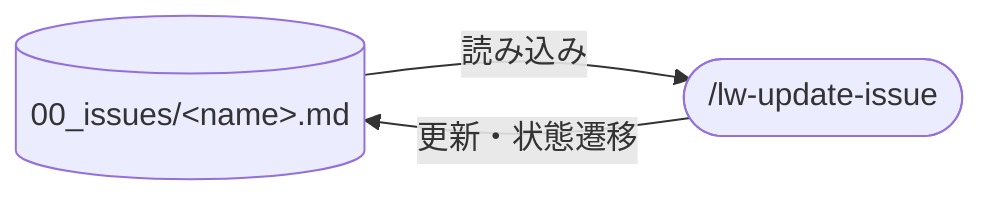

# llm-wiki-kit の update-issue skill 設計

`/lw-update-issue` skill の設計書。
進行中 issue の 💧 進行中 / 🌂 中断点 / ☔ TODO を更新し、旧内容を 🪣 経緯に降ろす操作を skill 化する。
💧/🌂 は上書き方式のため、更新のたびに過去の中断点が消える。
🪣 経緯セクションで旧内容を蓄積し、更新手順を標準化する skill。
**本ページは決定根拠のみを持つ。**
手順（9 ステップ）・言い訳対戦表・エラーハンドリング表は `templates/.claude/skills/lw-update-issue/SKILL.md` が正本で、本ページに写さない。

## データフロー

図は入出力の要約。実際の読み書き対象は `templates/.claude/skills/lw-update-issue/SKILL.md` が正本。

## skill 名

`/lw-update-issue`。
`lw-` prefix で llm-wiki-kit skill 群と揃い、`update` で「既存 issue の更新」が名前で分かる。
`/lw-create-issue`（起票）と `/lw-commit`（区切り）と並ぶ、issue ライフサイクルのファミリーの 1 つ。

## 🪣 経緯セクションの導入

### 動機

💧/🌂 は「いまどこ」を一目で掴む機能を持つが、上書き方式だと途中経過が `git log -p` でしか辿れない。
issue = issue tracker 代替という位置づけなら、GitHub Issues にコメント履歴が残るのと同じで、過去の中断点の遍歴が残るのが自然。

### 設計

セクション名を `## 🪣 経緯`（llm-wiki-kit の雨モチーフ、バケツに雨粒を溜めていくイメージ）にし、☔ TODO の後・関連の前に配置する。
新しいエントリが上（戻ってきた時に最新が最初に目に入る）。
既存 issue に 🪣 が無ければ `/lw-update-issue` 実行時に自動追加する（既存 FIXED は遡及しない）。
具体的なフォーマット・規約は [[lw-kit-詳細設計-issue]] と `.claude/rules/issue.md` が正本。

## 🪣 経緯の上限側の規定

### 動機

下限側（凝縮するな）の防御だけを持ち、上限側の規定を持たない状態では、1 エントリの行数が際限なく増える。
`log.md` の記入規約は「編集回数でなく成果物の変化で数える」という単位規定を持つが、🪣 には対応物がなかった。
実測では 1 エントリが 50 行規模に達していた。

### 単位は質的規約で決める

判定の軸は「新しい context window で読んだ人が再開できるか」。
何を書くかの規定本体は `.claude/rules/issue.md` が持ち、SKILL.md は分類の例示と選別の手順を持つ。

**数値上限を置く案は採らない。** 削減率はエントリの性質で決まり、単一の閾値が機能しない。
起票直後の調査エントリは背景セクションとほぼ完全に重複するので大幅に落ちるが、実装中の技術的判断エントリはほとんど落ちない。
閉じた issue 3 件で検算したところ、🪣 全体はおよそ 1/3 に収まった一方、1 エントリあたりの削減率は 4 倍近く開いた。

**分類の列挙だけで判別文を持たない形も採らない。** 列挙型は概念が増えるたびに漏れる。
実際、当初 3 分類で始めた検算で 3 種類の取りこぼしが出て 4 分類になった。
列挙は入口として置き、判別文（再実行・再測定でしか知れないなら残す）で受ける。

### 下限側は網羅の語彙で書く

下限側の防御は「種類を省くな」（網羅）の語彙で書き、「当時の流れを追える粒度で書け」のような粒度の指示は置かない。
粒度の指示は上限規定と同じ対象（1 エントリの分量）を逆向きに縛るので、両方あるとどちらかが捨てられる。
原則そのものは消さず、適用範囲の境界を書く形にあたる。

そのうえで実行ステップを探索（洗い出し）と活用（選別して書く）に分ける。
上限規定を同じステップに置くと、選別の判断が先に働いて候補が挙がらないまま次に進む。
この skill は ☔ のチェック（活用）と追加（探索）で同じ分離を採っており、構造が揃う。

### 探索側に領域別走査を置く

分割しただけでは探索ステップが成果物を持たないので、省略されても何も欠けない。
分類ごとに候補を挙げ、該当なしも明示する形にして、空欄が見えるようにする。

**ただし走査は候補列挙であって、書く枠ではない。**
この 1 文がないと、走査のチェックリストがそのままエントリのテンプレになり、分類を埋める圧力が働く。
規定を認識している実行者でも踏み、エントリが対策前の水準に戻った実測がある。

**draft を全部書いてから削る案は採らない。** 出力量が倍になる。

### 上限側にも言い訳対戦表を置く

上限規定は「書かなくてよい理由」を探す方向に働き、LLM が省略を推論するのと同じ向きになる。
禁止指示 1 行では止まらないので、下限側と同じ形の対戦表を活用ステップに置く。

書きすぎ側と削りすぎ側の両方を持たせる。
片側だけだと、上限規定のはずが下限強化の道具になる。

### 参照先の資格

二重記帳をやめて 1 行の参照に落とすとき、壊れるのは削除の側でなく参照化の側だった。
参照先が実在しない、あるいは参照先が改訂されて内容が移動する。

参照してよいのは、repo に残り、移動時に参照が追われる正本だけ。
可変性そのものでなく保守プロトコルの有無で線を引く（設計書も改訂されるが、移動時の追従は別途規定がある）。
同じ issue の 💧/🌂 は次回の更新で 🪣 に降ろされるので、先回りして書くと二重に積まれる。

参照を書いた直後にコマンドで実在を確認する。自然言語の指示だと解釈の余地が残る。

### 重複の検出は機械に任せる

書き手は context にその情報を持っているので、「これは既に別のセクションに書いた」を自力で検出できない。
知っている状態で読み返しても同じで、書いた本人による事後の点検は精度が出ない。

実測では、規定を厳密に適用して落ちる行のうち **7 割が同じ issue の他セクション**（☔ / 🌂 / 💧 / 背景）と重複していた。
残り 3 割は知見ファイルと別 issue で、これは書き手の記憶で拾える範囲にある。

そこで選別ステップに、候補ごとの `grep` を 1 つ置く。対象は編集中の issue 1 本に限る。

- 同一ファイルの照合はコストが低く、効果の 7 割を占める
- 他ファイル（設計書 / 知見 / 別 issue）まで機械照合に広げると、更新 1 回あたりの手数が跳ね上がる割に残り 3 割しか取れない

**書いた後に自己点検させる案は採らない。** 書き手の context は点検時にも残っているので、同じ盲点がそのまま持ち越される。

### 自己報告を最終ステップに置く

規定を認識している状態でも上限を超える。
崩れるのは規定の判別力ではなく「質的規約は書けば適用される」という前提の方にあたる。

宣言 → 手順 → 出力スロット → 機械 gate の順に強くなるので、出力スロット層を 1 つ置く。
選別の内訳と行数を毎回報告させる。候補件数を先に出させるので、走査の省略も同時に検出できる。

**エントリ全文を表示する案は採らない。** 報告が長いと読まれず、防御として働かない。

## skill 配置

全 skill は project-local（`.claude/skills/` 配下）。

- 実体: `.claude/skills/lw-update-issue/SKILL.md`
- 設計書: 本ページ（`docs/lw-kit/40_スキル設計/`）

global 化しない理由: 手順の中身が llm-wiki-kit 固有運用に密結合している。

- `00_issues/` のディレクトリ構造と 5 状態管理
- 💧 進行中 / 🌂 中断点 / ☔ TODO / 🪣 経緯の 4 セクション構造

## 呼び出し制御

`disable-model-invocation: true`。
当初は副作用が軽い（既存ファイルの Edit のみ）ことから `false` にしていたが、issue 更新は自分で直したいタイミングで起動する運用の方が合っていたため `true` に変更した。

## effort の水準

`effort: high`。

[[プロンプト設計原則]]「effort は skill 単位で決める」は責務の性格で分ける。
本 skill はステップ 3（洗い出し）とステップ 7（☔ TODO 追加）に探索の所作を持つので、機械的な手順の skill（`/lw-commit` / `/lw-lint`）とは水準が変わる。

低い水準でも指摘や候補の精度は保たれるが、候補列挙の網羅性が畳まれる。
本 skill が「このステップで種類を省かない」「走査は候補列挙であって書く枠ではない」と防御しているのは、まさにそこにあたる。
文面で守っているものを設定で削らない。

## 許可ツールの最小化

Write を持たない理由: 本 skill は既存 issue ファイルの更新に閉じる。新規ファイル作成は `/lw-create-issue` の責務。
`grep` / `find` を持つのは、参照先の実在確認と自己報告の行数計測を機械に任せるため。行数を LLM に自力で数えさせない。
`date` を `LANG=` 付きの形で allowlist に書くのは、曜日を日本語で出す呼び方に前方一致で合わせる必要があるため。
`git mv` は状態遷移の実行手段（下記「状態遷移をどちらからでも実行できるようにした」）。
本 skill は他に git を触らないが、`mv` だと旧パスの削除と新パスの追加を別途 staged にする手当てが要り、後続の `/lw-commit` に持ち越す。

許可リストの具体値は SKILL.md が正本。
設計書に写すと、SKILL.md 側で増減したときに気づかず乖離する。

## 責務の境界

### `/lw-commit` step 1 との切り分け

issue の更新ロジックの正本は `/lw-update-issue`。
`/lw-commit` step 1 は最新化されているかを確認し、未反映なら本 skill の SKILL.md を読んで同じ手順で更新する。

| 観点       | `/lw-commit` step 1                       | `/lw-update-issue`（正本）                   |
| ---------- | ----------------------------------------- | -------------------------------------------- |
| 役割       | 最新化されているか確認し、未反映なら更新  | 💧/🌂 の上書き + 🪣 経緯への降ろし + ☔ 更新 |
| 見る範囲   | 列挙で閉じる（commit フローに対応する分） | issue 全体                                   |
| 状態遷移   | 明示指示があれば mv する                  | 明示指示があれば mv する                     |
| 盤面の転記 | する                                      | しない（対象 issue 以外に触らない）          |

`/lw-update-issue` は `disable-model-invocation: true` なので `/lw-commit` からは起動できない。
手順を渡す経路が読む以外に無いので、`/lw-commit` は本 skill の SKILL.md を直接読む（線引きは [[lw-kit-スキル設計-lw-commit]]「他 skill の SKILL.md を読む形にした」が持つ）。

### 状態遷移をどちらからでも実行できるようにした

以前は「状態遷移はしない」とだけ書いていて、`/lw-commit` の側も「mv は本 skill では行わない」と書いていた。
どちらも引き受けないので、閉じる時は lead が毎回「FIXED にしたうえで更新して」と指示に書き足すことになっていた。

両方に持たせるのは、lead の起動が 2 つの skill に分かれているため。
どちらから入っても同じ結果になる形にしないと、起動した skill によって指示の書き方が変わる。

自発的に閉じない性質は変えていない。
`.claude/rules/issue.md`「ユーザー確認」が禁じているのは Claude 判断での mv で、明示指示を受けた mv は元から許可の範囲にある。
両 skill とも `disable-model-invocation: true` なので、起動そのものが lead の意思表示にあたる。

盤面（`1_issues.md` / `2_done.md`）の転記は持たない。
「対象 issue 以外のファイルに触らない」は更新フローを閉じるための不変条件で、盤面を触らせると崩れる（理由は [[lw-kit-スキル設計-lw-commit]]「盤面の転記は commit 側に残す」）。

### 未追跡の issue は `/lw-commit` 側に回す

`git mv` は追跡下にないファイルで失敗する。
`/lw-create-issue` は git を触らないので、起票直後の issue は必ず未追跡にあり、その場で切ってその場で閉じる短命な issue が確実にこの経路を通る。

本 skill には `git add` を足さない。
回復手段を持たせると更新フローに git の状態を作る操作が入り、「対象 issue 以外に触らない」で閉じている輪郭がぼやける。
`Bash(git add:*)` を元から持つ [[lw-kit-スキル設計-lw-commit]] 側に回し、本 skill は案内して停止する。

lead から見た手数は打ち直し 1 回で、`/lw-commit --fixed` が同じ結果（終端形への書き換え + mv + 盤面の転記）を出す。

### 書き戻しの済み / 未済を判定させない

`.claude/rules/issue.md`「完了 / 廃棄時の規律」は、閉じる前に永続的な知識を wiki page へ書き戻すことを必須にしている。
状態遷移のステップはこの規律を前提として参照するが、済んでいるかの判定は持たない。

判定を持たせると探索の所作になる。
「書き戻すべきものが残っていないか」を確かめるには issue の中身を棚卸しする必要があり、それは [[lw-kit-スキル設計-lw-retro]] が持つ責務そのものになる。
活用に専念する 2 つの skill に置くと、探索・活用の分離が崩れる。

同 rule の「ユーザー確認」が既にこの分担を持っている。
Claude 判断で閉じる時は書き戻し先を添えて確認する形が規定されていて、明示指示のときは確認なしで mv してよい。
明示指示そのものが仕分け済みの意思表示にあたるので、skill 側で判定を重ねると指示の意味を上書きすることになる。

gate を置いても実運用では毎回通る。
[[lw-kit-スキル設計-lw-commit]] は差分確認 gate を 2 度撤去しており、gate の価値は lead が実際に見るかどうかで決まる。
見ない gate は待ち時間だけを増やす。

## 実行ステップと why

流れの一覧は SKILL.md「Process 概観」が持つ。ここは各ステップの why だけを置く。

| #   | ステップ         | why                                                                              |
| --- | ---------------- | -------------------------------------------------------------------------------- |
| 1   | 対象 issue 特定  | 推定で進めず、特定できなければ停止                                               |
| 2   | Read             | 🪣 の有無確認も兼ねる（無ければ 4 で自動追加）                                   |
| 3   | 洗い出し（探索） | 上書き前に旧内容を候補に含める（上書き後は復元不能）。ここでは書かない           |
| 4   | 選んで 🪣 に書く | 3 の候補を選別する。上限側の規定はここに効く                                     |
| 5   | 💧/🌂 上書き     | 💧 = 状態 / 🌂 = 再開指示。同じ next-step を重複しない                           |
| 6   | ☔ TODO チェック | 活用（畳む）の所作                                                               |
| 7   | ☔ TODO 追加     | 探索（開く）の所作。6 と分離するのは探索・活用の混同を防ぐため                   |
| 8   | 状態遷移         | 明示指示のときだけ走る。5-7 で書いた内容を終端形に合わせ直す位置なので最後に置く |
| 9   | 自己報告         | 選別の内訳と行数を出し、書きすぎと的外れを検出可能にする                         |

issue の内容改訂を `log.md` に記録しない判断は [[lw-kit-詳細設計-log-index]] を参照。
当初は step 7 として log 追記を持ち「独立起動する skill は自己完結する」を根拠にしていたが、issue の改訂は 🪣 経緯が正本で log 側が二重になるため廃止した。
起票（`/lw-create-issue`）と廃棄は log に残るので、issue のライフサイクルは追える。

各ステップの具体的な操作手順・エラーケースは SKILL.md を参照。

## 保守規律

- 本設計書と SKILL.md の同期: SKILL.md を Edit したターンで本設計書の `updated:` も揃える
- [[lw-kit-詳細設計-issue]] 変更時の追従: 🪣 経緯やファイル内部構造を Edit した時、SKILL.md のステップ記述と齟齬がないか確認する
- `/lw-commit` step 1 変更時の確認: `/lw-commit` SKILL.md の step 1 を Edit した時、本設計書「責務の境界」の比較表が崩れていないか確認する

## 関連

- [[lw-kit-詳細設計-issue]] — issue 概念 + 内部構造の SSOT（🪣 経緯の規約追記先）
- [[lw-kit-スキル設計-lw-commit]] — `/lw-commit` step 1 が issue 最新化を持つ、責務の境界
- [[lw-kit-スキル設計-lw-create-issue]] — 設計書の型 + 起票側の対（create / update の責務分担）
- [[lw-kit-アーキテクチャ設計]] — ライフサイクルファミリーでの位置づけ
