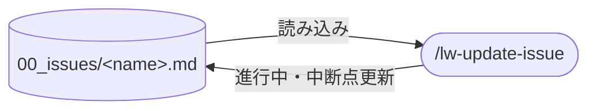

# llm-wiki-kit の update-issue skill 設計

`/lw-update-issue` skill の設計書。
進行中 issue の 💧 進行中 / 🌂 中断点 / ☔ TODO を更新し、旧内容を 🪣 経緯に降ろす操作を skill 化する。
💧/🌂 は上書き方式のため、更新のたびに過去の中断点が消える。
🪣 経緯セクションで旧内容を蓄積し、更新手順を標準化する skill。
本ページは設計判断の why を集約する。実行手順の how は SKILL.md を参照。

## データフロー



## skill 名

`/lw-update-issue`。
`lw-` prefix で llm-wiki-kit skill 群と揃い、`update` で「既存 issue の更新」が名前で分かる。
ワークスペース側の issue 運用設計の skill ファミリー表で `update-issue` として構想されていたものの実装。

## 🪣 経緯セクションの導入

### 動機

💧/🌂 は「いまどこ」を一目で掴む機能を持つが、上書き方式だと途中経過が `git log -p` でしか辿れない。
issue = issue tracker 代替という位置づけなら、GitHub Issues にコメント履歴が残るのと同じで、過去の中断点の遍歴が残るのが自然。

### 設計

セクション名を `## 🪣 経緯`(llm-wiki-kit の雨モチーフ、バケツに雨粒を溜めていくイメージ)にし、☔ TODO の後・関連の前に配置する。
新しいエントリが上(戻ってきた時に最新が最初に目に入る)。
既存 issue に 🪣 が無ければ `/lw-update-issue` 実行時に自動追加する(既存 FIXED は遡及しない)。
具体的なフォーマット・規約は [[lw-kit-詳細設計-issue]] と `.claude/rules/issue.md` が正本。

## skill 配置

全 skill は project-local（`.claude/skills/` 配下）。

- 実体: `.claude/skills/lw-update-issue/SKILL.md`
- 設計書: 本ページ（`docs/lw-kit/40_スキル設計/`）

global 化しない理由: 手順の中身が llm-wiki-kit 固有運用に密結合している。

- `00_issues/` のディレクトリ構造と 5 状態管理
- 💧 進行中 / 🌂 中断点 / ☔ TODO / 🪣 経緯の 4 セクション構造

## 呼び出し制御

`disable-model-invocation: true`。
当初は副作用が軽い(既存ファイルの Edit のみ)ことから `false` にしていたが、issue 更新は自分で直したいタイミングで起動する運用の方が合っていたため `true` に変更した。

## 許可ツールの最小化

Read / Edit + scoped Bash(`date` / `tail`)。
Write を持たない理由: 本 skill は既存 issue ファイルの更新に閉じる。新規ファイル作成は `/lw-create-issue` の責務。
具体的なリストと用途は SKILL.md を参照。

## 責務の境界

### `/lw-commit` step 2 との切り分け

issue の更新ロジックは `/lw-update-issue` に一本化する。
`/lw-commit` step 2 は自分で issue を編集せず、更新済みかどうかを確認するガード役に徹する。

| 観点       | `/lw-commit` step 2（ガード）                                      | `/lw-update-issue`（実行）                   |
| ---------- | ------------------------------------------------------------------ | -------------------------------------------- |
| 役割       | issue が最新化されているか確認、未更新なら `/lw-update-issue` 起動 | 💧/🌂 の上書き + 🪣 経緯への降ろし + ☔ 更新 |
| 自分で編集 | しない                                                             | する（skill の中核機能）                     |
| FIXED 判断 | TODO 全完了時に FIXED 化を lead に確認                             | 状態遷移しない（WIP のまま更新に専念）       |

commit 時に issue が最新化されていることを保証するため、`/lw-commit` step 2 は「update-issue が済んでいなければ代わりに起動する」フォールバックとして機能する。
更新ロジックの重複を避け、🪣 経緯への降ろしが commit 前に必ず行われる。

`/lw-commit` SKILL.md の step 2（issue 最新化）にも反映済み。

## 実行ステップと why

```text
1. 対象特定 → 2. Read → 3. 日時取得 + 🪣 経緯に降ろす → 4. 💧/🌂 上書き → 5. ☔ TODO チェック → 6. ☔ TODO 追加
```

| #   | ステップ                   | why                                                                              |
| --- | -------------------------- | -------------------------------------------------------------------------------- |
| 1   | 対象 issue 特定            | 推定で進めず、特定できなければ停止                                               |
| 2   | Read                       | 🪣 の有無確認も兼ねる(無ければ step 3 で自動追加)                                |
| 3   | 日時取得 + 🪣 経緯に降ろす | 上書き前に旧内容を保存する(上書き後は復元不能)。会話文脈も経緯の一部として含める |
| 4   | 💧/🌂 上書き               | 💧 = 状態 / 🌂 = 再開指示。同じ next-step を重複しない                           |
| 5   | ☔ TODO チェック           | 活用(畳む)の所作                                                                 |
| 6   | ☔ TODO 追加               | 探索(開く)の所作。step 5 と分離するのは探索・活用の混同を防ぐため                |

issue の内容改訂を `log.md` に記録しない判断は [[lw-kit-詳細設計-log-index]] を参照。
当初は step 7 として log 追記を持ち「独立起動する skill は自己完結する」を根拠にしていたが、issue の改訂は 🪣 経緯が正本で log 側が二重になるため廃止した。
起票（`/lw-create-issue`）と廃棄は log に残るので、issue のライフサイクルは追える。

各ステップの具体的な操作手順・エラーケースは SKILL.md を参照。

## 保守規律

- 本設計書と SKILL.md の同期: SKILL.md を Edit したターンで本設計書の `updated:` も揃える
- [[lw-kit-詳細設計-issue]] 変更時の追従: 🪣 経緯やファイル内部構造を Edit した時、SKILL.md のステップ記述と齟齬がないか確認する
- `/lw-commit` step 2 変更時の確認: `/lw-commit` SKILL.md の step 2 を Edit した時、本設計書「責務の境界」の比較表が崩れていないか確認する

## 関連

- [[lw-kit-詳細設計-issue]] — issue 概念 + 内部構造の SSOT（🪣 経緯の規約追記先）
- [[lw-kit-スキル設計-lw-commit]] — `/lw-commit` step 2 が issue 最新化を持つ、責務の境界
- [[lw-kit-スキル設計-lw-create-issue]] — 設計書の型 + 起票側の対（create / update の責務分担）
- [[lw-kit-アーキテクチャ設計]] — ライフサイクルファミリーでの位置づけ
