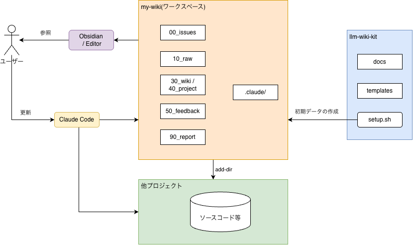
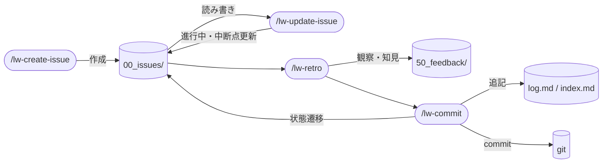
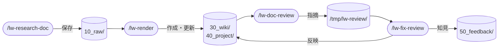
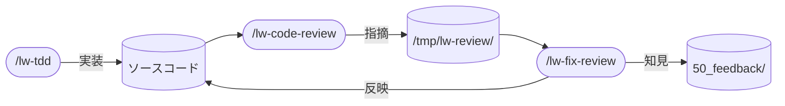

# llm-wiki-kit アーキテクチャ設計

llm-wiki-kit の構造・ワークフロー・設計原則を 1 箇所にまとめたリファレンス。
開発者・メンテナが「何がどこにあるか」「なぜそうしたか」を確認するための文書。
ユーザー向けの「どう使う」は README が担う。「これは何か」は README でなく作品紹介サイトが持つ（[[lw-kit-詳細設計-README]]）。

**本ページは kit 全体の入口と、どの単一 skill にも閉じない決定根拠を持つ。**
各節の表は要約で、正本は節の冒頭に示す。個々の仕組みの詳細は各設計書が正本。

## 外部関係図

llm-wiki-kit と外部の関係。



llm-wiki-kit とワークスペースは独立した 2 つの git リポジトリ。
`setup.sh` が `templates/` の全ファイルを cp してワークスペースを生成する(symlink なし)。
llm-wiki-kit の更新は現状手動で取り込む。選択的な取り込みを行う `lw-sync` は設計のみで未実装(実装はワークスペース側の issue で予定)。
各自が skills / rules / wiki 規約を自由にカスタマイズしてよい。

## ワークスペースの標準ディレクトリ構成

正本は各ディレクトリの実体。ここは要約。

| ディレクトリ   | 役割                                                      |
| -------------- | --------------------------------------------------------- |
| `00_issues/`   | いま取り組んでいるタスクの進捗・中断点・TODO を書くところ |
| `10_raw/`      | 調べた資料や取り込み元をそのまま置いておくところ          |
| `20_library/`  | 本の目次 wiki と PDF を管理するところ                     |
| `30_wiki/`     | 汎用的な知識を wiki ページとして蓄積するところ            |
| `40_project/`  | 案件ごとの固有情報をまとめるところ                        |
| `50_feedback/` | 作業の振り返りで得た観察・知見・指針を記録するところ      |
| `90_reports/`  | 定期的なレポートをまとめるところ                          |

ワークスペースはこの標準構造をベースにディレクトリを追加できる。

## llm-wiki-kit のディレクトリ構成

正本は repo の実体。ここは要約。

| ディレクトリ / ファイル | 役割                                                            |
| ----------------------- | --------------------------------------------------------------- |
| `templates/`            | ワークスペースの初期ファイル一式。`setup.sh` がまるごと cp する |
| `docs/`                 | 設計書や参考資料。ワークスペースには含めず、開発者が参照する    |
| `setup.sh`              | これを実行するとワークスペースが 1 つできる                     |

`templates/` の中身がそのままワークスペースのルートに展開される。
詳細は [[lw-kit-基本設計-ディレクトリ構成]] を参照。

## Claude Code 3 層モデル

llm-wiki-kit は Claude Code の 3 層構造で振る舞いを制御している。
正本は各層の実体（`templates/.claude/` 配下）。ここは要約。

| 層        | 何をするか                                              | いつ読み込まれるか           |
| --------- | ------------------------------------------------------- | ---------------------------- |
| CLAUDE.md | ワークスペース全体のルールを書いておくところ            | 毎ターン、常に読まれる       |
| rules     | ファイルの種類に応じて自動で読み込まれる規約            | 対象ファイルに触ったとき     |
| skills    | `/lw-create-issue` のようなスラッシュコマンドの実行手順 | ユーザーが明示的に呼んだとき |

詳細は [[lw-kit-詳細設計-CLAUDE.md]] / [[lw-kit-詳細設計-rules]] を参照。

## ルートファイル群

正本は各ファイルの実体。ここは要約。

| ファイル      | 役割                                         |
| ------------- | -------------------------------------------- |
| `index.md`    | wiki ページの一覧。何があるか探すときに見る  |
| `log.md`      | 全操作の履歴。いつ何をしたか追えるようにする |
| `0_icebox.md` | いつかやりたいことを書いておくリスト         |
| `1_issues.md` | いま進行中のタスクと、次にやるタスクの一覧   |
| `2_done.md`   | 完了したタスクの記録                         |

## 開発ワークフロー

3 つのワークフローと、それに属さないユーティリティがある。
issue 管理が外側のフレームとして他の 2 つを包む。

以下の表で各 skill が「やること」は要約。正本は各 SKILL.md の `description`。

### issue 管理

全ての作業は issue の開閉で管理する。

| 段       | skill              | やること                                           |
| -------- | ------------------ | -------------------------------------------------- |
| 開く     | `/lw-create-issue` | やることを issue ファイルとして起票する            |
| 更新     | `/lw-update-issue` | 作業の進捗・中断点・TODO を issue に書き込む       |
| 振り返り | `/lw-retro`        | セッションで気づいたことをフィードバックに記録する |
| 畳む     | `/lw-commit`       | 作業記録を log/index に書き込み、git commit する   |

`/lw-update-issue` はどの段の間でも繰り返し起動する。
`/lw-retro`(探索)と `/lw-commit`(活用)は責務を分離している。

skill が扱うのは issue の状態(起票・更新・遷移)で、タスク種別ごとの手順は guide が持つ。
guide は issue の ☔ TODO に流し込むワークフローのメニューで、`00_issues/.guide/` に置く(機構は [[lw-kit-詳細設計-guide]])。



### ナレッジ蓄積

外部知識を調査し、wiki に蓄積する。

| 段       | skill              | やること                                           |
| -------- | ------------------ | -------------------------------------------------- |
| 調査     | `/lw-research-doc` | Web や URL から情報を集めて素材として保存する      |
| 変換     | `/lw-render`       | 集めた素材を wiki ページに書き起こす               |
| レビュー | `/lw-doc-review`   | 書いたページを別の視点でチェックし、指摘を出す     |
| 反映     | `/lw-fix-review`   | 指摘を見て、直すかどうか判断し、直すものは反映する |



### コード開発

コードを書いてレビューする。

| 段       | skill             | やること                                           |
| -------- | ----------------- | -------------------------------------------------- |
| 実装     | `/lw-tdd`         | テストを先に書き、コードを書き、きれいにする       |
| レビュー | `/lw-code-review` | 書いたコードを別の視点でチェックし、指摘を出す     |
| 反映     | `/lw-fix-review`  | 指摘を見て、直すかどうか判断し、直すものは反映する |



`/lw-fix-review` はナレッジ蓄積とコード開発の両方で共通して使われる。

### ユーティリティ

3 つのワークフローに属さない独立した skill。

| skill                | やること                                       |
| -------------------- | ---------------------------------------------- |
| `/lw-lint`           | wiki のリンク切れや書式の不備をチェックする    |
| `/lw-archive-weekly` | 完了したタスクを週次レポートにまとめる         |
| `/lw-cmux-teams`     | Claude Code のチームメイトを立ち上げて管理する |

## 横断設計原則

どの単一 skill にも閉じない、kit 全体で守る原則。

- **why/how 分離**: 「なぜそうしたか」は設計書に、「どう実行するか」は実物(SKILL.md / rule / `templates/` / スクリプト)に書く。同じことを 2 箇所に書かない。食い違ったら実物(挙動の正本)が勝ち、設計書側を直す。判断の軸と宣言の型は「設計書の境界」
- **下書きのみ提示**: `/lw-lint` は `log.md` / `index.md` を勝手に書き換えず、下書きを提示してユーザーが判断する。起票・更新・commit の 3 skill(`/lw-create-issue` / `/lw-update-issue` / `/lw-commit`)と `/lw-render` は、記録の反映が責務に含まれるので自分で追記する
- **探索と活用を分ける**: 振り返り(`/lw-retro`)と commit(`/lw-commit`)は別の skill にする。1 つにまとめると振り返りが雑になる
- **fresh context**: レビューは会話の文脈を切った状態で行う。文脈を知っている人が採否を判断し、知らない人が独立にチェックする
- **project-local 統一**: 全 skill はワークスペースの `.claude/skills/` に置く。グローバルにする必要がない
- **触らないファイルを明示する**: チームメイトに仕事を頼むとき、触ってほしくないファイルを先に伝える
- **名前を 3 箇所で揃える**: ディレクトリ名 / frontmatter `name` / SKILL.md の H1 を同じ `lw-<name>` にする。`lw-` prefix は built-in skill との衝突回避（[[Claude-Code-Skillの書き方]]「配置場所」）。H1 に説明を足したくなったら、H1 は名前だけにして説明は直下のリード行に置く

### 設計書の境界

判断の軸は「その記述を消しても実物を見れば分かるか」。
分かるなら設計書は持たない。
実物に痕跡が残らない why(採らなかった選択肢とその理由、決定の根拠、不変条件)を設計書が持つ。

入口として要約を置く場合は、その節の冒頭で正本の在り処を示す。
宣言のない要約は写しと同じ扱いにする。

各設計書は H1 直下のリード行の次に、独立した段落で自分の境界を宣言する。

```text
**本ページは<持つもの>を持つ。**
<写さない対象>は `<正本のパス>` が正本で、本ページに写さない。
```

`<持つもの>` の既定は「決定根拠のみ」。
足せるのは判断の軸を通るもの、つまり消すと実物から復元できない項目に限る。
`<正本のパス>` は kit 視点で書く(ワークスペースの `.claude/CLAUDE.md` ではなく `templates/.claude/CLAUDE.md`)。
宣言の 3 行目に「写すと実物と一緒にずれる」等の理由を足してよい。

## 用語集

llm-wiki-kit で使う言葉を定義する。

| 用語           | 定義                                                                                       |
| -------------- | ------------------------------------------------------------------------------------------ |
| kit            | llm-wiki-kit のこと。ワークスペースの元になるテンプレート                                  |
| ワークスペース | `setup.sh` で作る自分専用のリポジトリ。ここに wiki を書いていく                            |
| issue          | いま取り組んでいるタスクを 1 ファイルにまとめたもの。`00_issues/` に置く                   |
| guide          | タスク種別ごとの手順のメニュー。issue の TODO にコピーして使う。`00_issues/.guide/` に置く |
| skill          | スラッシュコマンド(`/lw-render` 等)。`.claude/skills/` に置く                              |
| rule           | ファイルの種類に応じて自動で読み込まれる規約。`.claude/rules/` に置く                      |
| wiki page      | `30_wiki/` や `40_project/` に置く Markdown ファイル。知識を蓄積する単位                   |
| case root      | 案件のハブになる page。`40_project/<案件>/<案件>.md`                                       |
| raw            | 調べた資料をそのまま置いたもの。`10_raw/` に入れる                                         |
| render         | raw を wiki page に変換すること。`/lw-render` で行う                                       |
| knowledge      | llm-wiki-kit を理解するための参考 wiki。`docs/knowledge/` に置く                           |
| lead           | ユーザーと直接やり取りするメインの Claude Code セッション                                  |
| teammate       | lead が立ち上げる別の Claude Code セッション(advisor / worker 等)                          |
| 設計書         | 「なぜそうしたか」を記録する文書。`docs/lw-kit/` に置く                                    |

## 関連

- [[lw-kit]] — case-root(ハブ)
- [[ソフトウェア設計ドキュメント体系]] — 本設計の理論的背景(Diataxis / 情報設計の 3 要素)
- [[ADR]] — 個別スキル設計書の形式的位置づけ
